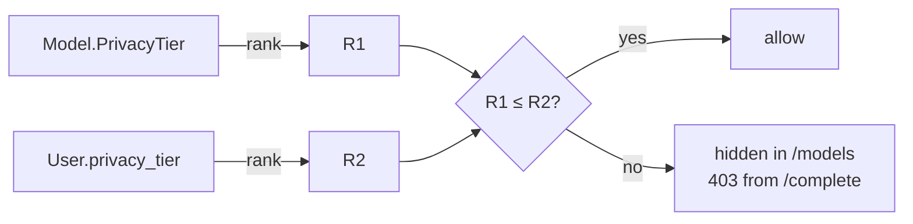

# Privacy Tier Gating

Each model in the catalogue carries a `PrivacyTier`:

| Tier        | Rank | Meaning                                                |
| ----------- | ---- | ------------------------------------------------------ |
| `ch_only`   | 0    | Hosted in Switzerland, no data retention               |
| `eu`        | 1    | Hosted in the EU                                       |
| `global`    | 2    | Anywhere (default — most permissive)                   |

A user has a `privacy_tier` field on their `users` record. The rule:

```text
allowed iff rank(modelTier) <= rank(userTier)
```

A `ch_only` user only sees `ch_only` models. An `eu` user sees `ch_only`
and `eu` models. A `global` user sees everything active. Unknown / missing
user tier values normalise to `eu`.

The check is enforced in **two places**:

1. **`GET /api/v1/models`** filters the catalogue down to what the user is
   eligible for — they never see ineligible models in the picker.
2. **`POST /…/complete`** re-checks the chosen model against the user's tier
   and returns `403 Model is not available for the user's privacy tier`
   if they smuggled in an ineligible model ID.



Why two places: the catalogue filter is UX, the handler check is the
authoritative gate. Both must agree.
