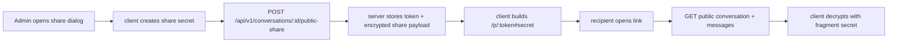

# Public Share

A **Public share** is a read-only, unauthenticated view of a Conversation. It is
not the same as adding a [Participant](./participant-add.md): nobody receives
membership, and the share can be revoked without changing the Participant list.

Only an Admin Participant can create or revoke a share.

The token in `/p/{token}` identifies the share record. The decryption secret is
kept in the URL fragment (`#...`), which browsers do not send to the server.

Share modes:

| Mode                  | Recipient sees                                                                 | Redaction mappings |
| --------------------- | ------------------------------------------------------------------------------ | ------------------ |
| `redacted-only`       | encrypted Messages after client decryption, with Placeholders left in place    | not exposed        |
| `include-sensitive`   | encrypted Messages plus encrypted mappings, so the client can Hydrate values   | exposed by token   |

Public routes are IP rate-limited. Invalid, revoked, or unknown tokens return a
neutral 404.

Revoking a Public share deletes the share row. Existing links stop working, but
the Conversation and its Participants are unchanged.
