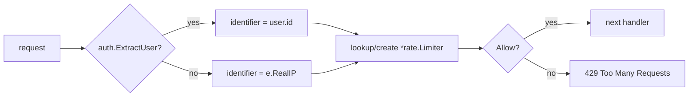

# Rate Limiting

Every `/api/v1/*` route is bound to `rateLimiterMiddleware`. Defaults:

- **600 requests per hour** sustained
- **Burst of 60** to absorb the parallel `/api/v1/*` GETs that fire on
  first paint of the SPA
- Limiter entries **expire after 30 min** of inactivity to keep memory bounded
- **Disabled in dev** (`app.IsDev()` short-circuits to `e.Next()`)

Identifier resolution:

Why user-id-first: shared NAT'd networks (offices, coworking spaces)
would otherwise share a bucket and rate-limit each other.

Authentication-flow limits are configured separately via Pocketbase's
built-in `Settings().RateLimits` (`hooks.ApplyRateLimits`) — see
[`backend/internal/hooks/rate_limits.go`]. Those caps are stricter
(e.g. 3 password resets per 5 min) because auth surfaces are abuse magnets.
