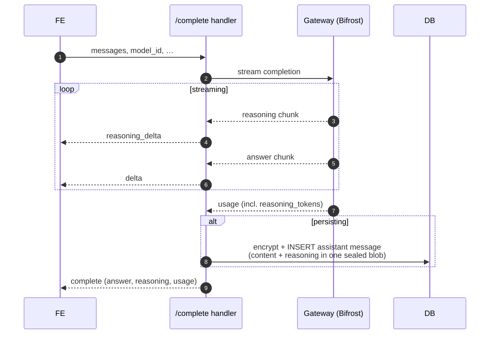

# Reasoning Visibility

Some models return **reasoning** (their "thinking") alongside the answer. Cognos
surfaces it in a subtle inline **"Show reasoning"** disclosure - streamed live,
collapsed once the answer lands - while giving it the exact same
no-plaintext-at-rest treatment as message content.

It rides the [completion pipeline](./completion-pipeline.md); this doc only
covers what reasoning adds. Bifrost normalises every provider's shape (OpenAI
`reasoning`, xAI `reasoning_content`, DeepSeek thinking) into one `reasoning`
string plus a `reasoning_tokens` count, so the gateway adapter is the only
provider-specific code.

## Two channels, never mixed

The answer and the reasoning travel on separate SSE event types, so reasoning
can never bleed into the final answer text:

- `delta` - answer text chunk (unchanged).
- `reasoning_delta` - reasoning text chunk (new). Clients that ignore unknown
  event types still get the full answer.
- `complete` - terminal payload: answer, optional `reasoning`, and
  `usage.reasoning_tokens` (defaults to `0`).

## Requesting reasoning (effort)

Some models only reason when asked, and at a chosen intensity. Each model
declares its accepted tiers in the catalogue (`reasoning_efforts`, e.g.
`["off","low","medium","high"]`, plus a `default_reasoning_effort`). The
composer shows a gauge selector **only for models that declare tiers**,
defaulting to the Model's default and remembering the Account holder's per-model choice in
their encrypted preferences. The chosen tier rides the completion as
`reasoning_effort`; the handler forwards it only if the model declares it
(otherwise `400`), and Bifrost maps it to the provider (`off` → reasoning
disabled). Models that declare no tiers behave exactly as before - no selector,
no parameter sent. Enabling a real model is a data change (set the two fields on
its `ai_models` record) once its provider's accepted tiers are confirmed.

## Invariants

1. **Reasoning is encrypted exactly like content.** It's a field on
   `MessageRecordData`, so it's inside the single sealed-box blob written to the
   `data` column (see [message-encryption](./message-encryption.md)). No
   plaintext column ever holds it.
2. **Counts travel; text doesn't.** Only `reasoning_tokens` (a number) reaches
   the response and could reach billing/analytics. Reasoning **text** is never
   logged, metered, or emitted as analytics - not even at debug level.
3. **The UI stays honest.** The disclosure is labelled "Reasoning supplied by
   the model. It may be incomplete or incorrect." - reasoning is an aid to
   inspection, not proof of correctness.
4. **Absent reasoning shows nothing.** Models that return no reasoning render no
   disclosure and report `reasoning_tokens: 0`.

Public shares render stored Reasoning using the same disclosure. Document exports intentionally
contain the final answer without hidden Reasoning, and usage surfaces do not expose the raw token
count.
