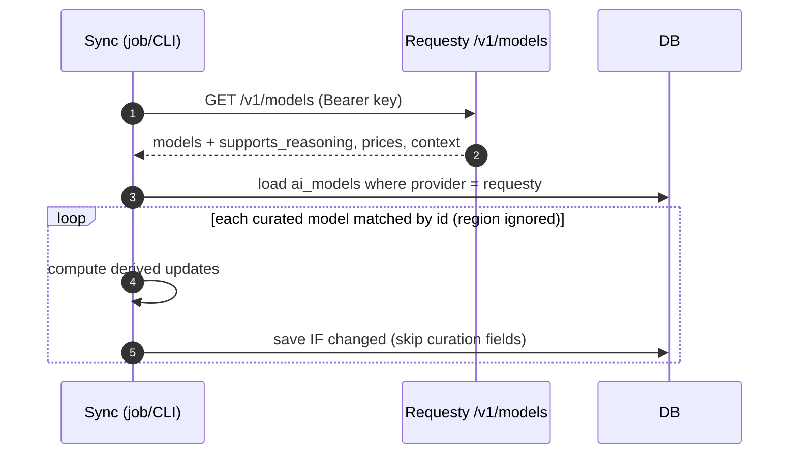

# Requesty Model Sync

Models change often — prices move, context windows grow, reasoning support
appears. Rather than re-curate by hand, the backend **enriches** the curated
catalogue from Requesty's model API. It is deliberately **enrich-only**: it
refreshes derived metadata on models we already curate, and never decides which
models exist or where they run.

## What it does — and never does

| Refreshes (derived)                                  | Never touches (curated / compliance)                |
| ---------------------------------------------------- | --------------------------------------------------- |
| `reasoning_efforts` + `default_reasoning_effort`     | `enabled`, `whitelisted`                            |
| `input/output_usd_per_million_tokens`                | `privacy_tier`, `hosting_country`, `hosting_region` |
| `input_context_tokens`, `max_output_tokens`          | which models exist, name, slug, tags                |
| capability flags incl. `supports_web_search`         |                                                     |

Requesty's `geolocation` never _moves_ a model — **residency stays curated**, so
the sync can never silently relocate a model or re-enable one you disabled. It
is used in exactly one fail-safe direction: `supports_web_search` survives the
sync **only when `geolocation == "eu"`** (exact string match — never an
id-suffix regex, which would assert EU residency more strongly than Requesty
itself does). Any other value forces the flag off, so a mislabelled model loses
web search rather than gaining it. See [web-search](./web-search.md).

## How it runs

- **Matching**: our `provider_model_id` (e.g. `azure/o4-mini@swedencentral`) is
  matched to a Requesty id by stripping the `@region` suffix and lowercasing, so
  the same model matches across regions.
- **Reasoning tiers** come from Requesty's normalised vocabulary (it maps
  `off/low/medium/high` to OpenAI effort strings or Anthropic/Google thinking
  budgets internally), so one uniform set works on every reasoning model.
- **Two entry points, one implementation** (`internal/catalogue/requestysync`):
  a background job (runs ~once on boot, then every ~6h; never blocks startup or
  fails requests if Requesty is down) and a `sync-requesty-models` CLI
  subcommand (wrapped by `scripts/sync-requesty-models.sh`) for ad-hoc/CI runs.

## Invariants

1. **Enrich-only.** Curation and compliance fields are never written. A model
   appears, stays enabled, and keeps its tier/region only by curation.
2. **No clobbering overrides.** `reasoning_efforts` is set only when empty, so a
   hand-tuned per-model tier list always wins.
3. **Safe to run anytime.** Idempotent (writes only on change), tolerant of a
   missing Requesty provider or a down API, and harmless across instances.

See [reasoning-visibility](./reasoning-visibility.md) for how the synced effort
tiers surface in the composer.
