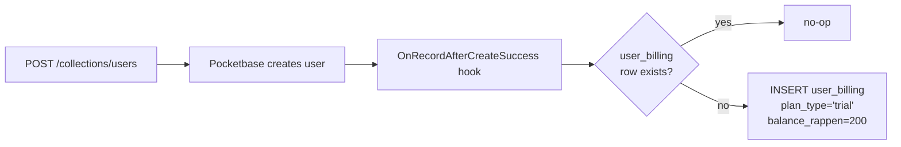

# Signup Trial Seed

When a new user record is created, an `OnRecordAfterCreateSuccess("users")`
hook calls `billing.PocketBaseRepo.EnsureTrialState`, which inserts a
`user_billing` row with `plan_type = "trial"` and a positive
`balance_rappen` seed (default **200 rappen = CHF 2**, configurable via
`COGNOS_BILLING_TRIAL_SEED_RAPPEN`).

The seed is granted **exactly once per user**. The repo wraps the insert in
a transaction and is a no-op if a `user_billing` row already exists, so the
hook is safe to re-fire (e.g. on migration replays).

The trial is consumed via the [billing access gate](./billing-access-gate.md);
when the balance can no longer cover the next request's upper-bound estimate,
the user transitions to `inactive`.
