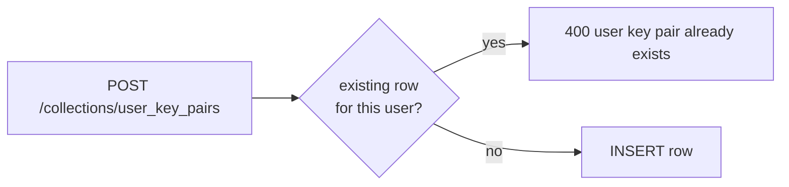

# Single User Key Pair

A user has **one and only one** `user_key_pairs` row. Creating a second is a
hard `400` from the `OnRecordCreateRequest("user_key_pairs")` hook.

Why: the key pair is the root of the user's vault. A second row would be
ambiguous — which one wraps the conversation secret keys? — and would let a
compromised session re-key the account silently. One row, set once at signup
during vault initialisation, is the unambiguous invariant.

The corresponding update endpoint (`PATCH /api/v1/user-key-pair/{id}`) only
accepts a `record_mac` change, so the public/secret key columns themselves
are immutable post-creation.

