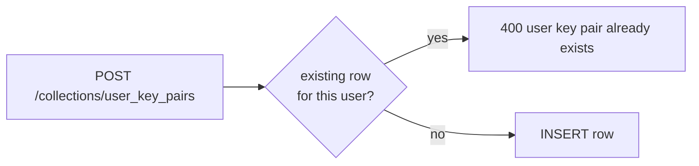

# Single Account Key Pair

An Account has **one and only one** `user_key_pairs` row. Creating a second is a
hard `400` from the `OnRecordCreateRequest("user_key_pairs")` hook.

Why: the Account key pair is the root of the Account's Vault. A second row would be
ambiguous — which one wraps the Conversation secret keys? — and would let a
compromised session re-key the Account silently. One row, set once when the
Account is created during Vault initialisation, is the unambiguous invariant.

The corresponding update endpoint (`PATCH /api/v1/user-key-pair/{id}`) only
accepts a `record_mac` change, so the public/secret key columns themselves
are immutable post-creation.

