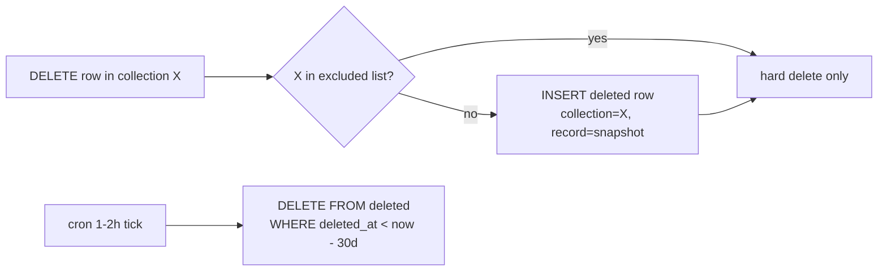

# Soft-Delete Retention

`hooks.SoftDelete` binds `OnRecordDeleteRequest` for **every** Pocketbase
collection. When a record is deleted, the hook copies a snapshot into the
`deleted` collection with `(collection, deleted_at, record)` so a
mis-delete can be inspected — and, if needed, restored — for up to 30 days.

A companion gocron job (`cleanUpDeletedRecordJob`, runs every 1–2 hours)
purges `deleted` rows older than 30 days.

**Excluded collections** (the snapshot is skipped entirely):

- `deleted` itself
- `conversation_public_keys`
- `conversation_secret_keys`
- `user_key_pairs`

Why exclude these: they hold key material. Copying a wrapped key into a
retention table that lives 30 days extends the window during which a DB
snapshot could be replayed against a revoked participant. The audit value
is also low — the
[key-version-read-gate](./key-version-read-gate.md) already preserves the
historical row in its original table, just invisibly to the API.

