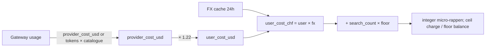

# Usage Cost Calculation

Every Completion's Account-facing cost runs through one canonical pipeline,
implemented in `billing.Service.CalculateCost`:

```text
1. provider_cost_usd  = gateway.usage.provider_cost_usd   (if reported)
                      ∨ catalogue.pricing × tokens         (fallback)
2. user_cost_usd      = provider_cost_usd × (1 + MARGIN)  ; MarginBPS, default 2200 = 22%
3. fx_rate            = FXRateProvider.USDToCHF()          ; cached 24h
4. user_cost_chf      = user_cost_usd × fx_rate
5. + web-search floor = search_count × floor_micro_rappen  ; only when the provider searched
6. metered in INTEGER micro-rappen (1 rappen = 1,000,000 µRp); charges CEIL
   up to rappen, balances FLOOR down — rounding never favours us twice
```



Why USD-first markup, then FX (and not the other way around): the margin is a
markup on **cost of goods sold**, which we incur in USD. Compounding the margin
in USD keeps it a stable percentage of provider invoices regardless of how the
CHF/USD pair moves. The math commutes, so the ordering is an audit choice, not
a numeric one.

The **web-search floor fee** exists because Requesty demonstrably does not
meter provider-side search (a live grounded Gemini call billed pure token
price), so a per-search fee would otherwise be silently eaten. It is added
whenever `search_count > 0` — even when a provider-reported total was trusted —
and is **already a post-margin Account holder price** (default `1_100_000` µRp ≈ 1.1 rappen
per search, provider fee + margin baked in), so it is never run through the
margin a second time. Configurable: `billing.web_search_floor_micro_rappen` /
`COGNOS_BILLING_WEB_SEARCH_FLOOR_MICRO_RAPPEN`; non-positive values fall back
to the default — **unset can never mean free searches**. See
[web-search](./web-search.md).

Storage rules:

- All ledger balances and transaction amounts are **integer rappen**. No
  floats touch the balance.
- USD values are kept as `DOUBLE` for analytics only.
- The FX rate used for a transaction is stored on the transaction row, so
  every figure on the ledger can be independently re-derived without
  hitting the live FX cache.

FX cache:
[`billing.CachedFXRateProvider`](../../backend/internal/billing/fx_rate.go)
wraps a fallback constant (or, in the future, a live ECB/SNB feed) with a
24-hour TTL. Non-positive upstream values fall back to
`DefaultFXRateFallbackUSDCHF = 0.88` so a misconfigured upstream never
multiplies the bill by zero.
