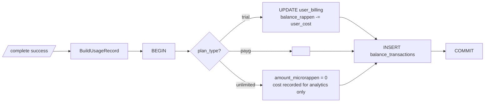

# Usage Ledger

`billing.PocketBaseRepo.RecordUsage` is the single seam where a completion
becomes a billing fact. Called once per successful gateway response, inside
a transaction.

For **trial** Accounts the same transaction also updates `user_billing.balance_microrappen`
so the running balance and the ledger row stay in lockstep:

`balance_transactions` columns set per row:

| Column                                  | Meaning                                                                    |
| --------------------------------------- | -------------------------------------------------------------------------- |
| `type`                                  | `"usage"`; refunds, adjustments and Trial seed use other types             |
| `amount_microrappen`                    | Exact signed amount; negative on Trial/PAYG and zero on Unlimited          |
| `provider_cost_microrappen`             | Exact Provider cost in CHF                                                 |
| `user_cost_microrappen`                 | Exact marked-up Account-facing cost                                        |
| `*_rappen`                              | Rounded display/compatibility projections of the exact fields              |
| `fx_rate_usd_chf`                       | FX snapshot used for this row                                              |
| `event_id`, `model_id`, `plan_type`     | Non-content audit dimensions                                               |
| `organisation`, `user_id`               | Billing subject and acting Account; Organisation is empty for personal use |
| `operation_type`                        | `text` or `image_generation`                                               |
| `generated_image_count`, `search_count` | Paid tool counts used for reconciliation                                   |
| `balance_after_microrappen`             | Personal Trial only; exact running balance after deduction                 |

Organisation Project usage records both the Organisation and acting Account, but never touches a
personal balance. Image generation uses the same ledger with `operation_type=image_generation`.

Why store FX, Provider cost, and tool counts separately from
`amount_microrappen`: every figure on the ledger must be independently auditable
from the others. With all present, anyone can re-derive:
`provider × (1 + margin) × fx + search_count × floor ≈ user_cost`, and
`balance_after = balance_before + amount` for trial.
