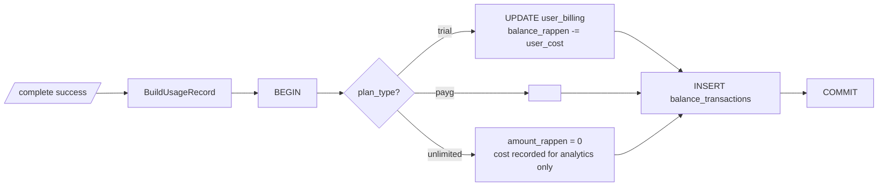

# Usage Ledger

`billing.PocketBaseRepo.RecordUsage` is the single seam where a completion
becomes a billing fact. Called once per successful gateway response, inside
a transaction.

For **trial** Accounts the same transaction also updates `user_billing.balance_rappen`
so the running balance and the ledger row stay in lockstep:

`balance_transactions` columns set per row:

| Column                 | Meaning                                                             |
| ---------------------- | ------------------------------------------------------------------- |
| `type`                 | `"usage"` (refunds, adjustments, trial seed use other types)        |
| `amount_rappen`        | Signed; **negative** for usage on trial/payg; **0** for unlimited   |
| `provider_cost_rappen` | Raw provider cost in CHF — recomputes margin without re-querying    |
| `user_cost_rappen`     | Marked-up user-facing cost                                          |
| `fx_rate_usd_chf`      | FX snapshot used for this row                                       |
| `event_id`             | UUID linking the row to its analytics event                         |
| `balance_after_rappen` | Trial only — running balance post-deduction                         |
| `search_count`         | Provider web searches in this completion — re-derives the floor fee |

Why store FX, provider cost, and search count separately from
`amount_rappen`: every figure on the ledger must be independently auditable
from the others. With all present, anyone can re-derive:
`provider × (1 + margin) × fx + search_count × floor ≈ user_cost`, and
`balance_after = balance_before + amount` for trial.
