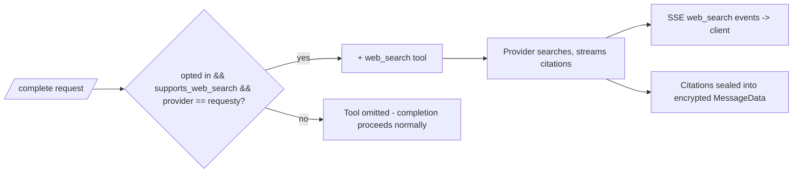

# Web Search

The model can search the web during a completion. Cognos never calls a search
engine itself — the backend passes one `web_search` tool declaration to
Requesty's Responses API and the **provider** searches (Gemini grounding,
Anthropic/OpenAI native search).

The rule: **the tool is attached only when all three hold, and is silently
dropped otherwise — never a 400, because search is best-effort, not the
requested operation** (contrast [model-capability-gating](./model-capability-gating.md)):

1. the request didn't opt out (`webSearch` defaults to **true**; the composer
   toggle sends `false`),
2. the model has `supports_web_search` — which only EU-hosted Requesty models
   can carry (see [requesty-model-sync](./requesty-model-sync.md)),
3. the provider is Requesty (Infomaniak never searches).

Properties this gives us:

- **Same trust boundary as messages.** Search queries are model-derived from
  the already client-side-redacted context; citations arrive in-flight and are
  persisted only inside the sealed message blob. Nothing search-related is
  stored or logged in plaintext — logs carry `search_count`/`citation_count`
  only, never URLs, titles, or query text.
- **EU residency is enforced at sync time, not request time** — a model that
  isn't EU-hosted can never present the capability in the first place.
- **Users click real URLs, not Google proxies** — Vertex grounding-redirect
  links are resolved server-side before streaming and sealing; see
  [grounding-redirect-resolution](./grounding-redirect-resolution.md) for the
  full rule and its compliance constraints.
- **Silent drop keeps model switching safe**: changing to a non-searching model
  mid-conversation just loses the tool, never errors.
- **Every search is billed**: a per-search floor fee applies whenever the
  provider searched, because Requesty demonstrably does not meter provider-side
  search (see [usage-cost-calculation](./usage-cost-calculation.md)).

Authoritative code: `backend/internal/handler/complete.go` (`enableWebSearch`
gate), `backend/internal/gateway/bifrost_client.go` (tool + citation
normalisation), `backend/internal/catalogue/requestysync/enrich.go` (EU
predicate). Spec: `docs/specs/web-search.md`.
