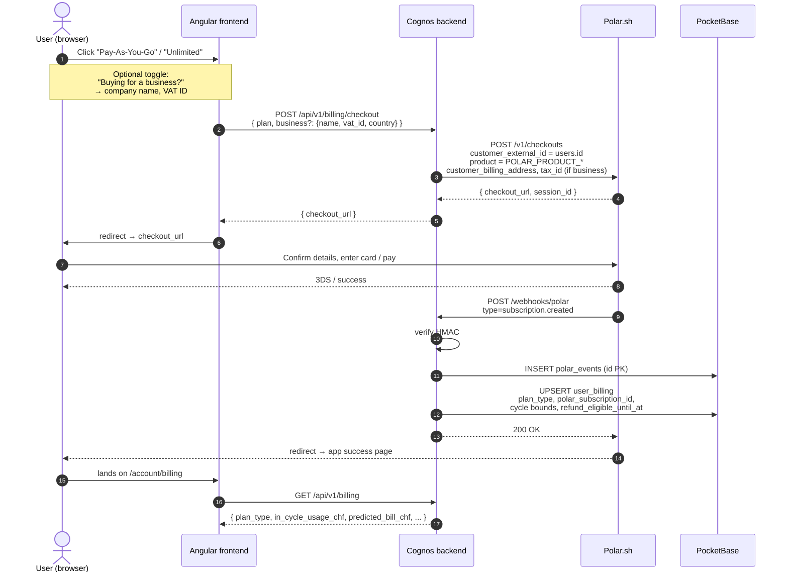
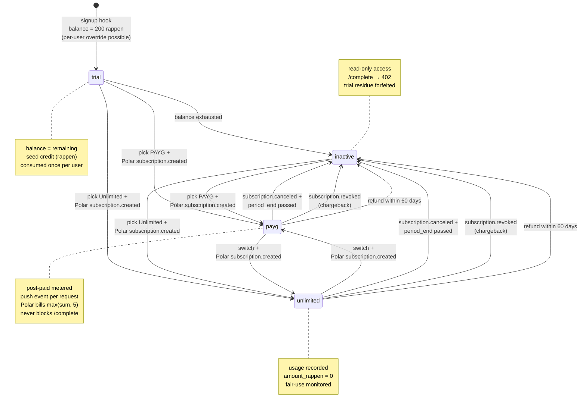
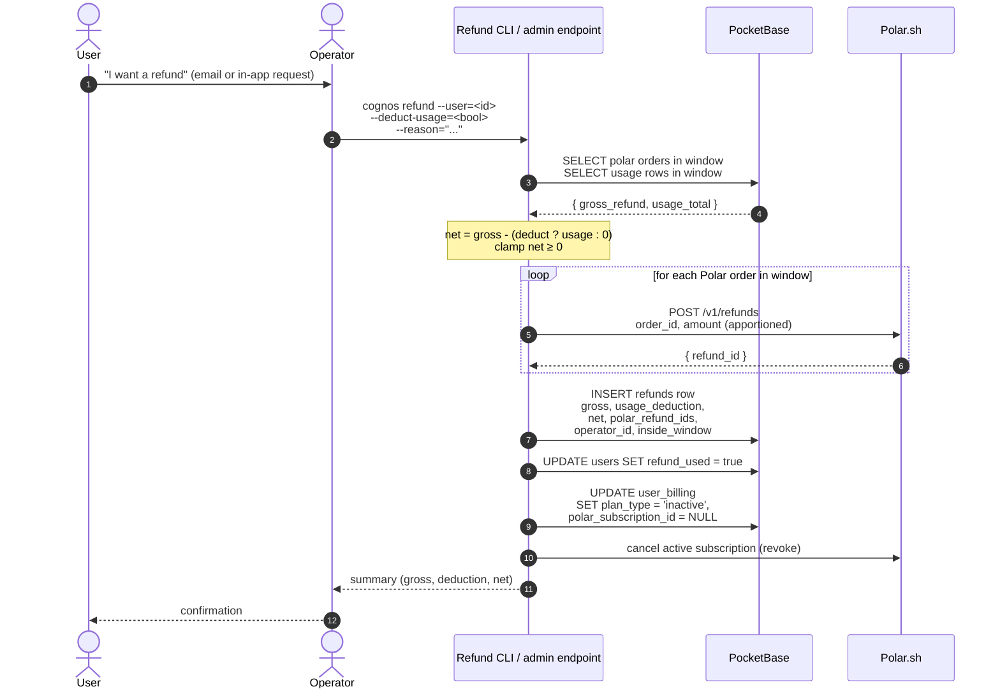
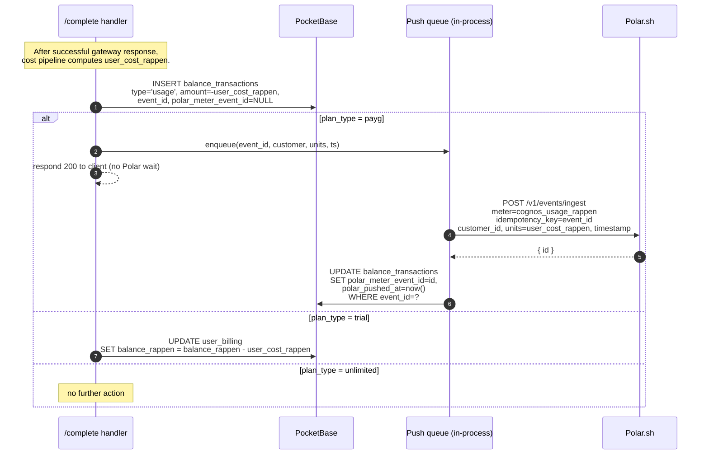
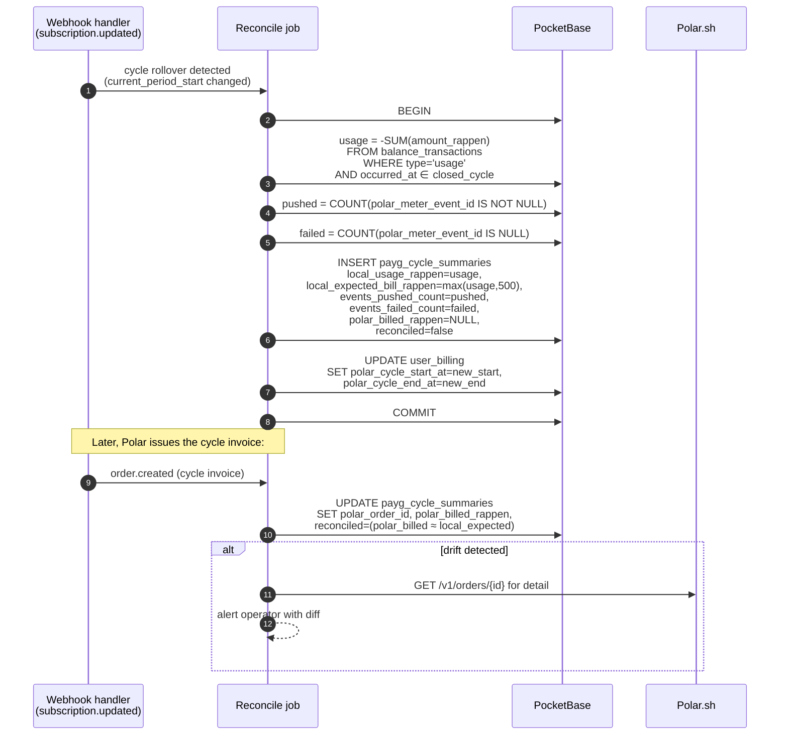

# Cognos Billing — Architecture Specification

**Version:** 0.3 (Draft) **Status:** Ready for review **Stack:** Go (backend), Angular (frontend),
PocketBase/SQLite (primary store), Polar.sh (metered subscriptions + tax)

---

## Table of Contents

1. [Overview & Goals](#1-overview--goals)
2. [Relationship to the Model-Selector Spec](#2-relationship-to-the-model-selector-spec)
3. [Plans](#3-plans)
4. [Pricing & Cost Calculation](#4-pricing--cost-calculation)
5. [Polar.sh Integration](#5-polarsh-integration)
6. [Billing State Machine](#6-billing-state-machine)
7. [Money-Back Guarantee](#7-money-back-guarantee)
8. [Fair-Use Policy (Unlimited Plan)](#8-fair-use-policy-unlimited-plan)
9. [Data Model](#9-data-model)
10. [Webhook Handler](#10-webhook-handler)
11. [PAYG Metered Usage Push & Cycle Reconciliation](#11-payg-metered-usage-push--cycle-reconciliation)
12. [APIs](#12-apis)
13. [UI / UX Touchpoints](#13-ui--ux-touchpoints)
14. [Failure Modes & Edge Cases](#14-failure-modes--edge-cases)
15. [Tax & Compliance Notes](#15-tax--compliance-notes)
16. [Implementation Roadmap](#16-implementation-roadmap)
17. [Resolved Decisions](#17-resolved-decisions)

---

## 1. Overview & Goals

Cognos charges all users for access. Two plans are offered, both billed in **CHF** (excluding
tax — Polar.sh adds tax on top at checkout). All payments are processed through **Polar.sh**, which
acts as the Merchant of Record and handles VAT / sales-tax compliance on our behalf.

The product offers a **60-day money-back guarantee** on every first purchase. Users may also be
refunded later at our discretion, with provider usage optionally deducted (see Section 7).

### Goals

1. Charge users in CHF using Polar.sh as the only payment surface.
2. Support two plans — **Pay-As-You-Go** and **Unlimited (with fair usage)** — plus a small free
   trial on signup that converts into a read-only state after exhaustion.
3. Apply a **20% margin** to provider COGS on PAYG, transparently to the user (they see Cognos
   prices, not provider prices).
4. Bill PAYG via **Polar's metered (usage-based) subscription** with a CHF 5/month minimum
   commit: every completion pushes a usage event to Polar with the user-facing cost in rappen,
   Polar invoices `max(sum(usage), CHF 5)` at cycle end automatically. We keep a parallel copy of
   every event in our own `balance_transactions` ledger for dashboard, audit, and reconciliation.
5. Track usage for the Unlimited plan but do not block — surface abuse to operators via a nightly
   internal report.
6. Honour the **60-day money-back guarantee** with a documented refund process and a clear ledger.
7. Store every Polar webhook event so we can replay, audit, and reconcile.

### Non-goals (this spec)

- Self-serve plan migration UI in production polish (manual admin path acceptable initially).
- Multi-currency display (CHF only; Polar may render local-currency equivalents at checkout).
- Invoicing infrastructure — Polar produces invoices.
- Dunning automation beyond what Polar provides natively.

---

## 2. Relationship to the Model-Selector Spec

This document **supersedes** the billing portions of
[`backend-model-selector.md`](./backend-model-selector.md) (Section 4.4 and the `user_billing` /
`balance_transactions` schemas) with the following amendments:

| Topic              | Old (`backend-model-selector.md`)  | New (this spec)                                                                                |
| ------------------ | ---------------------------------- | ---------------------------------------------------------------------------------------------- |
| PAYG mechanism     | CHF 5 base fee (mechanism unclear) | **Post-paid metered via Polar**: push event per completion → Polar bills `max(sum, CHF 5)`/mo  |
| Unlimited price    | CHF 35/mo                          | **CHF 100/mo** or **CHF 1000/yr** (2 months free)                                              |
| Plan enum value    | `flat_rate`                        | `unlimited` (rename — `flat_rate` kept as a temporary alias if needed)                         |
| Margin             | Not defined                        | **+20%** on provider USD cost, then convert to CHF                                             |
| Payment processor  | Not defined ("manual for now")     | **Polar.sh** (Merchant of Record, handles tax)                                                 |
| Free state         | Not defined                        | CHF 2 signup credit (per-user override via DB) → read-only after exhaustion                    |
| Refund policy      | Not defined                        | 60-day money-back, optional usage deduction, one refund per user lifetime                      |
| Business invoicing | Not defined                        | Surfaced at checkout (company name + VAT ID forwarded to Polar)                                |
| Currency           | Not defined                        | **CHF only**, end-to-end. EUR fallback only if Polar doesn't yet support CHF subscriptions     |

All other content in `backend-model-selector.md` (model catalogue, gateway, encryption, analytics)
is unchanged and remains the source of truth.

The existing `backend/internal/billing/service.go` (`CalculateCost`, `CanAfford`) is the
implementation starting point. This spec extends it with margin, plan-aware behaviour, and Polar
integration.

---

## 3. Plans

There are exactly three billing states a user can be in. Every authenticated user is in **exactly
one** at any moment.

| State            | Plan enum value | Price (excl. tax)                                                 | Usage handling                                                                                |
| ---------------- | --------------- | ----------------------------------------------------------------- | --------------------------------------------------------------------------------------------- |
| Trial            | `trial`         | Free, capped to seed credit (default CHF 2.00; per-user override) | Usage deducts from `balance_rappen` (internal credit). After exhaustion → `inactive`.         |
| Pay-As-You-Go    | `payg`          | `max(sum(usage), CHF 5)` per cycle, billed by Polar at cycle end  | Post-paid. Each completion pushes a usage event to Polar + writes a local `usage` ledger row. |
| Unlimited        | `unlimited`     | CHF 100/mo **or** CHF 1000/yr (≈ 2 months free)                   | Usage recorded for analytics + fair-use monitoring; no billing impact per request.            |
| (transient) None | `inactive`      | n/a                                                               | `/complete` returns 402. Read-only access to history/settings retained.                       |

### 3.1 Trial

- Granted automatically on first successful signup.
- Default seed amount **CHF 2.00 (200 rappen)**, configurable via `BILLING_TRIAL_SEED_RAPPEN`.
- **Per-user override** supported via the `trial_seed_overrides` table (keyed on email, consumed
  by the signup hook). Marketing / sales can pre-stage a larger seed for invited users without
  changing the global default. See Section 9.2.
- Lives in `user_billing.balance_rappen` with `plan_type = "trial"`.
- Usage deducts from the seed balance using the same PAYG cost formula (provider cost × 1.20 → CHF).
  Margin is applied even on trial so behaviour is identical post-conversion.
- When balance would go below 0, the `/complete` request is rejected with `402` and the plan
  transitions to `inactive`. The current completion is not partially served.
- Trial credit does **not** roll over into PAYG or Unlimited — it is consumed or expires.
- A user is granted trial credit **exactly once** in their lifetime, keyed on `users.id`. Operators
  can grant additional ad-hoc credit later via an `adjustment` transaction (Section 12.7).

### 3.2 Pay-As-You-Go (post-paid, metered via Polar)

PAYG is a **post-paid metered subscription**. The user subscribes once via Polar; thereafter every
completion is reported to Polar as a usage event and Polar invoices `max(sum(usage), CHF 5.00)` at
cycle end. We mirror every event into our own `balance_transactions` ledger so the dashboard,
margin reporting, and refund flow don't depend on Polar's API for read-back.

- **Polar product shape**: a single recurring subscription, `cognos-payg`, configured with a
  **CHF 5.00 minimum commit per cycle** and a **per-unit metered overage** at CHF 0.01 / unit
  where one unit equals one rappen of `user_cost`. Net effect:
    - Usage ≤ CHF 5 in the cycle → Polar bills CHF 5 (the commit).
    - Usage > CHF 5 in the cycle → Polar bills `usage` exactly (commit absorbed into usage).
  This achieves `max(usage, CHF 5)` without any cycle-end gymnastics on our side.
- **Plan start**: Polar `subscription.created` for `cognos-payg` → `plan_type = "payg"`. No
  balance is set; the user's PAYG state is purely "subscribed to the metered product".
- **Per-completion event push (Section 11)**: after each successful gateway call, the backend
  pushes an event to Polar's meter ingestion endpoint with `idempotency_key = ledger.event_id`,
  `customer_id`, `units = user_cost_rappen`, and `timestamp`. This is done **best-effort**: the
  HTTP response to the user is not delayed for Polar; failures are queued for asynchronous retry.
- **Cycle end**: Polar issues an invoice (`order.created` webhook). We record the order against
  the cycle for reconciliation but do **not** modify any balance — there is no balance.
- **No "out of balance" state**: PAYG users are never blocked for funds. They could in principle
  accrue arbitrary usage in a cycle, hence the soft spending-alert mechanism in Section 14.11.
- **Subscription cancellation**: at `period_end` the plan transitions to `inactive`. The final
  cycle's accrued usage is still billed by Polar.
- **Failed payment**: Polar's dunning runs. If Polar gives up (`subscription.revoked`) the user
  drops to `inactive`. The unpaid invoice remains on the Polar customer record for collection.
- **Plan switch PAYG → Unlimited**: takes effect immediately on Polar's side; final PAYG cycle is
  billed as normal (`max(usage_so_far, CHF 5)`).

> **Why route through Polar's metered billing?** Polar already handles invoicing, tax, dunning,
> and minimum-commit math. Pushing events lets it be the source of truth for what the customer
> owes; our ledger is the source of truth for what the customer used (and for our margin against
> provider cost). Two clean roles, no duplicated billing logic.

### 3.3 Unlimited

- Two Polar products: **`unlimited_monthly`** (CHF 100/mo) and **`unlimited_annual`** (CHF 1000/yr).
- Annual is a single Polar subscription product; the CHF 200/yr discount is encoded directly in the
  product price (no coupon code required).
- Renewal is automatic via Polar. Cancellation = no auto-renew at next cycle boundary.
- Every completion still writes a `usage` row to `balance_transactions` with
  `amount_rappen = 0` (i.e. no balance impact) and the real cost recorded in
  `provider_cost_rappen` / `user_cost_rappen` columns (see schema). This keeps a complete picture
  of provider COGS per user for fair-use review (Section 8) without affecting their balance.

### 3.4 Plan switches — summary

| From → To                         | When does it take effect?                            | Billing / Refund                                                                    |
| --------------------------------- | ---------------------------------------------------- | ----------------------------------------------------------------------------------- |
| Trial → PAYG / Unlimited          | On Polar `subscription.created`                      | Trial credit is consumed/abandoned, not migrated                                    |
| PAYG → Unlimited (monthly/annual) | Immediately                                          | Final PAYG cycle billed as `max(usage_to_now, CHF 5)`                               |
| Unlimited (monthly) → PAYG        | At end of current paid period                        | New PAYG cycle starts at switch                                                     |
| Unlimited (annual) → PAYG         | At end of current paid period (no pro-rata refund)   | New PAYG cycle starts at switch; refund only inside 60-day window                   |
| Unlimited monthly ↔ annual        | At end of current paid period (no pro-rata)          | No refund unless inside 60-day window                                               |
| Any → cancelled (`inactive`)      | At end of current paid period                        | PAYG: final cycle bill still issued; refund only inside 60-day window               |

---

## 4. Pricing & Cost Calculation

### 4.1 Margin and FX — the canonical pipeline

The single canonical cost pipeline for every completion:


```text
1.  provider_cost_usd       <- gateway response (if reported) OR catalogue * tokens
2.  user_cost_usd           <- provider_cost_usd * (1 + MARGIN)         # MARGIN = 0.20
3.  fx_rate_usd_chf         <- FX cache (refreshed daily, see 4.3)
4.  user_cost_chf           <- user_cost_usd * fx_rate_usd_chf
5.  user_cost_rappen        <- round(user_cost_chf * 100)               # integer
6.  provider_cost_rappen    <- round(provider_cost_usd * fx_rate * 100) # for analytics only
```

Why USD-first markup, then FX?

- The 20% is margin on **cost of goods sold**, which is incurred in USD. Compounding it in the
  cost denomination keeps the margin a stable percentage relative to provider invoices regardless
  of FX swings.
- We store three values (`provider_cost_usd`, `user_cost_usd`, `user_cost_chf`) plus the FX rate
  at request time — every figure on the ledger is independently auditable from the others.
- Mathematically `a*1.2*b == a*b*1.2`, so this is a clarity/audit choice, not a numeric one.

### 4.2 Storage rules

- **All monetary balances and transaction amounts are stored as integer Rappen.** 1 CHF = 100
  Rappen. No floats in the ledger.
- USD values (`provider_cost_usd`, `user_cost_usd`) are stored as `DOUBLE` for analytics only;
  they are never used to drive balance arithmetic.
- The FX rate used for a transaction is stored alongside that transaction — never re-derived.
- `balance_rappen` must never go negative for any plan. The completion handler reserves an
  upper-bound cost (Section 14.5) before calling the gateway and rejects with `402` if the user
  cannot afford it.

### 4.3 FX rate

- Source: ECB or SNB daily reference rate, fetched once per `FX_RATE_REFRESH_HOURS` (default 24).
- Fallback constant in env (`FX_RATE_FALLBACK_USD_CHF`) used if the fetch fails on startup.
- The rate snapshot used for a request is **captured at the time of the gateway call** — not at
  cycle end. This locks the user-facing cost for that completion regardless of later FX moves.

### 4.4 Configurable values

| Config                                 | Default                | Notes                                                                    |
| -------------------------------------- | ---------------------- | ------------------------------------------------------------------------ |
| `BILLING_MARGIN_BPS`                   | `2000` (= 20.00%)      | Basis points; allows fine adjustment without code change.                |
| `BILLING_PAYG_MIN_COMMIT_RAPPEN`       | `500` (CHF 5.00)       | Minimum commit per PAYG cycle, configured on Polar product. Shown in UI. |
| `BILLING_PAYG_SOFT_ALERT_RAPPEN`       | `5000` (CHF 50.00)     | Per-user in-cycle alert threshold (Section 14.11).                       |
| `BILLING_UNLIMITED_MONTHLY_RAPPEN`     | `10000` (CHF 100.00)   | Polar subscription price (excl. tax).                                    |
| `BILLING_UNLIMITED_ANNUAL_RAPPEN`      | `100000` (CHF 1000.00) | Polar subscription price (excl. tax).                                    |
| `BILLING_TRIAL_SEED_RAPPEN`            | `200` (CHF 2.00)       | Granted once on signup, unless per-user override is staged.              |
| `BILLING_REFUND_GUARANTEE_DAYS`        | `60`                   | Money-back window.                                                       |
| `BILLING_UNLIMITED_FAIR_USE_ALERT_CHF` | `200.0`                | Nightly alert threshold (user-cost CHF). 2× monthly price.               |

---

## 5. Polar.sh Integration

### 5.1 Product catalogue (Polar side)

We need three Polar products (Sandbox + Production), plus one meter:

| Polar product slug   | Type                                                | Pricing (excl. tax)                                                                                  | Maps to            |
| -------------------- | --------------------------------------------------- | ---------------------------------------------------------------------------------------------------- | ------------------ |
| `cognos-payg`        | Recurring (monthly) **metered with minimum commit** | CHF 5.00 minimum commit + CHF 0.01 per unit of `cognos_usage_rappen` (commit credited against usage) | PAYG subscription. |
| `cognos-unlimited-m` | Recurring (monthly)                                 | CHF 100.00                                                                                           | Unlimited monthly. |
| `cognos-unlimited-y` | Recurring (annual)                                  | CHF 1000.00 (≈ 2 months free vs monthly)                                                             | Unlimited annual.  |

Polar meter:

| Polar meter slug       | Unit description                                                              |
| ---------------------- | ----------------------------------------------------------------------------- |
| `cognos_usage_rappen`  | One unit = one rappen (CHF 0.01) of user-facing cost incurred by a completion.|

> **Polar product configuration note.** The exact UI / API names for "minimum commit absorbed by
> metered overage" vary across Polar's product surface. The net behaviour we want is:
> `cycle_invoice = max(sum(meter_units) × 0.01, CHF 5.00)`. If Polar's product builder cannot
> express this directly, the equivalent fallback is "CHF 0.01/unit metered, no base" + a backend
> top-off event of `max(0, 500 - sum)` rappen pushed at cycle-end. Either way, the user is
> charged exactly `max(usage, CHF 5)`. Confirm at integration time.

### 5.2 Currency

**CHF, end-to-end.** Being a Swiss company with a privacy-first brand is core to our positioning,
so the storefront, ledger, dashboards, invoices, and refund flows all transact in CHF. The
integration plan assumes Polar supports CHF-denominated subscriptions for our org.

If at integration time CHF is not yet available for the product type we need, the **single
documented fallback** is EUR-denominated products with prices set to the day-of CHF equivalent
(round to the nearest EUR 0.10). Internal accounting stays in CHF regardless: every Polar order
is recorded against its CHF intent using the FX rate captured at order time. This fallback is
explicitly a temporary measure and should be reversed once Polar adds CHF support.

### 5.3 Configuration

```bash
# ── Polar.sh ──────────────────────────────────────────────
POLAR_API_BASE=https://api.polar.sh                 # or sandbox host
POLAR_ORG_ID=org_xxx
POLAR_ACCESS_TOKEN=polar_xxx                        # server-side; never client
POLAR_WEBHOOK_SECRET=whsec_xxx                      # for HMAC verification
POLAR_PRODUCT_PAYG=prod_xxx
POLAR_PRODUCT_UNLIMITED_MONTHLY=prod_xxx
POLAR_PRODUCT_UNLIMITED_ANNUAL=prod_xxx
POLAR_METER_PAYG_USAGE=meter_xxx                    # cognos_usage_rappen
POLAR_INGEST_ENDPOINT=/v1/events/ingest             # confirm at integration time
POLAR_USAGE_PUSH_QUEUE_MAX=10000                    # in-process queue size before backpressure
```

### 5.4 Webhook events we listen for

| Polar event             | What we do                                                                                                                |
| ----------------------- | ------------------------------------------------------------------------------------------------------------------------- |
| `subscription.created`  | Transition user `trial`/`inactive` → `payg`/`unlimited`. Snapshot `polar_subscription_id`, cycle bounds.                  |
| `subscription.updated`  | Cycle rollover: record a new `payg_cycle_summaries` row for the closing cycle and reset our cycle bookkeeping.            |
| `subscription.canceled` | Mark plan ending at `current_period_end`. After that timestamp passes, transition to `inactive`.                          |
| `subscription.active`   | Defensive re-sync to `payg`/`unlimited` (e.g. after dunning recovery).                                                    |
| `subscription.revoked`  | Hard cancel — set plan to `inactive` immediately (used in chargebacks).                                                   |
| `order.created`         | Cycle invoice from Polar — record `polar_order_id` against the cycle summary for audit. No balance action.                |
| `order.refunded`        | Insert a `refund` row recording the refunded amount and metadata. No balance reversal (Polar already adjusted the order). |
| `customer.updated`      | Sync email / customer metadata if changed externally.                                                                     |

All other Polar event types are logged to `polar_events` for replay but otherwise ignored.

### 5.5 Idempotency & verification

- Every webhook hit verifies the HMAC signature using `POLAR_WEBHOOK_SECRET`. Bad signature → 401
  and no DB write.
- Polar's event ID (e.g. `evt_xyz`) is the primary key on `polar_events`. Re-delivery is a no-op.
- Webhook handler is `O(1)` work: write the raw event, enqueue domain side-effects on a separate
  internal queue. Re-deliveries from Polar don't compound side effects.

### 5.6 Checkout sequence



### 5.7 Server-to-Polar calls

The backend calls Polar to:

- Create a **checkout session** when a logged-in user chooses a plan or a top-up pack
  (`POST /v1/checkouts`), forwarding business invoicing details when supplied.
- Cancel / reactivate a user's subscription if they hit "cancel" in our UI (or we proxy to Polar's
  hosted customer portal — see 13.4).
- Issue **refunds** via the Polar API as part of the money-back flow (Section 7).

Each call is retried with exponential backoff up to 5 minutes; persistent failure raises an alert.

---

## 6. Billing State Machine



Edges:

- **signup**: PocketBase user `OnRecordAfterCreate` hook → `user_billing` row with
  `plan_type='trial'`, `balance_rappen = override(email) ?? BILLING_TRIAL_SEED_RAPPEN`
  (default 200 = CHF 2.00).
- **trial → inactive**: triggered inside the completion handler when `CanAfford` returns false.
  Sets `plan_type='inactive'`, `balance_rappen=0`. Trial credit is forfeited on transition; it
  does not migrate to a subsequent paid plan.
- **inactive → payg|unlimited**: triggered by Polar `subscription.created` webhook. Sets
  `plan_type`, `polar_subscription_id`, `polar_cycle_*` bounds, `refund_eligible_until_at`.
- **PAYG usage push**: each completion writes a `usage` row to `balance_transactions` and
  enqueues a Polar meter event with the same `event_id` for idempotency. Polar accrues the units
  against the cycle invoice. See Section 11.
- **payg|unlimited → inactive**: scheduled by `subscription.canceled` + `period_end` cron, or
  immediate via `subscription.revoked`. For PAYG, Polar still issues the final cycle invoice
  after the transition.

A user's state and Polar state must reconcile every cycle (Section 14.2).

---

## 7. Money-Back Guarantee

### 7.1 Policy

- **Window**: 60 calendar days from the **first successful Polar payment of the active
  subscription** (`refund_eligible_until_at` is snapshotted at subscription creation).
- **Trigger**: user emails support / clicks a "request refund" button. Initial implementation is
  email-driven; an in-app self-serve refund flow can come later.
- **Scope**: applies to the first paid period only (the initial monthly or annual payment). For
  annual users, this is potentially significant — a full CHF 1000 refund is on the table for 60
  days.
- **Usage deduction**: at operator discretion, we may deduct the actual user-facing cost of usage
  consumed in the refund period from the refund amount. The deducted figure uses the same PAYG
  formula (provider cost × 1.20, converted to CHF at the snapshot FX rate).
- **One-time per customer**: each `users.id` is eligible for the refund exactly once in their
  lifetime, even if they later sign up for a different plan.

### 7.2 Refund cases — examples

| Case                                            | Refund                                                       |
| ----------------------------------------------- | ------------------------------------------------------------ |
| Unlimited annual @ day 5, ~zero usage           | Full CHF 1000.                                               |
| Unlimited annual @ day 40, CHF 50 of usage      | Full CHF 1000 OR CHF 950 (operator chooses).                 |
| Unlimited annual @ day 90                       | No refund (outside window). Goodwill case only.              |
| PAYG @ day 30, CHF 12 billed, complaint         | Refund CHF 12 (last cycle). Usage deduction at op discretion.|
| Unlimited monthly @ day 5                       | Full CHF 100.                                                |
| Unlimited monthly @ day 35, on month 2          | Last month's CHF 100 only (still in 60d window).             |

### 7.3 Process



1. Support agent loads the user's `/admin/billing/{user_id}` page (or runs a CLI command):
   `cognos refund --user=<id> --reason="..." --deduct-usage=<true|false>`
2. The tool computes:
   - `gross_refund_rappen` = sum of Polar orders/subscription charges in the refund window
   - `usage_deduction_rappen` = (optional) sum of `user_cost_rappen` for usage rows in that window
   - `net_refund_rappen` = `gross_refund_rappen - usage_deduction_rappen` (clamped ≥ 0)
3. The tool calls Polar's refund API for each underlying Polar order with the apportioned amount.
4. A `refund` row is written with `polar_refund_ids`, the breakdown, and the operator who
   authorised it.
5. The user's plan is moved to `inactive` (refund implies they didn't want it).
6. `users.refund_used = true` is set to enforce one-per-lifetime.

### 7.4 Goodwill refunds outside the 60-day window

These exist but are not codified. The same CLI command works with a `--force` flag and a written
reason. There is no automatic limit.

### 7.5 Chargebacks

When Polar fires `subscription.revoked` / equivalent for a chargeback, we treat it the same as a
refund (set plan to `inactive`, log the event, no auto-reversal of usage data). Operators are
notified for fraud review.

---

## 8. Fair-Use Policy (Unlimited Plan)

The Unlimited plan is marketed as predictable pricing for typical individual / business use. It
is **not** a license for industrial-scale automation.

### 8.1 Enforcement model

**Monitor only. No automated user-facing block.** A nightly DuckDB query against the analytics
parquet files identifies any `unlimited` user whose 30-day rolling user-facing cost exceeds
`BILLING_UNLIMITED_FAIR_USE_ALERT_CHF` (default CHF 200/mo — i.e. 2× the monthly price).

```sql
SELECT
    billing_user_id,
    SUM(user_cost_chf) AS rolling_30d_cost_chf,
    COUNT(*)           AS request_count
FROM read_parquet('s3://cognos-analytics/events/**/*.parquet')
WHERE
    plan_type = 'unlimited'
    AND occurred_at >= NOW() - INTERVAL 30 DAY
GROUP BY billing_user_id
HAVING SUM(user_cost_chf) > 200.0
ORDER BY rolling_30d_cost_chf DESC;
```

Result is delivered to an internal email/Slack channel. Operator decides per-case action:

- Reach out, ask about use case.
- Suggest a custom Enterprise contract.
- In egregious abuse cases (>10× monthly price, clear automation), apply a manual rate limit or
  request migration to PAYG with notice.

### 8.2 Marketing copy

Wherever the Unlimited plan is advertised, the page must include a single sentence near the
purchase CTA: **"Subject to a fair-use policy for human, conversational use."** No specific CHF
threshold is published — it stays internal.

---

## 9. Data Model

### 9.1 Changes to existing tables

#### `users` (additions)

| Field                  | Type     | Notes                                                                  |
| ---------------------- | -------- | ---------------------------------------------------------------------- |
| `refund_used`          | Bool     | Default false. Set true when a refund has been issued (lifetime flag). |
| `polar_customer_id`    | Text     | Polar's customer ID, set on first Polar interaction. Nullable.         |
| `business_name`        | Text     | Company name for invoicing if the user buys for a business. Nullable.  |
| `business_vat_id`      | Text     | VAT/UID registration. Forwarded to Polar at checkout. Nullable.        |
| `business_country`     | Text     | ISO 3166-1 alpha-2 country code for the business address. Nullable.    |

#### `user_billing` (rename / extend)

| Field                          | Type     | Notes                                                                                                |
| ------------------------------ | -------- | ---------------------------------------------------------------------------------------------------- |
| `id`                           | Text PK  | Existing. This remains the opaque `billing_user_id` used in analytics.                               |
| `user_id`                      | FK users | Existing.                                                                                            |
| `plan_type`                    | Text     | Now one of: `trial`, `payg`, `unlimited`, `inactive`. (Old `flat_rate` migrated to `unlimited`.)     |
| `plan_started_at`              | DateTime | Existing.                                                                                            |
| `plan_ends_at`                 | DateTime | Existing. Set when scheduled to cancel.                                                              |
| `balance_rappen`               | Integer  | Existing. Always ≥ 0. Spendable credit for `trial` only. Zero for `payg` / `unlimited` / `inactive`. |
| `polar_subscription_id`        | Text     | NEW. Active Polar subscription ID. Null for `trial`/`inactive`.                                      |
| `polar_product_id`             | Text     | NEW. Polar product the subscription points at.                                                       |
| `polar_cycle_start_at`         | DateTime | NEW. Current Polar billing cycle start.                                                              |
| `polar_cycle_end_at`           | DateTime | NEW. Current Polar billing cycle end (= renewal/cancel boundary).                                    |
| `refund_eligible_until_at`     | DateTime | NEW. Snapshot of `first_payment_at + 60 days`. Null for `trial`.                                     |
| `trial_seed_granted_rappen`    | Integer  | NEW. What was actually granted on signup (default vs override). Audit field.                         |

#### `balance_transactions` (extend)

| Field                  | Type     | Notes                                                                                                     |
| ---------------------- | -------- | --------------------------------------------------------------------------------------------------------- |
| `id`                   | Text PK  | Existing.                                                                                                 |
| `user_id`              | FK users | Existing.                                                                                                 |
| `occurred_at`          | DateTime | Existing.                                                                                                 |
| `type`                 | Text     | One of: `usage`, `refund`, `trial_seed`, `adjustment`. (Plan-credit types no longer needed.)              |
| `amount_rappen`        | Integer  | Signed: negative for `usage`/`refund`; positive for `trial_seed`/`adjustment`.                            |
| `balance_after_rappen` | Integer  | Trial: balance after this row. PAYG/Unlimited: not meaningful (set to 0).                                 |
| `event_id`             | Text     | Existing — links to analytics `event_id` for `usage`. Null otherwise.                                     |
| `polar_order_id`       | Text     | Null for most rows; populated for `refund` rows linking to the refunded Polar order.                      |
| `polar_meter_event_id` | Text     | NEW. For PAYG `usage` rows: ID returned by Polar's meter ingest API. Null if push pending/failed.         |
| `polar_pushed_at`      | DateTime | NEW. Timestamp of successful push. Null while queued.                                                     |
| `provider_cost_rappen` | Integer  | NEW. For `usage` rows only. The raw provider cost in CHF (no margin). Allows margin recomputation.        |
| `user_cost_rappen`     | Integer  | NEW. For `usage` rows only. The marked-up user-facing cost in CHF. = `-amount_rappen` for PAYG.           |
| `fx_rate_usd_chf`      | Double   | NEW. For `usage` rows only. The FX rate snapshot at request time.                                         |
| `description`          | Text     | Existing.                                                                                                 |

### 9.2 New tables

#### `polar_events`

Raw, deduplicated webhook log. Source of truth for everything Polar tells us.

| Field                   | Type     | Notes                                                                  |
| ----------------------- | -------- | ---------------------------------------------------------------------- |
| `id`                    | Text PK  | Polar event ID (e.g. `evt_xxx`). Primary key — natural idempotency.    |
| `received_at`           | DateTime | When we received it.                                                   |
| `type`                  | Text     | Polar event type (e.g. `subscription.created`).                        |
| `polar_customer_id`     | Text     | Indexed for join.                                                      |
| `polar_subscription_id` | Text     | Indexed.                                                               |
| `polar_order_id`        | Text     | Indexed.                                                               |
| `payload_json`          | Text     | Full webhook body as received.                                         |
| `processed_at`          | DateTime | Null until our domain handler completes. Allows replay of unprocessed. |
| `processing_error`      | Text     | Null on success. Last error if any.                                    |

#### `refunds`

| Field                     | Type     | Notes                                                                            |
| ------------------------- | -------- | -------------------------------------------------------------------------------- |
| `id`                      | Text PK  | UUID.                                                                            |
| `user_id`                 | FK users |                                                                                  |
| `requested_at`            | DateTime |                                                                                  |
| `processed_at`            | DateTime | Null until completed.                                                            |
| `gross_refund_rappen`     | Integer  | Pre-deduction.                                                                   |
| `usage_deduction_rappen`  | Integer  | 0 if no deduction applied.                                                       |
| `net_refund_rappen`       | Integer  | What we actually refunded via Polar.                                             |
| `reason_text`             | Text     | Operator-recorded reason.                                                        |
| `operator_id`             | Text     | The admin user who authorised it.                                                |
| `polar_refund_ids_json`   | Text     | JSON array of Polar refund IDs created (may be multiple if window spans orders). |
| `inside_guarantee_window` | Bool     | True if requested within 60-day window.                                          |

#### `trial_seed_overrides`

Pre-staged trial credits matched on signup email. Allows marketing/sales to grant a larger trial
seed to specific invitees without changing the global default.

| Field           | Type     | Notes                                                                          |
| --------------- | -------- | ------------------------------------------------------------------------------ |
| `email`         | Text PK  | Lowercased.                                                                    |
| `rappen`        | Integer  | The seed amount to grant on signup (instead of `BILLING_TRIAL_SEED_RAPPEN`).   |
| `reason_text`   | Text     | e.g. "Conference giveaway 2026-06", "Partner programme".                       |
| `set_by`        | Text     | Admin user who staged it.                                                      |
| `set_at`        | DateTime |                                                                                |
| `expires_at`    | DateTime | Override is ignored if the user signs up after this. Nullable.                 |
| `consumed_at`   | DateTime | Set by the signup hook when used. After consumption, row is retained for audit.|

#### `payg_cycle_summaries`

One row per closed PAYG cycle. Records what we observed locally and what Polar billed,
side-by-side, so any drift is investigable.

| Field                       | Type     | Notes                                                                       |
| --------------------------- | -------- | --------------------------------------------------------------------------- |
| `id`                        | Text PK  |                                                                             |
| `user_id`                   | FK users |                                                                             |
| `cycle_start_at`            | DateTime |                                                                             |
| `cycle_end_at`              | DateTime |                                                                             |
| `polar_subscription_id`     | Text     |                                                                             |
| `polar_order_id`            | Text     | The cycle invoice from Polar (set when `order.created` arrives).            |
| `local_usage_rappen`        | Integer  | `-SUM(usage amount_rappen)` in `[cycle_start, cycle_end)`.                  |
| `local_expected_bill_rappen`| Integer  | `max(local_usage_rappen, BILLING_PAYG_MIN_COMMIT_RAPPEN)` — what we expect. |
| `polar_billed_rappen`       | Integer  | Net amount Polar invoiced. Set from `order.created`.                        |
| `events_pushed_count`       | Integer  | Number of usage events we successfully pushed during the cycle.             |
| `events_failed_count`       | Integer  | Number still un-pushed at cycle close — should be 0 in steady state.        |
| `reconciled`                | Bool     | True iff `polar_billed_rappen == local_expected_bill_rappen` (±1 rappen).   |
| `closed_at`                 | DateTime | When this summary was finalised.                                            |

---

## 10. Webhook Handler

### 10.1 Endpoint

`POST /webhooks/polar` — unauthenticated route (verified by HMAC), no JSON body limit (Polar
payloads are small but include nested customer/order objects).

### 10.2 Flow

```mermaid
flowchart TD
    A[POST /webhooks/polar] --> B[Read raw body bytes]
    B --> C{HMAC matches<br/>Polar-Webhook-Signature?}
    C -- no --> C1[Return 401<br/>No DB write]
    C -- yes --> D[Parse envelope:<br/>event_id, type]
    D --> E["INSERT INTO polar_events<br/>ON CONFLICT(id) DO NOTHING"]
    E --> F{Conflict?<br/>(duplicate delivery)}
    F -- yes --> F1[Return 200<br/>log 'duplicate']
    F -- no --> G[Dispatch by type to<br/>domain handler]
    G --> H{Handler success?}
    H -- yes --> I["UPDATE polar_events<br/>SET processed_at = now()"]
    I --> J[Return 200]
    H -- no --> K["UPDATE polar_events<br/>SET processing_error = ?"]
    K --> L[Return 500<br/>Polar retries → re-dispatch<br/>handlers MUST be idempotent]
```

```text
1. Read raw body (DO NOT json.Decode yet — signature is over raw bytes).
2. Verify HMAC: compare-constant-time(HMAC_SHA256(body, POLAR_WEBHOOK_SECRET),
                                      header "Polar-Webhook-Signature").
   - Mismatch -> 401, no DB write.
3. Parse the JSON envelope, extract event_id and type.
4. INSERT INTO polar_events ON CONFLICT(id) DO NOTHING.
   - If conflict: 200 OK, log "duplicate", return.
5. Dispatch by type to a domain handler (small per-event Go func).
6. On success: UPDATE polar_events SET processed_at = now() WHERE id = ?.
7. On error: log, UPDATE polar_events SET processing_error = ?.
   - Return 500 so Polar retries. The next attempt re-enters step 4, conflicts, but step 6 has not
     run -> we re-dispatch. Domain handlers must be idempotent.
```

### 10.3 Domain handler idempotency

Each handler must be safe to run multiple times. Specifically:

- `subscription.created`: `UPSERT user_billing SET plan_type, polar_subscription_id, cycle bounds
  WHERE user_id = ?` — keyed on `polar_subscription_id` uniqueness.
- `subscription.updated`: detect cycle rollover by comparing the event's `current_period_start`
  to the stored `polar_cycle_start_at`. On rollover, close the prior cycle (write
  `payg_cycle_summaries` row) and update cycle bounds. Both writes are keyed so re-delivery is a
  no-op.
- `subscription.canceled` / `subscription.revoked`: setting `plan_ends_at` and `plan_type` are
  idempotent assignments.
- `order.created`: keyed on `polar_order_id` — `UPDATE payg_cycle_summaries SET polar_order_id,
  polar_billed_rappen WHERE cycle_end_at = ?` for the matching cycle. No ledger row written.
- `order.refunded`: keyed on `polar_refund_id` — refuse to double-insert a `refund` row.

### 10.4 Mapping Polar customer ↔ Cognos user

- When a Cognos user starts the checkout flow, we call Polar's `POST /v1/checkouts` with
  `customer_external_id = users.id`. Polar stores it and includes it in every subsequent webhook
  for that customer.
- The webhook handler resolves the Cognos user via `customer_external_id`. If the field is missing
  (e.g. a customer was created in the Polar dashboard manually), we fall back to
  `polar_customer_id` lookup on `users` — and if that fails too, log a `policy_error` event for
  manual triage.

---

## 11. PAYG Metered Usage Push & Cycle Reconciliation

PAYG billing is post-paid metered via Polar. The backend's job is to (a) push one usage event to
Polar per completion, durably, and (b) reconcile what we observed locally against Polar's cycle
invoice when it arrives.

### 11.1 Per-completion event push



```text
1. After gateway responds, compute user_cost_rappen (Section 4.1).
2. INSERT balance_transactions row with type='usage'. The /complete response can return now —
   subsequent steps are async with respect to the HTTP response.
3. IF plan_type == 'payg':
      enqueue(event_id, polar_customer_id, units=user_cost_rappen, ts=occurred_at)
      A background worker drains the queue, posts to Polar's meter ingest endpoint with
      idempotency_key=event_id, and writes back polar_meter_event_id + polar_pushed_at.
4. IF plan_type == 'trial': UPDATE user_billing.balance_rappen -= user_cost_rappen.
5. IF plan_type == 'unlimited': no further action.
```

### 11.2 Push reliability

- The push queue lives in-process. On crash, on startup a sweep query re-enqueues every PAYG
  `usage` row with `polar_meter_event_id IS NULL` from the last 30 days.
- A periodic job (every 5 minutes) does the same sweep as a backstop, in case a queue worker
  silently stalled.
- `idempotency_key = balance_transactions.event_id` means re-pushes are safe: Polar deduplicates
  on its side and returns the same `id`.
- If Polar returns a permanent error (4xx other than 409 conflict), the row is flagged with
  `processing_error` and an operator alert fires. The local ledger is still authoritative for
  margin reporting; only Polar's bill is affected.
- We never block the user-facing `/complete` response on the push. The user receives their
  completion immediately; the push happens in the background.

### 11.3 Cycle rollover & reconciliation



```text
1. subscription.updated → detect cycle rollover.
2. INSERT payg_cycle_summaries(cycle_start, cycle_end, local_usage, local_expected_bill,
                               events_pushed, events_failed)
3. Update user_billing cycle bounds.
4. When order.created arrives for that cycle:
      UPDATE payg_cycle_summaries SET polar_order_id, polar_billed_rappen,
             reconciled = abs(polar_billed - local_expected) <= 1
5. If !reconciled: alert. Common causes: events failed to push, FX drift on a re-push, manual
   Polar credit memo.
```

### 11.4 Why this is post-paid (vs the earlier pre-paid sketch)

- Polar's metered + minimum-commit feature handles the `max(usage, CHF 5)` math natively.
- One Polar product, no top-up packs, no balance ledger arithmetic.
- Per-completion latency is unaffected: pushes are background; the user-facing 200 returns
  immediately after the local ledger row is written.
- The trade-off is that users can in theory accrue arbitrary in-cycle usage. The soft alert and
  fair-use monitoring in Section 14.11 handle this.

---

## 12. APIs

All endpoints prefixed `/api/v1/`. Authenticated via the existing session.

### 12.1 `GET /api/v1/billing` (extend)

```json
{
  "plan_type": "payg",
  "polar_subscription_id": "sub_xxx",
  "cycle_start_at": "2026-06-01T00:00:00Z",
  "cycle_end_at":   "2026-07-01T00:00:00Z",
  "in_cycle_usage_chf": 3.42,
  "min_commit_chf": 5.00,
  "predicted_bill_chf": 5.00,
  "predicted_bill_explanation": "Below the CHF 5.00 minimum — you'll be billed CHF 5.00 at cycle end.",
  "refund_eligible_until_at": "2026-08-01T00:00:00Z",
  "manage_url": "https://polar.sh/customer-portal/...?token=..."
}
```

For `unlimited`:

```json
{
  "plan_type": "unlimited",
  "interval": "monthly",
  "next_renewal_at": "2026-07-15T00:00:00Z",
  "cancel_at_period_end": false,
  "refund_eligible_until_at": "2026-08-14T00:00:00Z",
  "manage_url": "..."
}
```

For `trial`:

```json
{
  "plan_type": "trial",
  "balance_chf": 0.32,
  "trial_seed_chf": 0.50
}
```

### 12.2 `POST /api/v1/billing/checkout`

Body:

```json
{
  "plan": "payg" | "unlimited_monthly" | "unlimited_annual",
  "business": {
    "name": "Acme AG",
    "vat_id": "CHE-123.456.789 MWST",
    "country": "CH",
    "address_line": "Bahnhofstrasse 1",
    "city": "Zürich",
    "postal_code": "8001"
  }
}
```

`business` is optional and only set when the user has ticked "Buying for a business" on the
pricing page. When present, it is forwarded to Polar's checkout via `customer_billing_address` +
`tax_id` so the resulting invoice carries the company details. We also mirror the fields onto the
local `users` record for display in our dashboard.

Response:

```json
{ "checkout_url": "https://polar.sh/...?session=..." }
```

The frontend redirects the user to `checkout_url`. After payment, Polar redirects the user back
to our app and fires `subscription.created` to the webhook.

### 12.3 `POST /api/v1/billing/cancel`

Body: empty. Cancels the active Polar subscription at period end. Response 204.

(Alternative: skip this endpoint and link directly to Polar's hosted customer portal — see 13.4.)

### 12.4 `GET /api/v1/billing/transactions` (extend)

Returns transactions filtered to the current cycle for PAYG, last 50 for Unlimited.

### 12.5 `POST /api/v1/billing/refund-request` (initially: stubbed)

Body:

```json
{ "reason_text": "..." }
```

For v0 this simply emails support@cognos with the user's details and reason. A self-serve refund
flow is post-MVP.

### 12.6 Admin: `POST /admin/billing/refund` (operator-only)

Body:

```json
{ "user_id": "...", "deduct_usage": false, "reason_text": "...", "force_outside_window": false }
```

Authenticated via admin session. Drives Section 7.3.

### 12.7 Error responses on `/complete`

| HTTP code              | `code`             | Condition                                                              |
| ---------------------- | ------------------ | ---------------------------------------------------------------------- |
| `402 Payment Required` | `INACTIVE`         | `plan_type = 'inactive'`. User must subscribe.                         |
| `402 Payment Required` | `TRIAL_EXHAUSTED`  | `plan_type = 'trial'` and `balance < estimated_cost`.                  |
| `403 Forbidden`        | `MODEL_INELIGIBLE` | Selected model not allowed for user's privacy tier.                    |

PAYG users are **never** blocked for funds — usage accrues to the cycle invoice. Failed Polar
payment on a renewal causes a transition to `inactive`, which then 402s as `INACTIVE`.

The 402 response includes a structured body so the client can show the right CTA without parsing
text:

```json
{
  "error": "TRIAL_EXHAUSTED",
  "message": "Your free trial has been used up.",
  "balance_chf": 0.02,
  "estimated_cost_chf": 0.32,
  "next_step": "subscribe"
}
```

---

## 13. UI / UX Touchpoints

### 13.1 Signup → first chat

- User registers; backend grants trial credit (default CHF 2.00, or per-user override).
- The chat UI shows a small "Trial: CHF 2.00 remaining" pill near the model selector, updating
  live as completions consume the balance.
- First completion sent → succeeds (assuming sufficient seed credit).

### 13.2 Trial exhaustion

- On the next `/complete` that would deduct below 0, server returns 402 with
  `code = "TRIAL_EXHAUSTED"`.
- The chat UI shows a modal: "Your free trial is used up. Pick a plan to keep chatting."
    - Two buttons: **Pay-As-You-Go (CHF 5/mo + usage)** and **Unlimited (CHF 100/mo)**.
    - Annual offer surfaced beneath: **"Save CHF 200 with Unlimited Annual (CHF 1000/yr)"**.
- Choosing a plan hits `/api/v1/billing/checkout` and redirects to Polar.

### 13.3 Billing dashboard

A single page at `/account/billing` showing:

- Current plan + price + next renewal date.
- **PAYG:** in-cycle usage prominently with a running total
  ("CHF 3.42 used this cycle — billed CHF 5.00 on {cycle_end} as you're below the minimum"
  or "CHF 12.18 used this cycle — billed CHF 12.18 on {cycle_end}"). A progress bar against the
  CHF 5.00 minimum is helpful for users who want to "get their money's worth" of the floor.
- Current cycle usage breakdown (model × cost) with a per-row drill-down.
- Recent transactions (latest 50). PAYG rows show `usage` only; Unlimited the same. Polar invoice
  amounts surfaced from the matching `payg_cycle_summaries.polar_billed_rappen`.
- "Buying for a business?" toggle — collects company name + VAT ID, persisted on `users` and
  forwarded to Polar on the next checkout/subscription update.
- "Manage subscription / payment method" → link to Polar's customer portal (for card updates,
  invoice downloads, etc.).
- "Switch plan" CTA → opens checkout for the other plan.
- "Request refund" link (visible only inside the 60-day window).

### 13.4 Polar customer portal

We rely on Polar's hosted customer portal for:

- Updating payment method.
- Downloading invoices.
- Self-serve cancellation.

The portal URL is generated server-side on each `GET /api/v1/billing` call (Polar issues short-
lived tokens). We do not embed it; we link out.

### 13.5 Marketing wording

- Pricing page must show **CHF** amounts, **excl. tax**, with the line: "Tax is added at checkout
  based on your location."
- 60-day guarantee badge visible on both plans, with copy clarifying it applies to the **initial
  purchase only**.
- Fair-use sentence under Unlimited (see 8.2).
- "Buying for a business?" toggle on the pricing page that reveals company name + VAT ID fields
  prior to checkout, so the invoice is correctly addressed from the first transaction.
- Currency is CHF everywhere — no auto-localisation. Being Swiss is part of the brand and our
  privacy positioning.

---

## 14. Failure Modes & Edge Cases

### 14.1 Polar webhook is delayed / never arrives

- Nightly job re-checks: for every user with `polar_cycle_end_at < now() - 1h`, attempt to fetch
  the latest subscription state from Polar's API and reconcile.
- If Polar reports the subscription canceled but we still think it's active for > 24h, alert.

### 14.2 Reconciliation

A weekly job:

```sql
-- All Polar subscriptions Polar thinks are active
-- vs. all user_billing rows we think have an active polar_subscription_id
-- Symmetric diff -> alert.
```

This catches: orphaned Polar subscriptions (Polar active, we don't know about it), and
optimistic-locked rows (we think active, Polar canceled).

### 14.3 User deletes their account

- Drain any pending PAYG meter-event pushes before issuing the cancellation, so Polar's final
  invoice reflects everything the user actually used.
- Cancel the active Polar subscription immediately (revoke), null out `polar_subscription_id`.
  Polar still issues the final invoice for in-cycle usage.
- Keep `balance_transactions`, `payg_cycle_summaries`, `refunds`, `polar_events` for audit.
  `users` row may be soft-deleted depending on existing auth design.

### 14.4 FX rate fetch fails on a critical day

- We fall back to `FX_RATE_FALLBACK_USD_CHF`. Operator is notified.
- Each `usage` row records the FX rate actually used, so the audit trail is preserved.

### 14.5 Estimating cost before the gateway call (trial only)

- For **trial** users, the completion handler's `CanAfford` check uses an estimated upper bound:
  `max_input_tokens × input_price + max_output_tokens × output_price`, both at catalogue rates
  times the 1.20 margin times the current FX rate. If estimated > `balance_rappen`, return 402.
- For **PAYG** users no upfront estimate is needed — usage just accrues to the cycle invoice.
- For **Unlimited** users no estimate is needed.

### 14.6 Concurrent completions on the same user

- For **trial**, the `balance_transactions` insert + `user_billing.balance_rappen` update must
  run in a single SQL transaction with row-level locking on `user_billing`. SQLite serialises
  writes per database file — acceptable for current scale; revisit if we shard.
- For **PAYG**, the `usage` insert is independent per request; concurrency only matters for the
  cycle-summary read-modify-write at rollover, which happens once per cycle per user.

### 14.7 Polar meter event push failures

- Transient failure (5xx, timeout): the queue worker retries with exponential backoff. The local
  `usage` row is the source of truth; nothing user-visible is affected.
- Permanent failure (4xx other than 409 conflict): row flagged with `processing_error`, an alert
  fires. The cycle summary's `events_failed_count` increments at rollover; operator decides
  whether to backfill via Polar's bulk-import API or absorb the loss for that cycle.
- Polar deduplicates on `idempotency_key = event_id`, so re-pushes never double-count.
- A startup sweep re-enqueues every PAYG `usage` row with `polar_meter_event_id IS NULL` for the
  last 30 days, plus a periodic backstop every 5 minutes.

### 14.8 User signs up, never uses, never pays

- They stay on `trial` until they exhaust seed credit (which they may never do). No webhook fires.
  This is fine. No data scrubbing required by this spec.

### 14.9 What if Polar tax rate retroactively changes for a region?

- Polar handles this on their invoice. Our internal accounting is net-of-tax. No action required.

### 14.10 Fallback if Polar can't express minimum-commit-against-metered natively

If at integration time Polar's product builder cannot directly express
"CHF 5/cycle minimum commit + CHF 0.01/unit metered with commit absorbed into usage", the
fallback is:

- Configure the product as **pure metered, CHF 0.01/unit, no base**.
- At cycle close (driven by `subscription.updated` rollover), if `local_usage_rappen < 500`,
  push one final synthetic event of `(500 - local_usage_rappen)` rappen to top the user up to the
  minimum. Use a distinguished `idempotency_key` like `min_commit_<cycle_id>` so the top-off
  cannot be replayed.

End result for the customer is identical: invoice = `max(usage, CHF 5)`. The reconciliation step
in Section 11.3 handles either configuration unchanged.

### 14.11 Soft in-cycle spending alert

PAYG users can theoretically accrue large invoices in a cycle since there's no balance cap.
A lightweight protection without a hard block:

- Whenever a `usage` row is written for PAYG and `local_usage_rappen` for the open cycle crosses
  `BILLING_PAYG_SOFT_ALERT_RAPPEN` (default CHF 50), the system sends the user a one-time email/
  in-app notice for that cycle: "You've used CHF 50 of PAYG this cycle. Heads up — you'll be
  billed for what you use."
- Optionally a second notice at 2× the threshold.
- These notices do not block the user. They exist so a runaway script can't silently rack up a
  hundreds-of-francs invoice unnoticed.
- A hard cap is intentionally not in this spec; if a user wants predictable billing they should
  switch to Unlimited.

---

## 15. Tax & Compliance Notes

- **Polar.sh is Merchant of Record.** They collect VAT / sales tax in jurisdictions where required
  and remit to authorities. We do not handle tax registration, returns, or invoicing ourselves.
- All prices in our UI, our database, and this spec are **net of tax**. The customer's actual
  payment includes Polar's tax surcharge at checkout — we do not see or record it.
- Polar invoices are the legal record. Our `polar_events` table stores enough metadata
  (order IDs, amounts net of tax) to reconcile against Polar's reports.
- Switzerland VAT (8.1% standard) applies to CH customers; Polar handles this automatically. Our
  internal cost analysis ignores VAT.

---

## 16. Implementation Roadmap

Build in phases gated by review. Each phase ships behind feature flags where possible so the
existing test deployment isn't broken mid-rollout.

### Phase B1 — Cost pipeline & ledger foundation

| #    | Task                                                                               | Area               |
| ---- | ---------------------------------------------------------------------------------- | ------------------ |
| B1.1 | Extend `internal/billing/service.go` to apply `BILLING_MARGIN_BPS`                 | `billing`          |
| B1.2 | Add `provider_cost_rappen`, `user_cost_rappen`, `fx_rate_usd_chf` to ledger schema | `store`, migration |
| B1.3 | Update `/complete` handler to write the extended `usage` row                       | `handler`          |
| B1.4 | Add FX rate cache + ECB/SNB fetch + fallback                                       | `billing`          |
| B1.5 | Unit tests covering margin math, FX rounding, integer-Rappen invariants            | `billing`          |

### Phase B2 — Plans, trial, and inactive state

| #    | Task                                                                             | Area               |
| ---- | -------------------------------------------------------------------------------- | ------------------ |
| B2.1 | Migration: add new `plan_type` enum values; map legacy `flat_rate` → `unlimited` | `store`, migration |
| B2.2 | `OnRecordAfterCreate` hook seeding `trial` + balance                             | `hooks`            |
| B2.3 | `CanAfford` gate inside `/complete` returning 402 with structured code           | `handler`          |
| B2.4 | Trial-exhaustion modal in frontend                                               | frontend           |
| B2.5 | Integration tests for trial → inactive transition                                | backend tests      |

### Phase B3 — Polar integration & subscriptions

| #    | Task                                                                                 | Area                |
| ---- | ------------------------------------------------------------------------------------ | ------------------- |
| B3.1 | Create Polar products (PAYG metered, unlimited M/Y) and `cognos_usage_rappen` meter  | ops                 |
| B3.2 | `internal/polar/` client: checkout, meter ingest, order lookup, refund, portal       | `polar`             |
| B3.3 | `trial_seed_overrides` table + admin CLI to stage overrides                          | `store`, `cmd`      |
| B3.4 | `business_*` fields on `users`; checkout endpoint forwards them to Polar             | `handler`, frontend |
| B3.5 | `POST /api/v1/billing/checkout` + frontend redirect                                  | `handler`, frontend |
| B3.6 | `POST /webhooks/polar`: HMAC verify + raw write to `polar_events`                    | `handler`           |
| B3.7 | Domain handlers for `subscription.{created,updated,canceled,revoked,active}`         | `billing`           |
| B3.8 | Reconciliation job (Section 14.2)                                                    | `jobs`              |

### Phase B4 — PAYG metered usage & cycle reconciliation

| #    | Task                                                                                  | Area             |
| ---- | ------------------------------------------------------------------------------------- | ---------------- |
| B4.1 | Add `polar_meter_event_id`, `polar_pushed_at` to `balance_transactions`               | `store`          |
| B4.2 | `internal/billing/meter_push.go` — async queue + worker + backoff                     | `billing`        |
| B4.3 | Startup + 5-minute sweep for un-pushed PAYG usage rows                                | `jobs`           |
| B4.4 | `payg_cycle_summaries` table + write on `subscription.updated` rollover               | `store`          |
| B4.5 | `order.created` handler → fill `polar_billed_rappen`, set `reconciled`                | `billing`        |
| B4.6 | Soft-alert email/notice at `BILLING_PAYG_SOFT_ALERT_RAPPEN`                           | `billing`        |
| B4.7 | `order.refunded` handler writing `refund` row                                         | `billing`        |
| B4.8 | Integration tests: zero usage cycle, sub-min, over-min, push retry, drift alert       | backend tests    |

### Phase B5 — Refunds & admin

| #    | Task                                                                       | Area               |
| ---- | -------------------------------------------------------------------------- | ------------------ |
| B5.1 | `refunds` table + migration                                                | `store`, migration |
| B5.2 | CLI `cognos refund` + admin endpoint                                       | `cmd`, `handler`   |
| B5.3 | Stubbed user-facing `POST /api/v1/billing/refund-request` (emails support) | `handler`          |
| B5.4 | One-refund-per-lifetime enforcement                                        | `billing`          |

### Phase B6 — Dashboard & marketing surfaces

| #    | Task                                                                     | Area          |
| ---- | ------------------------------------------------------------------------ | ------------- |
| B6.1 | `/account/billing` page (plan, cycle, transactions, manage-portal link)  | frontend      |
| B6.2 | Pricing page CHF + tax-on-top wording + fair-use sentence                | web/marketing |
| B6.3 | 60-day guarantee badge & FAQ                                             | web/marketing |
| B6.4 | E2E: signup → trial → exhaust → checkout → success → completion succeeds | e2e           |

### Phase B7 — Fair-use monitoring

| #    | Task                                          | Area   |
| ---- | --------------------------------------------- | ------ |
| B7.1 | Nightly DuckDB fair-use query → alert channel | `jobs` |
| B7.2 | Operator runbook for fair-use outreach        | docs   |

---

## 17. Resolved Decisions

All major decisions have been confirmed. The list below records them for the record so future
contributors don't have to ask again.

| #   | Decision                                        | Resolution                                                                                                                                       |
| --- | ----------------------------------------------- | ------------------------------------------------------------------------------------------------------------------------------------------------ |
| 1   | Currency                                        | **CHF, end-to-end.** Being Swiss is part of the brand. EUR fallback only if Polar doesn't yet support CHF subscriptions for our org.             |
| 2   | Trial seed amount                               | **CHF 2.00** default (`BILLING_TRIAL_SEED_RAPPEN=200`), with **per-user override** via the `trial_seed_overrides` table for marketing campaigns. |
| 3   | One refund per user lifetime                    | **Yes.** Enforced via `users.refund_used`.                                                                                                       |
| 4   | Refunds outside the 60-day window               | **None**, except manual goodwill exceptions via `cognos refund --force`.                                                                         |
| 5   | PAYG mechanism                                  | **Post-paid metered via Polar**: push one usage event per completion; Polar bills `max(sum, CHF 5)` at cycle end. Local ledger kept in parallel. |
| 6   | Fair-use threshold (Unlimited)                  | CHF 200/mo rolling 30-day user-cost. Internal alert only — not published.                                                                        |
| 7   | Unlimited monthly → annual switch               | End-of-cycle, no pro-rata, no discount carried over.                                                                                             |
| 8   | 60-day window after plan switch                 | Carries forward against the **original** subscription start, not the new one.                                                                    |
| 9   | VAT display                                     | All UI shows excl. tax with "Tax added at checkout" note.                                                                                        |
| 10  | Polar product shape for PAYG                    | Single recurring subscription with CHF 5/mo minimum commit + CHF 0.01/unit metered (commit absorbed into usage). Fallback shape in §14.10.       |
| 11  | Discount on monthly-to-annual mid-cycle upgrade | **No.** End-of-cycle switch, no pro-rata, no carry-over credit.                                                                                  |
| 12  | 60-day guarantee on Unlimited annual _renewals_ | **No.** Initial purchase only.                                                                                                                   |
| 13  | Business invoicing (company name + VAT ID)      | **Yes.** Surfaced at checkout via a "Buying for a business?" toggle; forwarded to Polar's `customer_billing_address` + `tax_id`.                 |
| 14  | Marketing currency consistency                  | CHF everywhere — pricing page, dashboard, invoices. No auto-localised pricing.                                                                   |
| 15  | Admin tooling depth                             | CLI + minimal admin endpoint for now. Richer admin UI is its own follow-up spec when usage demands it.                                           |

### Items deferred to future specs

- Self-serve refund UI (currently a stubbed email-to-support endpoint).
- Hard PAYG spending cap (the soft alert in §14.11 is intentionally non-blocking).
- Richer admin UI for ledger inspection and bulk operations.
- Enterprise / custom contract plans above Unlimited.
- Region-specific marketing pricing (out of scope for this spec — the in-product surface is CHF
  only).
