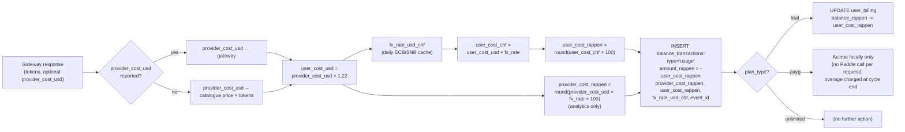
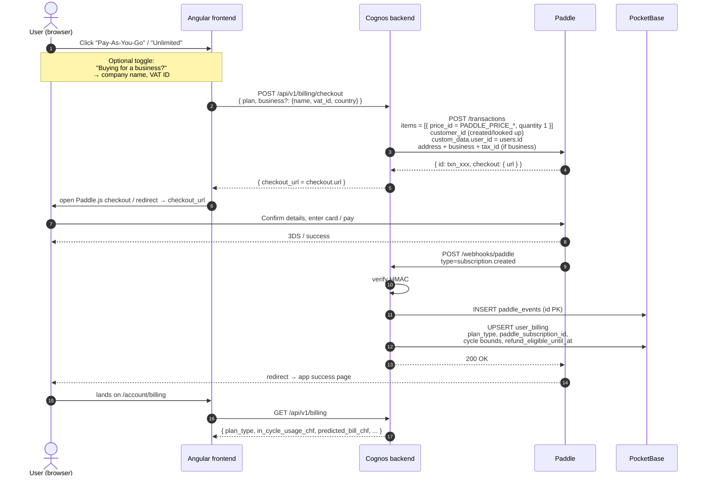
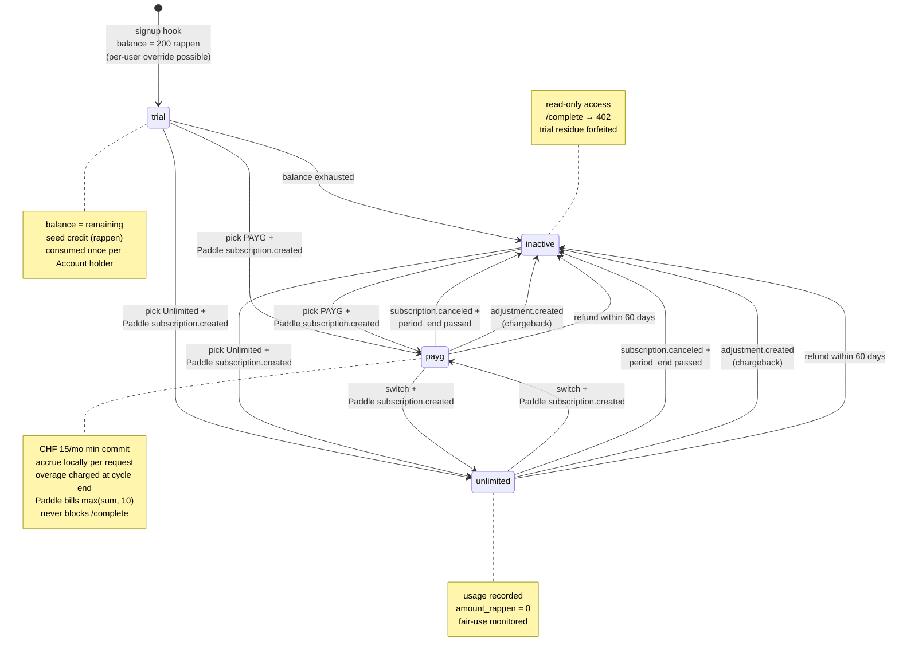
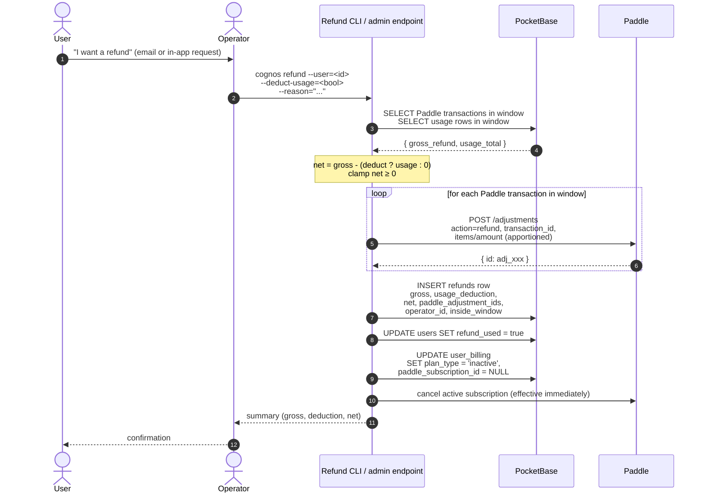
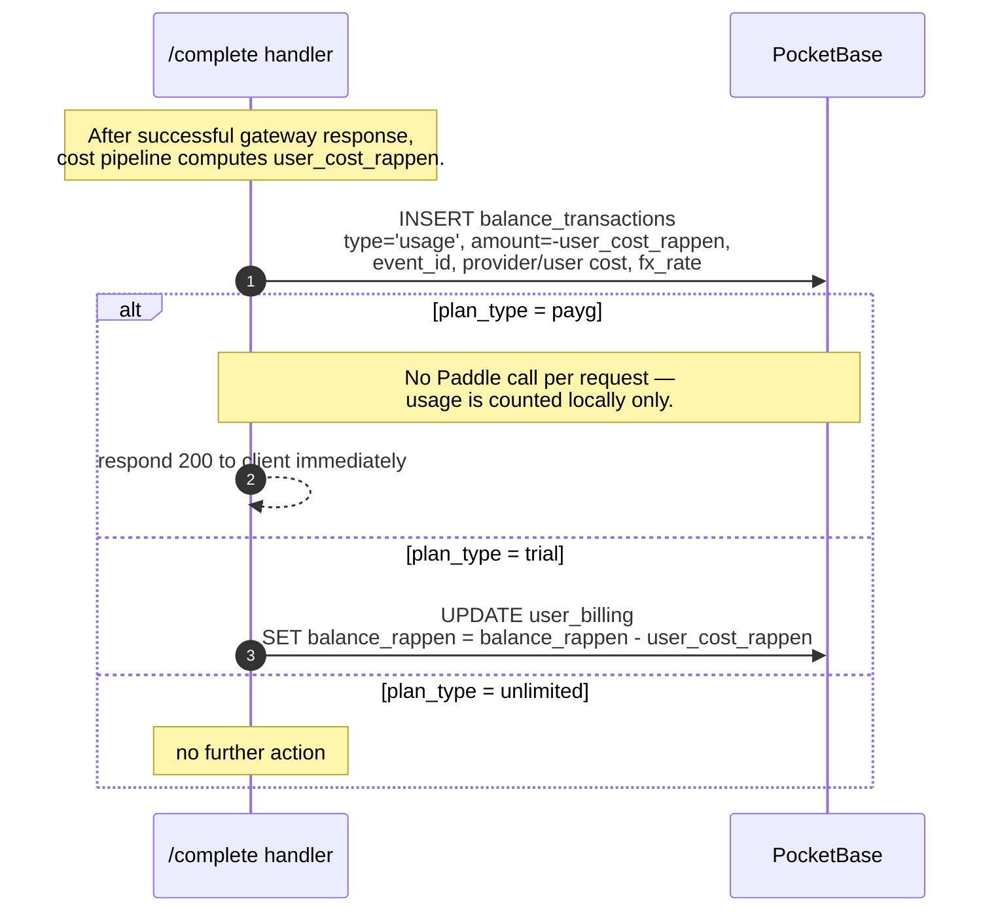
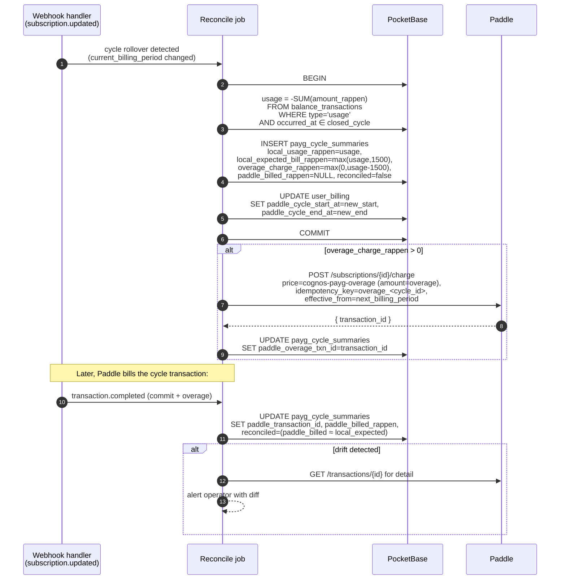

# Cognos Billing — Architecture Specification

**Version:** 0.3 (Draft) **Status:** Ready for review **Stack:** Go (backend), Angular (frontend),
PocketBase/SQLite (primary store), Paddle (subscriptions + usage overage charges + tax)

---

## Table of Contents

1. [Overview & Goals](#1-overview--goals)
2. [Relationship to the Model-Selector Spec](#2-relationship-to-the-model-selector-spec)
3. [Plans](#3-plans)
4. [Pricing & Cost Calculation](#4-pricing--cost-calculation)
5. [Paddle Integration](#5-paddle-integration)
6. [Billing State Machine](#6-billing-state-machine)
7. [Money-Back Guarantee](#7-money-back-guarantee)
8. [Fair-Use Policy (Unlimited Plan)](#8-fair-use-policy-unlimited-plan)
9. [Data Model](#9-data-model)
10. [Webhook Handler](#10-webhook-handler)
11. [PAYG Usage Accrual & Cycle Reconciliation](#11-payg-usage-accrual--cycle-reconciliation)
12. [APIs](#12-apis)
13. [UI / UX Touchpoints](#13-ui--ux-touchpoints)
14. [Failure Modes & Edge Cases](#14-failure-modes--edge-cases)
15. [Tax & Compliance Notes](#15-tax--compliance-notes)
16. [Implementation Roadmap](#16-implementation-roadmap)
17. [Resolved Decisions](#17-resolved-decisions)

---

## 1. Overview & Goals

Cognos charges all Account holders for access. Two plans are offered, both billed in **CHF**
(excluding tax — Paddle adds tax on top at checkout). All payments are processed through **Paddle**,
which acts as the Merchant of Record and handles VAT / sales-tax compliance on our behalf.

The product offers a **60-day money-back guarantee** on every first purchase. Users may also be
refunded later at our discretion, with provider usage optionally deducted (see Section 7).

### Goals

1. Charge Account holders in CHF using Paddle as the only payment surface.
2. Support two plans — **Pay-As-You-Go** and **Unlimited (with fair usage)** — plus a small free
   trial on signup that converts into a read-only state after exhaustion.
3. Apply a **22% markup** to provider COGS on PAYG, transparently to the Account holder (they see
   Cognos prices, not provider prices).
4. Bill PAYG via a **Paddle subscription with a CHF 15/month minimum commit**. Paddle has no
   usage-metering API, so usage accrues in our own `balance_transactions` ledger (the source of
   truth) and at cycle end we post a **single one-time overage charge** to Paddle for any usage
   above the commit. Net effect: the customer is billed `max(sum(usage), CHF 15)` per cycle.
5. Track usage for the Unlimited plan but do not block — surface abuse to operators via a nightly
   internal report.
6. Honour the **60-day money-back guarantee** with a documented refund process and a clear ledger.
7. Store every Paddle webhook event so we can replay, audit, and reconcile.

### Non-goals (this spec)

- Self-serve plan migration UI in production polish (manual admin path acceptable initially).
- Multi-currency display (CHF only; Paddle may render local-currency equivalents at checkout).
- Invoicing infrastructure — Paddle produces invoices.
- Dunning automation beyond what Paddle provides natively.

---

## 2. Relationship to the Model-Selector Spec

This document **supersedes** the billing portions of
[`backend-model-selector.md`](./backend-model-selector.md) (Section 4.4 and the `user_billing` /
`balance_transactions` schemas) with the following amendments:

| Topic              | Old (`backend-model-selector.md`)  | New (this spec)                                                                                                   |
| ------------------ | ---------------------------------- | ----------------------------------------------------------------------------------------------------------------- |
| PAYG mechanism     | CHF 5 base fee (mechanism unclear) | **CHF 15/mo min commit + cycle-end overage charge via Paddle**: accrue usage locally → bill `max(sum, CHF 15)`/mo |
| Unlimited price    | CHF 35/mo                          | **CHF 150/mo** or **CHF 1500/yr** (2 months free)                                                                 |
| Plan enum value    | `flat_rate`                        | `unlimited` (rename — `flat_rate` kept as a temporary alias if needed)                                            |
| Margin             | Not defined                        | **+22%** on provider USD cost, then convert to CHF                                                                |
| Payment processor  | Not defined ("manual for now")     | **Paddle** (Merchant of Record, handles tax)                                                                      |
| Free state         | Not defined                        | CHF 2 signup credit (per-user override via DB) → read-only after exhaustion                                       |
| Refund policy      | Not defined                        | 60-day money-back, optional usage deduction, one refund per Account holder lifetime                               |
| Business invoicing | Not defined                        | Surfaced at checkout (company name + VAT ID forwarded to Paddle)                                                  |
| Currency           | Not defined                        | **CHF only**, end-to-end. EUR fallback only if Paddle doesn't yet support CHF subscriptions                       |

All other content in `backend-model-selector.md` (model catalogue, gateway, encryption, analytics)
is unchanged and remains the source of truth.

The existing `backend/internal/billing/service.go` (`CalculateCost`, `CanAfford`) is the
implementation starting point. This spec extends it with margin, plan-aware behaviour, and Paddle
integration.

---

## 3. Plans

There are exactly three billing states an Account holder can be in. Every authenticated Account
holder is in **exactly one** at any moment.

| State            | Plan enum value | Price (excl. tax)                                                 | Usage handling                                                                                                                                                           |
| ---------------- | --------------- | ----------------------------------------------------------------- | ------------------------------------------------------------------------------------------------------------------------------------------------------------------------ |
| Trial            | `trial`         | Free, capped to seed credit (default CHF 2.00; per-user override) | Usage deducts from `balance_rappen` (internal credit). After exhaustion → `inactive`.                                                                                    |
| Pay-As-You-Go    | `payg`          | `max(sum(usage), CHF 15)` per cycle                               | CHF 15/mo min commit billed by Paddle **in advance**; each completion writes a local `usage` ledger row; any overage is charged once at cycle end (on the next invoice). |
| Unlimited        | `unlimited`     | CHF 150/mo **or** CHF 1500/yr (≈ 2 months free)                   | Usage recorded for analytics + fair-use monitoring; no billing impact per request.                                                                                       |
| (transient) None | `inactive`      | n/a                                                               | `/complete` returns 402. Read-only access to history/settings retained.                                                                                                  |

### 3.1 Trial

- Granted automatically on first successful signup.
- Default seed amount **CHF 2.00 (200 rappen)**, configurable via `BILLING_TRIAL_SEED_RAPPEN`.
- **Per-user override** supported via the `trial_seed_overrides` table (keyed on email, consumed by
  the signup hook). Marketing / sales can pre-stage a larger seed for invited Account holders
  without changing the global default. See Section 9.2.
- Lives in `user_billing.balance_rappen` with `plan_type = "trial"`.
- Usage deducts from the seed balance using the same PAYG cost formula (provider cost × 1.22 → CHF).
  Margin is applied even on trial so behaviour is identical post-conversion.
- When balance would go below 0, the `/complete` request is rejected with `402` and the plan
  transitions to `inactive`. The current completion is not partially served.
- Trial credit does **not** roll over into PAYG or Unlimited — it is consumed or expires.
- An Account holder is granted trial credit **exactly once** in their lifetime, keyed on `users.id`.
  Operators can grant additional ad-hoc credit later via an `adjustment` transaction (Section 12.7).

### 3.2 Pay-As-You-Go (minimum commit + cycle-end overage)

PAYG is a **recurring Paddle subscription with a CHF 15.00/cycle minimum commit, plus a single
overage charge posted at cycle end**. Paddle has no usage-metering / event-ingestion API (the only
primitive for variable amounts is a one-time charge on an existing subscription), so **our
`balance_transactions` ledger is the authoritative usage counter** and Paddle simply collects the
resulting amount. We never push per-completion events to Paddle.

- **Paddle product shape**: a single recurring subscription, `cognos-payg`, whose recurring price
  is the **CHF 15.00 minimum commit per cycle**, billed by Paddle each cycle. Overage above the
  commit is added as a **one-time charge** at cycle end (see below). Net effect:
    - Usage ≤ CHF 15 in the cycle → customer is billed CHF 15.00 (the commit, no overage charge).
    - Usage > CHF 15 in the cycle → customer is billed CHF 15.00 + `(usage − CHF 15.00)` = `usage`.
    This achieves `max(usage, CHF 15)` per cycle.
- **Billing timeline — the commit is charged _in advance_.** Paddle bills recurring prices at the
  _start_ of each period, so the CHF 15.00 minimum is collected **up front**: once at checkout for
  the first cycle, then on every renewal for the upcoming cycle. Any overage from a cycle is added
  to the **following** renewal invoice (in arrears). A customer's renewal invoice therefore reads
  `CHF 15.00 (upcoming cycle minimum) + overage (previous cycle usage above the minimum)`. Because
  the floor is pre-paid before any usage, this **must be disclosed clearly at signup and on every
  invoice** — see Sections 13.2, 13.3, 13.5, and 15.
- **Plan start**: Paddle `subscription.created` for `cognos-payg` → `plan_type = "payg"`. No balance
  is set; the Account holder's PAYG state is purely "subscribed to the minimum-commit product".
- **Per-completion accrual (Section 11)**: after each successful gateway call, the backend writes a
  local `usage` row only. There is **no** per-completion call to Paddle, so the HTTP response is
  never delayed for a billing provider.
- **Cycle end overage charge (Section 11)**: just before each renewal (driven by the
  `subscription.updated` rollover), if the cycle's local usage exceeds the CHF 15.00 commit, the
  backend posts **one** one-time charge of `(usage − CHF 15.00)` to the subscription via Paddle's
  one-time-charge API, billed on the next transaction. A deterministic idempotency key per cycle
  prevents double-charging on retry.
- **Cycle invoice**: Paddle issues the cycle transaction (`transaction.completed` webhook) covering
  the commit plus any overage charge. We record it against the cycle for reconciliation but do
  **not** modify any balance — there is no balance.
- **No "out of balance" state**: PAYG Account holders are never blocked for funds. They could in
  principle accrue arbitrary usage in a cycle, hence the soft spending-alert mechanism in Section
  14.11.
- **Subscription cancellation**: at `period_end` the plan transitions to `inactive`. The final
  cycle's accrued usage is still billed by Paddle (commit + final overage charge).
- **Failed payment**: Paddle's dunning runs. If Paddle marks the subscription `canceled` after
  dunning gives up, the Account holder drops to `inactive`. The unpaid transaction remains on the
  Paddle customer record for collection.
- **Plan switch PAYG → Unlimited**: takes effect immediately on Paddle's side; the final PAYG cycle
  is billed as normal (`max(usage_so_far, CHF 15)`, overage charged on close).

> **Why this shape?** Paddle is Merchant of Record and handles invoicing, tax, and dunning, but it
> does not aggregate usage. So we split the roles cleanly: our ledger is the source of truth for
> what the customer used (and for our margin against provider cost), and Paddle is the source of
> truth for what the customer is charged — the recurring commit plus the one overage charge we
> compute and post per cycle.

### 3.3 Unlimited

- Two Paddle products: **`unlimited_monthly`** (CHF 150/mo) and **`unlimited_annual`** (CHF
  1500/yr).
- Annual is a single Paddle subscription product; the CHF 200/yr discount is encoded directly in the
  product price (no coupon code required).
- Renewal is automatic via Paddle. Cancellation = no auto-renew at next cycle boundary.
- Every completion still writes a `usage` row to `balance_transactions` with `amount_rappen = 0`
  (i.e. no balance impact) and the real cost recorded in `provider_cost_rappen` / `user_cost_rappen`
  columns (see schema). This keeps a complete picture of provider COGS per Account holder for
  fair-use review (Section 8) without affecting their balance.

### 3.4 Plan switches — summary

| From → To                         | When does it take effect?                          | Billing / Refund                                                      |
| --------------------------------- | -------------------------------------------------- | --------------------------------------------------------------------- |
| Trial → PAYG / Unlimited          | On Paddle `subscription.created`                   | Trial credit is consumed/abandoned, not migrated                      |
| PAYG → Unlimited (monthly/annual) | Immediately                                        | Final PAYG cycle billed as `max(usage_to_now, CHF 15)`                |
| Unlimited (monthly) → PAYG        | At end of current paid period                      | New PAYG cycle starts at switch                                       |
| Unlimited (annual) → PAYG         | At end of current paid period (no pro-rata refund) | New PAYG cycle starts at switch; refund only inside 60-day window     |
| Unlimited monthly ↔ annual        | At end of current paid period (no pro-rata)        | No refund unless inside 60-day window                                 |
| Any → cancelled (`inactive`)      | At end of current paid period                      | PAYG: final cycle bill still issued; refund only inside 60-day window |

---

## 4. Pricing & Cost Calculation

### 4.1 Margin and FX — the canonical pipeline

The single canonical cost pipeline for every completion:



```text
1.  provider_cost_usd       <- gateway response (if reported) OR catalogue * tokens
2.  user_cost_usd           <- provider_cost_usd * (1 + MARKUP)         # MARKUP = 0.22
3.  fx_rate_usd_chf         <- FX cache (refreshed daily, see 4.3)
4.  user_cost_chf           <- user_cost_usd * fx_rate_usd_chf
5.  user_cost_rappen        <- round(user_cost_chf * 100)               # integer
6.  provider_cost_rappen    <- round(provider_cost_usd * fx_rate * 100) # for analytics only
```

Why USD-first markup, then FX?

- The 22% is a **markup on cost of goods sold**, which is incurred in USD. It produces an 18.03%
  contribution margin before the PAYG minimum, Paddle fees, refunds and FX slippage. Applying it in
  the cost denomination keeps the markup stable relative to provider invoices regardless
  of FX swings.
- We store three values (`provider_cost_usd`, `user_cost_usd`, `user_cost_chf`) plus the FX rate
  at request time — every figure on the ledger is independently auditable from the others.
- Mathematically `a*1.2*b == a*b*1.2`, so this is a clarity/audit choice, not a numeric one.

### 4.2 Storage rules

- **All monetary balances and transaction amounts are stored as integer Rappen.** 1 CHF = 100
  Rappen. No floats in the ledger.
- USD values (`provider_cost_usd`, `user_cost_usd`) are stored as `DOUBLE` for analytics only;
  they are never used to drive balance arithmetic.
- The FX rate used for a transaction is stored alongside that transaction — never re-derived.
- `balance_rappen` must never go negative for any plan. The completion handler reserves an
  upper-bound cost (Section 14.5) before calling the gateway and rejects with `402` if the Account
  holder cannot afford it.

### 4.3 FX rate

- Source: ECB or SNB daily reference rate, fetched once per `FX_RATE_REFRESH_HOURS` (default 24).
- Fallback constant in env (`FX_RATE_FALLBACK_USD_CHF`) used if the fetch fails on startup.
- The rate snapshot used for a request is **captured at the time of the gateway call** — not at
  cycle end. This locks the Account holder-facing cost for that completion regardless of later FX
  moves.

### 4.4 Configurable values

| Config                                 | Default                | Notes                                                                            |
| -------------------------------------- | ---------------------- | -------------------------------------------------------------------------------- |
| `BILLING_MARGIN_BPS`                   | `2200` (= 22.00%)      | Basis-point markup; allows fine adjustment without code change.                  |
| `BILLING_PAYG_MIN_COMMIT_RAPPEN`       | `1500` (CHF 15.00)     | Minimum commit per PAYG cycle = the Paddle subscription base price. Shown in UI. |
| `BILLING_PAYG_SOFT_ALERT_RAPPEN`       | `5000` (CHF 50.00)     | Per-user in-cycle alert threshold (Section 14.11).                               |
| `BILLING_UNLIMITED_MONTHLY_RAPPEN`     | `15000` (CHF 150.00)   | Paddle subscription price (excl. tax).                                           |
| `BILLING_UNLIMITED_ANNUAL_RAPPEN`      | `150000` (CHF 1500.00) | Paddle subscription price (excl. tax).                                           |
| `BILLING_TRIAL_SEED_RAPPEN`            | `200` (CHF 2.00)       | Granted once on signup, unless per-user override is staged.                      |
| `BILLING_REFUND_GUARANTEE_DAYS`        | `60`                   | Money-back window.                                                               |
| `BILLING_UNLIMITED_FAIR_USE_ALERT_CHF` | `200.0`                | Nightly alert threshold (user-cost CHF). 2× monthly price.                       |

---

## 5. Paddle Integration

### 5.1 Product catalogue (Paddle side)

We need three Paddle products, each with a recurring price (Sandbox + Production), plus one
non-recurring price used for PAYG overage charges:

| Paddle entity                 | Type                             | Pricing (excl. tax)                       | Maps to                        |
| ----------------------------- | -------------------------------- | ----------------------------------------- | ------------------------------ |
| `cognos-payg` (price)         | Recurring (monthly)              | CHF 15.00 — the minimum commit per cycle  | PAYG subscription base.        |
| `cognos-payg-overage` (price) | One-time (`billing_cycle: null`) | CHF — amount set per charge (the overage) | PAYG cycle-end overage charge. |
| `cognos-unlimited-m` (price)  | Recurring (monthly)              | CHF 150.00                                | Unlimited monthly.             |
| `cognos-unlimited-y` (price)  | Recurring (annual)               | CHF 1500.00 (≈ 2 months free vs monthly)  | Unlimited annual.              |

> **How `max(usage, CHF 15)` is achieved without a meter.** Paddle has no usage-metering /
> event-ingestion API; the only primitive for a variable amount is a **one-time charge** added to
> an existing subscription. So:
>
> - The `cognos-payg` recurring price (CHF 15.00) bills the minimum commit every cycle.
> - Usage is counted **locally** in `balance_transactions` (Section 11), not by Paddle.
> - At cycle end, if local usage exceeds CHF 15.00, the backend posts one one-time charge of
>   `(usage − CHF 15.00)` against the subscription using the `cognos-payg-overage` price (or an
>   inline price object), billed on the next transaction.
>
> Net invoice for the cycle = `max(usage, CHF 15.00)`. See Section 11 for the charge timing,
> idempotency, and reconciliation, and Section 14.10 for the zero-base alternative shape.

### 5.2 Currency

**CHF, end-to-end.** Being a Swiss company with a privacy-first brand is core to our positioning,
so the storefront, ledger, dashboards, invoices, and refund flows all transact in CHF. The
integration plan assumes Paddle supports CHF-denominated subscriptions for our org.

If at integration time CHF is not yet available for the product type we need, the
**single documented fallback** is EUR-denominated products with prices set to the day-of CHF
equivalent (round to the nearest EUR 0.10). Internal accounting stays in CHF regardless: every
Paddle transaction is recorded against its CHF intent using the FX rate captured at transaction
time. This fallback is explicitly a temporary measure and should be reversed once Paddle adds CHF
support.

### 5.3 Configuration

```bash
# ── Paddle ──────────────────────────────────────────────
PADDLE_API_BASE=https://api.paddle.com               # https://sandbox-api.paddle.com for sandbox
PADDLE_API_KEY=pdl_live_apikey_xxx                   # server-side bearer token; never client
PADDLE_WEBHOOK_SECRET=pdl_ntfset_xxx_secret          # notification-destination secret for signature verification
PADDLE_PRICE_PAYG=pri_xxx                            # cognos-payg recurring (CHF 15.00 min commit)
PADDLE_PRICE_PAYG_OVERAGE=pri_xxx                    # cognos-payg-overage one-time (amount set per charge)
PADDLE_PRICE_UNLIMITED_MONTHLY=pri_xxx
PADDLE_PRICE_UNLIMITED_ANNUAL=pri_xxx
```

### 5.4 Webhook events we listen for

| Paddle event             | What we do                                                                                                                                   |
| ------------------------ | -------------------------------------------------------------------------------------------------------------------------------------------- |
| `subscription.created`   | Transition Account holder `trial`/`inactive` → `payg`/`unlimited`. Snapshot `paddle_subscription_id`, cycle bounds.                          |
| `subscription.activated` | Defensive re-sync to `payg`/`unlimited` (e.g. after dunning recovery or trial end).                                                          |
| `subscription.updated`   | Cycle rollover: post the closing cycle's PAYG overage charge (Section 11), record a new `payg_cycle_summaries` row, reset cycle bookkeeping. |
| `subscription.canceled`  | Mark plan ending at `current_billing_period.ends_at` (or immediately if effective now). After it passes, transition to `inactive`.           |
| `subscription.past_due`  | Subscription in dunning. No plan change yet; surfaced for monitoring. `subscription.canceled` follows if Paddle gives up.                    |
| `transaction.completed`  | Cycle transaction paid — record `paddle_transaction_id` + billed amount against the cycle summary for audit. No balance action.              |
| `adjustment.created`     | A refund/credit adjustment. Insert a `refund` row recording the amount and metadata. No balance reversal (Paddle already adjusted it).       |
| `customer.updated`       | Sync email / customer metadata if changed externally.                                                                                        |

All other Paddle event types are logged to `paddle_events` for replay but otherwise ignored.
Chargebacks surface as an `adjustment.created` of type `chargeback`; treat them like a refund and
move the plan to `inactive` (Section 7.5).

### 5.5 Idempotency & verification

- Every webhook hit verifies the `Paddle-Signature` header (HMAC-SHA256 over `ts:rawBody` using the
  notification-destination secret in `PADDLE_WEBHOOK_SECRET`). Bad signature → 401 and no DB write.
- Paddle's event ID (e.g. `evt_xyz`) is the primary key on `paddle_events`. Re-delivery is a no-op.
- Webhook handler is `O(1)` work: write the raw event, enqueue domain side-effects on a separate
  internal queue. Re-deliveries from Paddle don't compound side effects.

### 5.6 Checkout sequence



### 5.7 Server-to-Paddle calls

The backend calls Paddle to:

- Create a **checkout** when a logged-in Account holder chooses a plan (`POST /transactions`,
  returning a `checkout.url`), forwarding business invoicing details when supplied.
- Post the **PAYG cycle-end overage charge** as a one-time charge on the subscription
  (`POST /subscriptions/{id}/charge` with the overage price/amount — Section 11).
- Cancel / reactivate an Account holder's subscription if they hit "cancel" in our UI (or we proxy
  to Paddle's hosted customer portal — see 13.4).
- Issue **refunds** via the Paddle adjustments API (`POST /adjustments`, `action: refund`) as part
  of the money-back flow (Section 7).

Each call is retried with exponential backoff up to 5 minutes; persistent failure raises an alert.

---

## 6. Billing State Machine



Edges:

- **signup**: PocketBase `OnRecordAfterCreate` hook → `user_billing` row with
  `plan_type='trial'`, `balance_rappen = override(email) ?? BILLING_TRIAL_SEED_RAPPEN`
  (default 200 = CHF 2.00).
- **trial → inactive**: triggered inside the completion handler when `CanAfford` returns false.
  Sets `plan_type='inactive'`, `balance_rappen=0`. Trial credit is forfeited on transition; it
  does not migrate to a subsequent paid plan.
- **inactive → payg|unlimited**: triggered by Paddle `subscription.created` webhook. Sets
  `plan_type`, `paddle_subscription_id`, `paddle_cycle_*` bounds, `refund_eligible_until_at`.
- **PAYG usage accrual**: each completion writes a `usage` row to `balance_transactions` only — no
  per-request Paddle call. At cycle rollover the backend posts a single overage charge for usage
  above the commit. See Section 11.
- **payg|unlimited → inactive**: scheduled by `subscription.canceled` + `period_end` cron, or
  immediate via a chargeback `adjustment.created`. For PAYG, Paddle still issues the final cycle
  invoice after the transition.

An Account holder's state and Paddle state must reconcile every cycle (Section 14.2).

---

## 7. Money-Back Guarantee

### 7.1 Policy

- **Window**: 60 calendar days from the **first successful Paddle payment of the active
  subscription** (`refund_eligible_until_at` is snapshotted at subscription creation).
- **Trigger**: Account holder emails support / clicks a "request refund" button. Initial
  implementation is email-driven; an in-app self-serve refund flow can come later.
- **Scope**: applies to the first paid period only (the initial monthly or annual payment). For
  annual Account holders, this is potentially significant — a full CHF 1500 refund is on the table
  for 60 days.
- **Usage deduction**: at operator discretion, we may deduct the actual Account holder-facing cost
  of usage consumed in the refund period from the refund amount. The deducted figure uses the same
  PAYG formula (provider cost × 1.22, converted to CHF at the snapshot FX rate).
- **One-time per customer**: each `users.id` is eligible for the refund exactly once in their
  lifetime, even if they later sign up for a different plan.

### 7.2 Refund cases — examples

| Case                                       | Refund                                                        |
| ------------------------------------------ | ------------------------------------------------------------- |
| Unlimited annual @ day 5, ~zero usage      | Full CHF 1500.                                                |
| Unlimited annual @ day 40, CHF 50 of usage | Full CHF 1500 OR CHF 950 (operator chooses).                  |
| Unlimited annual @ day 90                  | No refund (outside window). Goodwill case only.               |
| PAYG @ day 30, CHF 12 billed, complaint    | Refund CHF 12 (last cycle). Usage deduction at op discretion. |
| Unlimited monthly @ day 5                  | Full CHF 150.                                                 |
| Unlimited monthly @ day 35, on month 2     | Last month's CHF 150 only (still in 60d window).              |

### 7.3 Process



1. Support agent loads the Account holder's `/admin/billing/{user_id}` page (or runs a CLI command):
   `cognos refund --user=<id> --reason="..." --deduct-usage=<true|false>`
2. The tool computes:
   - `gross_refund_rappen` = sum of Paddle transactions/subscription charges in the refund window
   - `usage_deduction_rappen` = (optional) sum of `user_cost_rappen` for usage rows in that window
   - `net_refund_rappen` = `gross_refund_rappen - usage_deduction_rappen` (clamped ≥ 0)
3. The tool creates a Paddle refund adjustment against each underlying transaction with the
   apportioned amount.
4. A `refund` row is written with `paddle_adjustment_ids`, the breakdown, and the operator who
   authorised it.
5. The Account holder's plan is moved to `inactive` (refund implies they didn't want it).
6. `users.refund_used = true` is set to enforce one-per-lifetime.

### 7.4 Goodwill refunds outside the 60-day window

These exist but are not codified. The same CLI command works with a `--force` flag and a written
reason. There is no automatic limit.

### 7.5 Chargebacks

When Paddle fires an `adjustment.created` of type `chargeback` (and cancels the subscription), we
treat it the same as a refund (set plan to `inactive`, log the event, no auto-reversal of usage
data). Operators are notified for fraud review.

---

## 8. Fair-Use Policy (Unlimited Plan)

The Unlimited plan is marketed as predictable pricing for typical individual / business use. It
is **not** a license for industrial-scale automation.

### 8.1 Enforcement model

**Alert first. No silent automated Account-facing block.** A nightly ledger query identifies any
`unlimited` Account whose 30-day rolling Account-facing cost reaches the CHF 200 review threshold.
At CHF 450 (3× the monthly price), the alert escalates to an immediate shutdown review; a human must
record whether to continue, limit or pause new Completions under the fair-use response procedure.

```sql
SELECT
    billing_user_id,
    SUM(user_cost_chf) AS rolling_30d_cost_chf,
    COUNT(*)           AS request_count
FROM read_parquet('s3://cognos-analytics/events/**/*.parquet')
WHERE
    plan_type = 'unlimited'
    AND occurred_at >= NOW() - INTERVAL 30 DAY
GROUP BY billing_user_id
HAVING SUM(user_cost_chf) >= 200.0
ORDER BY rolling_30d_cost_chf DESC;
```

The application emits structured logs for the alert channel. The operator follows
`docs/billing-ops-runbook.md` and decides per case:

- Reach out, ask about use case.
- Suggest a custom Enterprise contract.
- At CHF 450 rolling cost, or sooner for clear automation, compromised credentials or a pricing
  fault, make and record the shutdown decision immediately. Never describe the alert itself as an
  automatic fair-use suspension.

### 8.2 Marketing copy

Wherever the Unlimited plan is advertised, the page must include a single sentence near the
purchase CTA: **"Subject to a fair-use policy for human, conversational use."** No specific CHF
threshold is published — it stays internal.

---

## 9. Data Model

> **Status — schema implemented.** PocketBase migrations now realise this data
> model:
>
> - `1760000014_created_billing_collections.go` — `user_billing` +
>   `balance_transactions`, using Paddle field names
>   (`paddle_subscription_id`, `paddle_price_id`, `paddle_cycle_start_at`,
>   `paddle_cycle_end_at`, `paddle_transaction_id`). The earlier Polar field
>   names were rewritten in place (billing was never deployed).
> - `1760000025_users_paddle_fields.go` — adds `display_name`, `refund_used`,
>   `paddle_customer_id`, `business_name`, `business_vat_id`, `business_country`
>   to `users`.
> - `1760000026_created_paddle_billing_collections.go` — `paddle_events`
>   (idempotency on a unique `paddle_event_id`), `refunds`,
>   `trial_seed_overrides` (unique `email`), `payg_cycle_summaries`.
>
> All four billing collections keep every API rule `nil` (superuser / server-only;
> never the public auto API). Schema coverage lives in
> `backend/db/migrations/paddle_schema_test.go`. Note: `paddle_events`'s natural
> key is the unique `paddle_event_id` field rather than the record id, to avoid
> PocketBase's record-id length constraints while preserving webhook idempotency.

### 9.1 Changes to existing tables

#### `users` (additions)

| Field                | Type | Notes                                                                           |
| -------------------- | ---- | ------------------------------------------------------------------------------- |
| `refund_used`        | Bool | Default false. Set true when a refund has been issued (lifetime flag).          |
| `paddle_customer_id` | Text | Paddle's customer ID, set on first Paddle interaction. Nullable.                |
| `business_name`      | Text | Company name for invoicing if the Account holder buys for a business. Nullable. |
| `business_vat_id`    | Text | VAT/UID registration. Forwarded to Paddle at checkout. Nullable.                |
| `business_country`   | Text | ISO 3166-1 alpha-2 country code for the business address. Nullable.             |

#### `user_billing` (rename / extend)

| Field                       | Type     | Notes                                                                                                |
| --------------------------- | -------- | ---------------------------------------------------------------------------------------------------- |
| `id`                        | Text PK  | Existing. This remains the opaque `billing_user_id` used in analytics.                               |
| `user_id`                   | FK users | Existing.                                                                                            |
| `plan_type`                 | Text     | Now one of: `trial`, `payg`, `unlimited`, `inactive`. (Old `flat_rate` migrated to `unlimited`.)     |
| `plan_started_at`           | DateTime | Existing.                                                                                            |
| `plan_ends_at`              | DateTime | Existing. Set when scheduled to cancel.                                                              |
| `balance_rappen`            | Integer  | Existing. Always ≥ 0. Spendable credit for `trial` only. Zero for `payg` / `unlimited` / `inactive`. |
| `paddle_subscription_id`    | Text     | NEW. Active Paddle subscription ID. Null for `trial`/`inactive`.                                     |
| `paddle_price_id`           | Text     | NEW. Paddle price ID the subscription's item points at.                                              |
| `paddle_cycle_start_at`     | DateTime | NEW. Current Paddle billing cycle start.                                                             |
| `paddle_cycle_end_at`       | DateTime | NEW. Current Paddle billing cycle end (= renewal/cancel boundary).                                   |
| `refund_eligible_until_at`  | DateTime | NEW. Snapshot of `first_payment_at + 60 days`. Null for `trial`.                                     |
| `trial_seed_granted_rappen` | Integer  | NEW. What was actually granted on signup (default vs override). Audit field.                         |

#### `balance_transactions` (extend)

| Field                   | Type     | Notes                                                                                                      |
| ----------------------- | -------- | ---------------------------------------------------------------------------------------------------------- |
| `id`                    | Text PK  | Existing.                                                                                                  |
| `user_id`               | FK users | Existing.                                                                                                  |
| `occurred_at`           | DateTime | Existing.                                                                                                  |
| `type`                  | Text     | One of: `usage`, `refund`, `trial_seed`, `adjustment`. (Plan-credit types no longer needed.)               |
| `amount_rappen`         | Integer  | Signed: negative for `usage`/`refund`; positive for `trial_seed`/`adjustment`.                             |
| `balance_after_rappen`  | Integer  | Trial: balance after this row. PAYG/Unlimited: not meaningful (set to 0).                                  |
| `event_id`              | Text     | Existing — links to analytics `event_id` for `usage`. Null otherwise.                                      |
| `paddle_transaction_id` | Text     | Null for most rows; populated for `refund` rows linking to the Paddle transaction the adjustment refunded. |
| `provider_cost_rappen`  | Integer  | NEW. For `usage` rows only. The raw provider cost in CHF (no margin). Allows margin recomputation.         |
| `user_cost_rappen`      | Integer  | NEW. For `usage` rows only. The marked-up Account holder-facing cost in CHF. = `-amount_rappen` for PAYG.  |
| `fx_rate_usd_chf`       | Double   | NEW. For `usage` rows only. The FX rate snapshot at request time.                                          |
| `description`           | Text     | Existing.                                                                                                  |

### 9.2 New tables

#### `paddle_events`

Raw, deduplicated webhook log. Source of truth for everything Paddle tells us.

| Field                    | Type     | Notes                                                                  |
| ------------------------ | -------- | ---------------------------------------------------------------------- |
| `id`                     | Text PK  | Paddle event ID (e.g. `evt_xxx`). Primary key — natural idempotency.   |
| `received_at`            | DateTime | When we received it.                                                   |
| `type`                   | Text     | Paddle event type (e.g. `subscription.created`).                       |
| `paddle_customer_id`     | Text     | Indexed for join.                                                      |
| `paddle_subscription_id` | Text     | Indexed.                                                               |
| `paddle_transaction_id`  | Text     | Indexed.                                                               |
| `payload_json`           | Text     | Full webhook body as received.                                         |
| `processed_at`           | DateTime | Null until our domain handler completes. Allows replay of unprocessed. |
| `processing_error`       | Text     | Null on success. Last error if any.                                    |

#### `refunds`

| Field                        | Type     | Notes                                                                                       |
| ---------------------------- | -------- | ------------------------------------------------------------------------------------------- |
| `id`                         | Text PK  | UUID.                                                                                       |
| `user_id`                    | FK users |                                                                                             |
| `requested_at`               | DateTime |                                                                                             |
| `processed_at`               | DateTime | Null until completed.                                                                       |
| `gross_refund_rappen`        | Integer  | Pre-deduction.                                                                              |
| `usage_deduction_rappen`     | Integer  | 0 if no deduction applied.                                                                  |
| `net_refund_rappen`          | Integer  | What we actually refunded via Paddle.                                                       |
| `reason_text`                | Text     | Operator-recorded reason.                                                                   |
| `operator_id`                | Text     | The admin user who authorised it.                                                           |
| `paddle_adjustment_ids_json` | Text     | JSON array of Paddle adjustment IDs created (may be multiple if window spans transactions). |
| `inside_guarantee_window`    | Bool     | True if requested within 60-day window.                                                     |

#### `trial_seed_overrides`

Pre-staged trial credits matched on signup email. Allows marketing/sales to grant a larger trial
seed to specific invitees without changing the global default.

| Field         | Type     | Notes                                                                           |
| ------------- | -------- | ------------------------------------------------------------------------------- |
| `email`       | Text PK  | Lowercased.                                                                     |
| `rappen`      | Integer  | The seed amount to grant on signup (instead of `BILLING_TRIAL_SEED_RAPPEN`).    |
| `reason_text` | Text     | e.g. "Conference giveaway 2026-06", "Partner programme".                        |
| `set_by`      | Text     | Admin user who staged it.                                                       |
| `set_at`      | DateTime |                                                                                 |
| `expires_at`  | DateTime | Override is ignored if the Account holder signs up after this. Nullable.        |
| `consumed_at` | DateTime | Set by the signup hook when used. After consumption, row is retained for audit. |

#### `payg_cycle_summaries`

One row per closed PAYG cycle. Records what we observed locally and what Paddle billed,
side-by-side, so any drift is investigable.

| Field                        | Type     | Notes                                                                                            |
| ---------------------------- | -------- | ------------------------------------------------------------------------------------------------ |
| `id`                         | Text PK  |                                                                                                  |
| `user_id`                    | FK users |                                                                                                  |
| `cycle_start_at`             | DateTime |                                                                                                  |
| `cycle_end_at`               | DateTime |                                                                                                  |
| `paddle_subscription_id`     | Text     |                                                                                                  |
| `paddle_transaction_id`      | Text     | The cycle transaction from Paddle (set when `transaction.completed` arrives).                    |
| `local_usage_rappen`         | Integer  | `-SUM(usage amount_rappen)` in `[cycle_start, cycle_end)`.                                       |
| `local_expected_bill_rappen` | Integer  | `max(local_usage_rappen, BILLING_PAYG_MIN_COMMIT_RAPPEN)` — what we expect.                      |
| `overage_charge_rappen`      | Integer  | The one-time overage charge we posted for this cycle. `max(0, local_usage − commit)`; 0 if none. |
| `paddle_overage_txn_id`      | Text     | Paddle ID of the one-time overage charge (the resulting transaction/charge). Null if no overage. |
| `paddle_billed_rappen`       | Integer  | Net amount Paddle invoiced (commit + overage). Set from `transaction.completed`.                 |
| `reconciled`                 | Bool     | True iff `paddle_billed_rappen == local_expected_bill_rappen` (±1 rappen).                       |
| `closed_at`                  | DateTime | When this summary was finalised.                                                                 |

---

## 10. Webhook Handler

> **Status — implemented (lean cut).** `POST /webhooks/paddle` (`PaddleWebhook`)
> is live: it verifies the `Paddle-Signature` HMAC over `ts:rawBody` (bad
> signature → 401, no DB write), stores every event once in `paddle_events`
> (idempotent on the unique `paddle_event_id`; re-delivery → 200 `duplicate`),
> then dispatches. Domain handlers wired now: `subscription.created` /
> `subscription.activated` flip the Account holder onto the price's plan and snapshot the
> subscription + cycle + `refund_eligible_until_at`; `subscription.updated`
> refreshes the snapshot (plan/price, cycle window, scheduled cancellation) and
> on a PAYG cycle rollover closes the prior cycle by writing an idempotent
> `payg_cycle_summaries` row (local usage, expected bill, overage) and posting
> the overage as a one-time charge to Paddle (`Paddle-Idempotency-Key` per cycle;
> a failure leaves `reconciled=false` for the backstop); `subscription.past_due`
> flags `user_billing.past_due` (access continues through dunning; dashboard +
> chat shell show a "payment failed — update your card" banner) and
> `subscription.activated` clears it on recovery; `subscription.canceled` drops
> them to `inactive`. `transaction.completed` records the Paddle transaction +
> billed amount against the matching `payg_cycle_summaries` row for audit, and a
> ~5-minute gocron backstop re-posts any overage charge that never landed
> (idempotency-key-safe). `adjustment.created` writes a `refunds` row (sets
> `users.refund_used`; a `chargeback` action also drops the Account to `inactive`,
> §7.5), and the invoices endpoint surfaces a REFUNDED badge by cross-referencing
> that ledger. The exact per-cycle `reconciled` equality (pending live Paddle
> timing verification) is the remaining fast-follow.
> Customer↔user mapping uses `custom_data.user_id` with a `paddle_customer_id`
> fallback; unmappable events are logged and accepted (not retried). Signature
> verification is covered in `internal/paddle/webhook_test.go`; the end-to-end
> activate/replay/cancel flow in `cmd/api/paddle_webhook_test.go`.

### 10.1 Endpoint

`POST /webhooks/paddle` — unauthenticated route (verified by HMAC), no JSON body limit (Paddle
payloads are small but include nested customer/transaction objects).

### 10.2 Flow

```mermaid
flowchart TD
    A[POST /webhooks/paddle] --> B[Read raw body bytes]
    B --> C{HMAC matches<br/>Paddle-Signature?}
    C -- no --> C1[Return 401<br/>No DB write]
    C -- yes --> D[Parse envelope:<br/>event_id, type]
    D --> E["INSERT INTO paddle_events<br/>ON CONFLICT(id) DO NOTHING"]
    E --> F{Conflict?<br/>(duplicate delivery)}
    F -- yes --> F1[Return 200<br/>log 'duplicate']
    F -- no --> G[Dispatch by type to<br/>domain handler]
    G --> H{Handler success?}
    H -- yes --> I["UPDATE paddle_events<br/>SET processed_at = now()"]
    I --> J[Return 200]
    H -- no --> K["UPDATE paddle_events<br/>SET processing_error = ?"]
    K --> L[Return 500<br/>Paddle retries → re-dispatch<br/>handlers MUST be idempotent]
```

```text
1. Read raw body (DO NOT json.Decode yet — signature is over raw bytes).
2. Verify HMAC: parse the `Paddle-Signature` header (`ts=...;h1=...`), then
   compare-constant-time(HMAC_SHA256("<ts>:<rawBody>", PADDLE_WEBHOOK_SECRET), h1).
   - Mismatch -> 401, no DB write.
3. Parse the JSON envelope, extract event_id and type.
4. INSERT INTO paddle_events ON CONFLICT(id) DO NOTHING.
   - If conflict: 200 OK, log "duplicate", return.
5. Dispatch by type to a domain handler (small per-event Go func).
6. On success: UPDATE paddle_events SET processed_at = now() WHERE id = ?.
7. On error: log, UPDATE paddle_events SET processing_error = ?.
   - Return 500 so Paddle retries. The next attempt re-enters step 4, conflicts, but step 6 has not
     run -> we re-dispatch. Domain handlers must be idempotent.
```

### 10.3 Domain handler idempotency

Each handler must be safe to run multiple times. Specifically:

- `subscription.created`: `UPSERT user_billing SET plan_type, paddle_subscription_id, cycle bounds
WHERE user_id = ?` — keyed on `paddle_subscription_id` uniqueness.
- `subscription.updated`: detect cycle rollover by comparing the event's `current_period_start`
  to the stored `paddle_cycle_start_at`. On rollover, close the prior cycle (write
  `payg_cycle_summaries` row) and update cycle bounds. Both writes are keyed so re-delivery is a
  no-op.
- `subscription.canceled`: setting `plan_ends_at` and `plan_type` are idempotent assignments.
- `subscription.updated` (overage charge): the cycle's overage charge is posted with a
  deterministic idempotency key (`overage_<payg_cycle_summaries.id>`), so a re-delivered rollover
  never double-charges. Record the resulting `paddle_overage_txn_id` on the cycle summary.
- `transaction.completed`: keyed on `paddle_transaction_id` — `UPDATE payg_cycle_summaries SET
paddle_transaction_id, paddle_billed_rappen WHERE cycle_end_at = ?` for the matching cycle. No
  ledger row written.
- `adjustment.created` (refund): keyed on `paddle_adjustment_id` — refuse to double-insert a
  `refund` row.

### 10.4 Mapping Paddle customer ↔ Cognos Account holder

- When an Account holder starts the checkout flow, we create the Paddle transaction/customer with
  `custom_data.user_id = users.id` (and persist the returned `paddle_customer_id` on `users`).
  Paddle includes the customer on every subsequent webhook for that customer.
- The webhook handler resolves the Cognos user via `custom_data.user_id`. If it is missing
  (e.g. a customer was created in the Paddle dashboard manually), we fall back to
  `paddle_customer_id` lookup on `users` — and if that fails too, log a `policy_error` event for
  manual triage.

---

## 11. PAYG Usage Accrual & Cycle Reconciliation

PAYG billing is a **CHF 15/cycle minimum commit + a single cycle-end overage charge**, both
collected by Paddle. Paddle has **no usage-metering API**, so the backend's job is to (a) accrue
usage locally per completion, (b) post one overage charge per cycle for usage above the commit, and
(c) reconcile what we observed locally against Paddle's cycle transaction when it arrives.

### 11.1 Per-completion accrual



```text
1. After gateway responds, compute user_cost_rappen (Section 4.1).
2. INSERT balance_transactions row with type='usage'. The /complete response returns now.
3. IF plan_type == 'payg': nothing else — usage accrues in the ledger; Paddle is not called.
4. IF plan_type == 'trial': UPDATE user_billing.balance_rappen -= user_cost_rappen.
5. IF plan_type == 'unlimited': no further action.
```

### 11.2 Cycle-end overage charge



```text
1. subscription.updated → detect cycle rollover (current_billing_period changed).
2. usage = -SUM(usage amount_rappen) over the closing cycle.
3. INSERT payg_cycle_summaries(cycle_start, cycle_end, local_usage, local_expected_bill=max(usage,1500),
                               overage_charge=max(0, usage-1500)).
4. Update user_billing cycle bounds.
5. IF overage_charge > 0: POST one one-time charge to the subscription with
      idempotency_key=overage_<cycle_id>; store paddle_overage_txn_id.
6. When transaction.completed arrives for that cycle:
      UPDATE payg_cycle_summaries SET paddle_transaction_id, paddle_billed_rappen,
             reconciled = abs(paddle_billed - local_expected) <= 1
7. If !reconciled: alert. Common causes: overage charge failed to post, FX drift, manual Paddle
   credit/adjustment.
```

### 11.3 Overage-charge reliability

- The overage charge is the **only** PAYG call to Paddle, made once per cycle at rollover, so there
  is no per-completion push queue to drain.
- It is posted with a deterministic `idempotency_key = overage_<cycle_id>`, so a re-delivered
  `subscription.updated` (or a retried job) never double-charges — Paddle returns the same charge.
- If the charge fails transiently (5xx, timeout), the reconcile job retries with exponential
  backoff; `paddle_overage_txn_id` stays null until it succeeds. A periodic backstop (every
  5 minutes) re-attempts any cycle summary with `overage_charge_rappen > 0` and
  `paddle_overage_txn_id IS NULL`.
- If the charge fails permanently (4xx), the cycle summary is flagged with a `processing_error` and
  an operator alert fires. The local ledger is still authoritative for margin reporting; only that
  cycle's overage collection is affected, and an operator can backfill via a manual charge.
- The Account holder-facing `/complete` response is never blocked by anything in this section.

### 11.4 Why minimum-commit-plus-overage (vs a meter or the earlier pre-paid sketch)

- Paddle has no usage meter, so `max(usage, CHF 15)` can't be expressed by a metered price. The
  recurring commit + one cycle-end one-time charge reproduces it exactly with primitives Paddle
  does support.
- No top-up packs, no balance ledger arithmetic, no per-request provider call.
- Per-completion latency is unaffected: the Account holder-facing 200 returns immediately after the
  local ledger row is written; Paddle is touched only once per cycle.
- The trade-off is that Account holders can in theory accrue arbitrary in-cycle usage. The soft
  alert and fair-use monitoring in Section 14.11 handle this.

---

## 12. APIs

All endpoints prefixed `/api/v1/`. Authenticated via the existing session.

### 12.1 `GET /api/v1/billing` (extend)

```json
{
  "plan_type": "payg",
  "paddle_subscription_id": "sub_xxx",
  "cycle_start_at": "2026-06-01T00:00:00Z",
  "cycle_end_at": "2026-07-01T00:00:00Z",
  "in_cycle_usage_chf": 3.42,
  "min_commit_chf": 15.0,
  "min_commit_paid_upfront": true,
  "predicted_overage_chf": 0.0,
  "predicted_cycle_total_chf": 15.0,
  "predicted_bill_explanation": "You pre-paid the CHF 15.00 minimum for this cycle. You're CHF 3.42 into it — no extra is due unless your usage passes CHF 15.00, in which case the overage is added to your next invoice.",
  "refund_eligible_until_at": "2026-08-01T00:00:00Z",
  "manage_url": "https://paddle.com/customer-portal/...?token=..."
}
```

For `unlimited`:

```json
{
  "plan_type": "unlimited",
  "interval": "monthly",
  "next_renewal_at": "2026-07-15T00:00:00Z",
  "cancel_at_period_end": false,
  "refund_eligible_until_at": "2026-08-14T00:00:00Z",
  "manage_url": "..."
}
```

For `trial`:

```json
{
  "plan_type": "trial",
  "balance_chf": 0.32,
  "trial_seed_chf": 0.5
}
```

### 12.2 `POST /api/v1/billing/checkout`

> **Status — implemented.** `internal/paddle` (HTTP client), the
> `BillingCheckout` handler, and the route are live. The handler resolves the
> plan → Paddle price, mirrors business details onto the Account holder, forwards
> `custom_data.user_id` + business to Paddle, returns the hosted `checkout_url`,
> and persists the returned `paddle_customer_id`. Errors map cleanly: unknown
> plan → 400, Paddle failure → 502, Paddle not configured → 503. The frontend
> redirects to `checkout_url`; Paddle returns the Account holder to
> `/account/billing?status=activating`, where the page polls until the
> `subscription.created` webhook (Case 5) flips the plan, then drops back to
> chat. The `accepted plan` keys are `payg`, `unlimited_monthly`,
> `unlimited_annual`.

Body:

```json
{
  "plan": "payg" | "unlimited_monthly" | "unlimited_annual",
  "business": {
    "name": "Acme AG",
    "vat_id": "CHE-123.456.789 MWST",
    "country": "CH",
    "address_line": "Bahnhofstrasse 1",
    "city": "Zürich",
    "postal_code": "8001"
  }
}
```

`business` is optional and only set when the Account holder has ticked "Buying for a business" on
the pricing page. When present, it is forwarded to Paddle as the customer's `business` (name + tax
identifier) and `address` so the resulting invoice carries the company details. We also mirror the
fields onto the local `users` record for display in our dashboard.

Response:

```json
{ "checkout_url": "https://paddle.com/...?session=..." }
```

The frontend redirects the Account holder to `checkout_url`. After payment, Paddle redirects the
Account holder back to our app and fires `subscription.created` to the webhook.

### 12.3 `POST /api/v1/billing/cancel`

Body: empty. Cancels the active Paddle subscription at period end. Response 204.

(Alternative: skip this endpoint and link directly to Paddle's hosted customer portal — see 13.4.)

### 12.4 `GET /api/v1/billing/transactions` (extend)

Returns transactions filtered to the current cycle for PAYG, last 50 for Unlimited.

### 12.5 `POST /api/v1/billing/refund-request` (initially: stubbed)

Body:

```json
{ "reason_text": "..." }
```

For v0 this simply emails support@cognos with the Account holder's details and reason. A self-serve
refund flow is post-MVP.

### 12.6 Admin: `POST /admin/billing/refund` (operator-only)

Body:

```json
{
  "user_id": "...",
  "deduct_usage": false,
  "reason_text": "...",
  "force_outside_window": false
}
```

Authenticated via admin session. Drives Section 7.3.

### 12.7 Error responses on `/complete`

| HTTP code              | `code`             | Condition                                                     |
| ---------------------- | ------------------ | ------------------------------------------------------------- |
| `402 Payment Required` | `INACTIVE`         | `plan_type = 'inactive'`. User must subscribe.                |
| `402 Payment Required` | `TRIAL_EXHAUSTED`  | `plan_type = 'trial'` and `balance < estimated_cost`.         |
| `403 Forbidden`        | `MODEL_INELIGIBLE` | Selected model not allowed for Account holder's privacy tier. |

PAYG Account holders are **never** blocked for funds — usage accrues to the cycle invoice. Failed
Paddle payment on a renewal causes a transition to `inactive`, which then 402s as `INACTIVE`.

The 402 response includes a structured body so the client can show the right CTA without parsing
text:

```json
{
  "error": "TRIAL_EXHAUSTED",
  "message": "Your free trial has been used up.",
  "balance_chf": 0.02,
  "estimated_cost_chf": 0.32,
  "next_step": "subscribe"
}
```

---

## 13. UI / UX Touchpoints

### 13.1 Signup → first chat

- User registers; backend grants trial credit (default CHF 2.00, or per-user override).
- The chat UI shows a small "Trial: CHF 2.00 remaining" pill near the model selector, updating
  live as completions consume the balance.
- First completion sent → succeeds (assuming sufficient seed credit).

### 13.2 Trial exhaustion

- On the next `/complete` that would deduct below 0, server returns 402 with
  `code = "TRIAL_EXHAUSTED"`.
- The chat UI shows a modal: "Your free trial is used up. Pick a plan to keep chatting."
    - Two buttons: **Pay-As-You-Go (CHF 15/mo + usage)** and **Unlimited (CHF 150/mo)**.
    - Annual offer surfaced beneath: **"Save CHF 300 with Unlimited Annual (CHF 1500/yr)"**.
- The PAYG option must state the up-front charge **before** the Account holder commits — both on the
  button's supporting line and on the final checkout confirmation. Required wording (or equivalent):
  **"CHF 15.00 is charged now for this month's minimum. If your usage goes above CHF 15.00, the
  extra is added to your next monthly invoice. You're never charged less than CHF 15.00 per month
  while subscribed."** No dark patterns — the "charged now" amount is shown on the confirm button.
- Choosing a plan hits `/api/v1/billing/checkout` and redirects to Paddle (whose checkout also
  shows the CHF 15.00 due-now total before the customer enters payment details).

### 13.3 Billing dashboard

> **Status — implemented (core).** A Settings area (`/account`, sidebar nav +
> breadcrumbs) hosts the **Plan & billing** dashboard at `/account/billing`,
> driven by the extended `GET /api/v1/billing`. It renders all states: active
> (Unlimited / PAYG), cancels-soon (Resume), and inactive/read-only (Choose a
> plan). The standalone pricing page moved to `/pricing`; locked-chat CTAs and
> the dashboard's switch/choose buttons route there. Usage breakdown comes from
> `GET /api/v1/billing/usage` (per-model counts/spend from ledger metadata — no
> decryption). Cancel/Resume call `POST /api/v1/billing/{cancel,resume}`. The
> other settings sections (Account, Usage, Security, Team, Notifications) are
> placeholders. **Deferred (needs live Paddle):** inline invoice list + PDF
> download, the live payment-method card (brand/last4), the Paddle
> customer-portal session, and PAYG top-up. The payment + invoices cards
> currently show the Paddle-as-MoR assurances only.

A single page at `/account/billing` showing:

- Current plan + price + next renewal date.
- **PAYG:** make the up-front floor explicit, then show in-cycle usage with a running total:
    - A fixed line at the top: **"CHF 15.00 monthly minimum — paid in advance on {cycle_start}."**
    - The running total below it: ("CHF 3.42 used this cycle — covered by your CHF 15.00 minimum;
    nothing extra due yet" or "CHF 12.18 used this cycle — CHF 2.18 overage will be added to your
    invoice on {next_renewal}"). A progress bar against the CHF 15.00 minimum helps Account
    holders who want to "get their money's worth" of the floor.
- Current cycle usage breakdown (model × cost) with a per-row drill-down.
- Recent transactions (latest 50). PAYG rows show `usage` only; Unlimited the same. Paddle invoice
  amounts surfaced from the matching `payg_cycle_summaries.paddle_billed_rappen`, with each invoice
  split into its **minimum (in advance)** and **overage (previous cycle)** line items (Section 15).
- "Buying for a business?" toggle — collects company name + VAT ID, persisted on `users` and
  forwarded to Paddle on the next checkout/subscription update.
- "Manage subscription / payment method" → link to Paddle's customer portal (for card updates,
  invoice downloads, etc.).
- "Switch plan" CTA → opens checkout for the other plan.
- "Request refund" link (visible only inside the 60-day window).

### 13.4 Paddle customer portal

We rely on Paddle's hosted customer portal for:

- Updating payment method.
- Downloading invoices.
- Self-serve cancellation.

The portal URL is generated server-side on each `GET /api/v1/billing` call via Paddle's
customer-portal-sessions API (`POST /customer-portal-sessions`). We do not embed it; we link out.

### 13.5 Marketing wording

- Pricing page must show **CHF** amounts, **excl. tax**, with the line: "Tax is added at checkout
  based on your location."
- 60-day guarantee badge visible on both plans, with copy clarifying it applies to the **initial
  purchase only**.
- PAYG pricing must state the up-front nature, not just "CHF 15/mo + usage". Required line near the
  PAYG CTA (or equivalent): **"CHF 15/month minimum, charged at the start of each month. Usage above
  CHF 15 is added to your next invoice."** The 60-day money-back guarantee covers this first charge.
- Fair-use sentence under Unlimited (see 8.2).
- "Buying for a business?" toggle on the pricing page that reveals company name + VAT ID fields
  prior to checkout, so the invoice is correctly addressed from the first transaction.
- Currency is CHF everywhere — no auto-localisation. Being Swiss is part of the brand and our
  privacy positioning.

---

## 14. Failure Modes & Edge Cases

### 14.1 Paddle webhook is delayed / never arrives

- Nightly job re-checks: for every Account holder with `paddle_cycle_end_at < now() - 1h`, attempt
  to fetch the latest subscription state from Paddle's API and reconcile.
- If Paddle reports the subscription canceled but we still think it's active for > 24h, alert.

### 14.2 Reconciliation

A weekly job:

```sql
-- All Paddle subscriptions Paddle thinks are active
-- vs. all user_billing rows we think have an active paddle_subscription_id
-- Symmetric diff -> alert.
```

This catches: orphaned Paddle subscriptions (Paddle active, we don't know about it), and
optimistic-locked rows (we think active, Paddle canceled).

### 14.3 User deletes their account

- Post the final PAYG overage charge for usage accrued in the open cycle before issuing the
  cancellation, so Paddle's final invoice reflects everything the Account holder actually used.
- Cancel the active Paddle subscription immediately, null out `paddle_subscription_id`.
  Paddle still issues the final transaction for the commit + overage.
- Keep `balance_transactions`, `payg_cycle_summaries`, `refunds`, `paddle_events` for audit.
  `users` row may be soft-deleted depending on existing auth design.

### 14.4 FX rate fetch fails on a critical day

- We fall back to `FX_RATE_FALLBACK_USD_CHF`. Operator is notified.
- Each `usage` row records the FX rate actually used, so the audit trail is preserved.

### 14.5 Estimating cost before the gateway call (trial only)

- For **trial** Account holders, the completion handler's `CanAfford` check uses an estimated upper
  bound: `max_input_tokens × input_price + max_output_tokens × output_price`, both at catalogue
  rates times the 1.22 markup times the current FX rate. If estimated > `balance_rappen`, return
  402.
- For **PAYG** Account holders no upfront estimate is needed — usage just accrues to the cycle
  invoice.
- For **Unlimited** Account holders no estimate is needed.

### 14.6 Concurrent completions on the same Account holder

- For **trial**, the `balance_transactions` insert + `user_billing.balance_rappen` update must
  run in a single SQL transaction with row-level locking on `user_billing`. SQLite serialises
  writes per database file — acceptable for current scale; revisit if we shard.
- For **PAYG**, the `usage` insert is independent per request; concurrency only matters for the
  cycle-summary read-modify-write at rollover, which happens once per cycle per Account holder.

### 14.7 PAYG overage charge failures

- Transient failure (5xx, timeout): the reconcile job retries the one-time charge with exponential
  backoff. The local `usage` row and cycle summary are the source of truth; nothing Account
  holder-visible is affected, and `paddle_overage_txn_id` stays null until the charge succeeds.
- Permanent failure (4xx): the cycle summary is flagged with `processing_error` and an alert fires.
  An operator decides whether to post the charge manually or absorb the loss for that cycle.
- The charge uses `idempotency_key = overage_<cycle_id>`, so retries never double-charge.
- A periodic backstop (every 5 minutes) re-attempts any cycle summary with
  `overage_charge_rappen > 0` and `paddle_overage_txn_id IS NULL`.

### 14.8 User signs up, never uses, never pays

- They stay on `trial` until they exhaust seed credit (which they may never do). No webhook fires.
  This is fine. No data scrubbing required by this spec.

### 14.9 What if Paddle tax rate retroactively changes for a region?

- Paddle handles this on their invoice. Our internal accounting is net-of-tax. No action required.

### 14.10 Alternative PAYG charge shape (zero base)

The primary shape (Section 3.2 / 11) is a **CHF 15.00 recurring commit + a cycle-end one-time
overage charge** for usage above the commit. An equivalent alternative, if it fits Paddle's
catalogue or subscription-lifecycle billing better:

- Configure the recurring price at **CHF 0.00** (or omit a recurring base), and at cycle close
  post a **single one-time charge for the full cycle amount** = `max(local_usage_rappen, 1000)`
  rappen, using `idempotency_key = cycle_<cycle_id>` so it cannot be double-billed.

End result for the customer is identical: invoice = `max(usage, CHF 15)`. The reconciliation step in
Section 11.2 handles either shape unchanged — only `overage_charge_rappen` / `paddle_billed_rappen`
bookkeeping differs. Decide which shape at integration time based on how Paddle bills one-time
charges relative to the renewal transaction.

### 14.11 Soft in-cycle spending alert

PAYG Account holders can theoretically accrue large invoices in a cycle since there's no balance
cap. A lightweight protection without a hard block:

- Whenever a `usage` row is written for PAYG and `local_usage_rappen` for the open cycle crosses
  `BILLING_PAYG_SOFT_ALERT_RAPPEN` (default CHF 50), the system sends the Account holder a one-time
  email/ in-app notice for that cycle: "You've used CHF 50 of PAYG this cycle. Heads up — you'll be
  billed for what you use."
- Optionally a second notice at 2× the threshold.
- These notices do not block the Account holder. They exist so a runaway script can't silently rack
  up a hundreds-of-francs invoice unnoticed.
- A hard cap is intentionally not in this spec; if an Account holder wants predictable billing they
  should switch to Unlimited.

---

## 15. Tax & Compliance Notes

- **Paddle is Merchant of Record.** They collect VAT / sales tax in jurisdictions where required
  and remit to authorities. We do not handle tax registration, returns, or invoicing ourselves.
- All prices in our UI, our database, and this spec are **net of tax**. The customer's actual
  payment includes Paddle's tax surcharge at checkout — we do not see or record it.
- Paddle invoices are the legal record. Our `paddle_events` table stores enough metadata
  (transaction IDs, amounts net of tax) to reconcile against Paddle's reports.
- **PAYG invoice line items must be self-explanatory.** Each PAYG transaction is configured so the
  customer's Paddle invoice/receipt shows the two parts distinctly, e.g.
  **"Pay-As-You-Go minimum — {cycle month} (charged in advance)"** for the CHF 15.00 commit and
  **"Usage above minimum — {previous cycle month}"** for any overage. The product/price names and
  the overage charge's description are set with this customer-facing labelling in mind, so the
  up-front nature of the floor is unambiguous on the document the customer keeps.
- Switzerland VAT (8.1% standard) applies to CH customers; Paddle handles this automatically. Our
  internal cost analysis ignores VAT.

---

## 16. Implementation Roadmap

Build in phases gated by review. Each phase ships behind feature flags where possible so the
existing test deployment isn't broken mid-rollout.

### Phase B1 — Cost pipeline & ledger foundation

| #    | Task                                                                               | Area               |
| ---- | ---------------------------------------------------------------------------------- | ------------------ |
| B1.1 | Extend `internal/billing/service.go` to apply `BILLING_MARGIN_BPS`                 | `billing`          |
| B1.2 | Add `provider_cost_rappen`, `user_cost_rappen`, `fx_rate_usd_chf` to ledger schema | `store`, migration |
| B1.3 | Update `/complete` handler to write the extended `usage` row                       | `handler`          |
| B1.4 | Add FX rate cache + ECB/SNB fetch + fallback                                       | `billing`          |
| B1.5 | Unit tests covering margin math, FX rounding, integer-Rappen invariants            | `billing`          |

### Phase B2 — Plans, trial, and inactive state

| #    | Task                                                                             | Area               |
| ---- | -------------------------------------------------------------------------------- | ------------------ |
| B2.1 | Migration: add new `plan_type` enum values; map legacy `flat_rate` → `unlimited` | `store`, migration |
| B2.2 | `OnRecordAfterCreate` hook seeding `trial` + balance                             | `hooks`            |
| B2.3 | `CanAfford` gate inside `/complete` returning 402 with structured code           | `handler`          |
| B2.4 | Trial-exhaustion modal in frontend                                               | frontend           |
| B2.5 | Integration tests for trial → inactive transition                                | backend tests      |

### Phase B3 — Paddle integration & subscriptions

| #    | Task                                                                                         | Area                |
| ---- | -------------------------------------------------------------------------------------------- | ------------------- |
| B3.1 | Create Paddle prices (PAYG commit + overage, unlimited M/Y)                                  | ops                 |
| B3.2 | `internal/paddle/` client: checkout, subscription charge, transaction lookup, refund, portal | `paddle`            |
| B3.3 | `trial_seed_overrides` table + admin CLI to stage overrides                                  | `store`, `cmd`      |
| B3.4 | `business_*` fields on `users`; checkout endpoint forwards them to Paddle                    | `handler`, frontend |
| B3.5 | `POST /api/v1/billing/checkout` + frontend redirect                                          | `handler`, frontend |
| B3.6 | `POST /webhooks/paddle`: `Paddle-Signature` verify + raw write to `paddle_events`            | `handler`           |
| B3.7 | Domain handlers for `subscription.{created,activated,updated,canceled,past_due}`             | `billing`           |
| B3.8 | Reconciliation job (Section 14.2)                                                            | `jobs`              |

### Phase B4 — PAYG usage accrual & cycle reconciliation

| #    | Task                                                                                     | Area          |
| ---- | ---------------------------------------------------------------------------------------- | ------------- |
| B4.1 | Local `usage`-row accrual for PAYG in `/complete` (no per-request Paddle call)           | `handler`     |
| B4.2 | `internal/billing/overage_charge.go` — cycle-end one-time charge + idempotency + backoff | `billing`     |
| B4.3 | 5-minute backstop for cycle summaries with un-posted overage charges                     | `jobs`        |
| B4.4 | `payg_cycle_summaries` table + write + overage charge on `subscription.updated` rollover | `store`       |
| B4.5 | `transaction.completed` handler → fill `paddle_billed_rappen`, set `reconciled`          | `billing`     |
| B4.6 | Soft-alert email/notice at `BILLING_PAYG_SOFT_ALERT_RAPPEN`                              | `billing`     |
| B4.7 | `adjustment.created` handler writing `refund` row                                        | `billing`     |
| B4.8 | Integration tests: zero usage cycle, sub-min, over-min, overage retry, drift alert       | backend tests |

### Phase B5 — Refunds & admin

| #    | Task                                                                                 | Area               |
| ---- | ------------------------------------------------------------------------------------ | ------------------ |
| B5.1 | `refunds` table + migration                                                          | `store`, migration |
| B5.2 | CLI `cognos refund` + admin endpoint                                                 | `cmd`, `handler`   |
| B5.3 | Stubbed Account holder-facing `POST /api/v1/billing/refund-request` (emails support) | `handler`          |
| B5.4 | One-refund-per-lifetime enforcement                                                  | `billing`          |

### Phase B6 — Dashboard & marketing surfaces

| #    | Task                                                                                                      | Area                     |
| ---- | --------------------------------------------------------------------------------------------------------- | ------------------------ |
| B6.1 | `/account/billing` page (plan, cycle, transactions, manage-portal link)                                   | frontend                 |
| B6.2 | Pricing page CHF + tax-on-top wording + fair-use sentence                                                 | web/marketing            |
| B6.3 | 60-day guarantee badge & FAQ                                                                              | web/marketing            |
| B6.4 | PAYG up-front-charge disclosure: trial modal + checkout confirm + pricing page + invoice line-item labels | frontend, web, `billing` |
| B6.5 | E2E: signup → trial → exhaust → checkout (sees "CHF 15 due now") → success → completion succeeds          | e2e                      |

### Phase B7 — Fair-use monitoring

| #    | Task                                          | Area   |
| ---- | --------------------------------------------- | ------ |
| B7.1 | Nightly DuckDB fair-use query → alert channel | `jobs` |
| B7.2 | Operator runbook for fair-use outreach        | docs   |

---

## 17. Resolved Decisions

All major decisions have been confirmed. The list below records them for the record so future
contributors don't have to ask again.

| #   | Decision                                        | Resolution                                                                                                                                                                                                                                                         |
| --- | ----------------------------------------------- | ------------------------------------------------------------------------------------------------------------------------------------------------------------------------------------------------------------------------------------------------------------------ |
| 1   | Currency                                        | **CHF, end-to-end.** Being Swiss is part of the brand. EUR fallback only if Paddle doesn't yet support CHF subscriptions for our account.                                                                                                                          |
| 2   | Trial seed amount                               | **CHF 2.00** default (`BILLING_TRIAL_SEED_RAPPEN=200`), with **per-user override** via the `trial_seed_overrides` table for marketing campaigns.                                                                                                                   |
| 3   | One refund per Account holder lifetime          | **Yes.** Enforced via `users.refund_used`.                                                                                                                                                                                                                         |
| 4   | Refunds outside the 60-day window               | **None**, except manual goodwill exceptions via `cognos refund --force`.                                                                                                                                                                                           |
| 5   | PAYG mechanism                                  | **CHF 15/mo min commit + cycle-end overage charge.** Usage accrues locally (Paddle has no meter); one one-time charge per cycle for usage above the commit, so Paddle bills `max(sum, CHF 15)`.                                                                    |
| 5a  | PAYG floor charged in advance                   | **Yes — the CHF 15 minimum is pre-paid** at checkout and on each renewal; overage is billed in arrears on the next invoice. **Must be disclosed** at signup, on the checkout confirm, on the pricing page, and as distinct invoice line items (§13.2, §13.5, §15). |
| 6   | Fair-use threshold (Unlimited)                  | CHF 200/mo rolling 30-day Account holder cost. Internal alert only — not published.                                                                                                                                                                                |
| 7   | Unlimited monthly → annual switch               | End-of-cycle, no pro-rata, no discount carried over.                                                                                                                                                                                                               |
| 8   | 60-day window after plan switch                 | Carries forward against the **original** subscription start, not the new one.                                                                                                                                                                                      |
| 9   | VAT display                                     | All UI shows excl. tax with "Tax added at checkout" note.                                                                                                                                                                                                          |
| 10  | Paddle product shape for PAYG                   | Recurring CHF 15/mo commit price + a one-time overage price charged at cycle end (Paddle has no usage meter). Zero-base alternative in §14.10.                                                                                                                     |
| 11  | Discount on monthly-to-annual mid-cycle upgrade | **No.** End-of-cycle switch, no pro-rata, no carry-over credit.                                                                                                                                                                                                    |
| 12  | 60-day guarantee on Unlimited annual _renewals_ | **No.** Initial purchase only.                                                                                                                                                                                                                                     |
| 13  | Business invoicing (company name + VAT ID)      | **Yes.** Surfaced at checkout via a "Buying for a business?" toggle; forwarded to Paddle as the customer `business` + `address` + `tax_id`.                                                                                                                        |
| 14  | Marketing currency consistency                  | CHF everywhere — pricing page, dashboard, invoices. No auto-localised pricing.                                                                                                                                                                                     |
| 15  | Admin tooling depth                             | CLI + minimal admin endpoint for now. Richer admin UI is its own follow-up spec when usage demands it.                                                                                                                                                             |

### Items deferred to future specs

- Self-serve refund UI (currently a stubbed email-to-support endpoint).
- Hard PAYG spending cap (the soft alert in §14.11 is intentionally non-blocking).
- Richer admin UI for ledger inspection and bulk operations.
- Enterprise / custom contract plans above Unlimited.
- Region-specific marketing pricing (out of scope for this spec — the in-product surface is CHF
  only).
