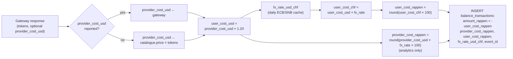
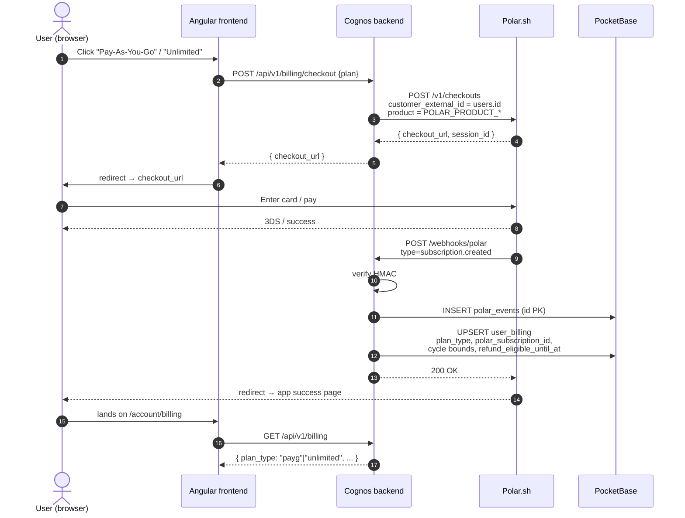
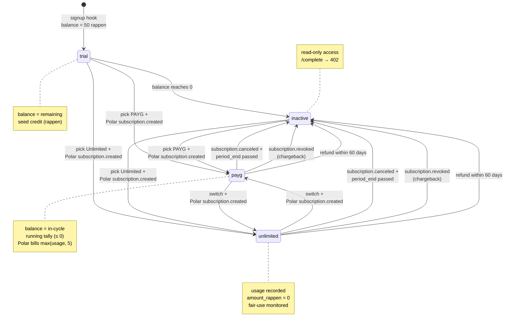
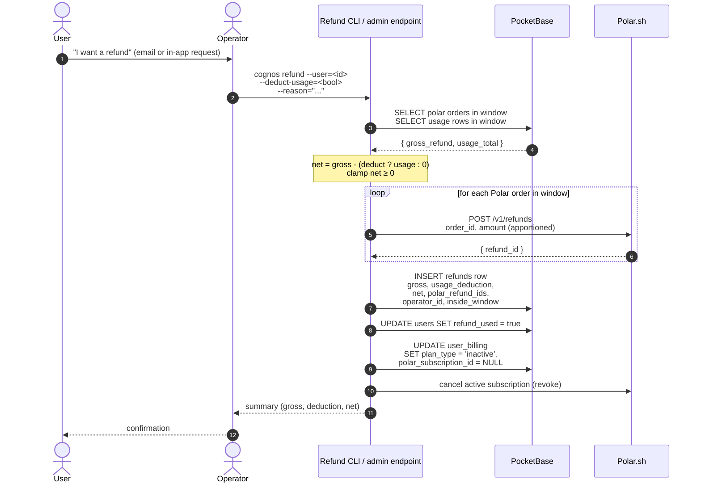

# Cognos Billing — Architecture Specification

**Version:** 0.1 (Draft) **Status:** Proposed **Stack:** Go (backend), Angular (frontend),
PocketBase/SQLite (primary store), Polar.sh (payments + tax)

---

## Table of Contents

1. [Overview & Goals](#1-overview--goals)
2. [Relationship to the Model-Selector Spec](#2-relationship-to-the-model-selector-spec)
3. [Plans](#3-plans)
4. [Pricing & Cost Calculation](#4-pricing--cost-calculation)
5. [Polar.sh Integration](#5-polarsh-integration)
6. [Billing State Machine](#6-billing-state-machine)
7. [Money-Back Guarantee](#7-money-back-guarantee)
8. [Fair-Use Policy (Unlimited Plan)](#8-fair-use-policy-unlimited-plan)
9. [Data Model](#9-data-model)
10. [Webhook Handler](#10-webhook-handler)
11. [Month-End PAYG Billing Job](#11-month-end-payg-billing-job)
12. [APIs](#12-apis)
13. [UI / UX Touchpoints](#13-ui--ux-touchpoints)
14. [Failure Modes & Edge Cases](#14-failure-modes--edge-cases)
15. [Tax & Compliance Notes](#15-tax--compliance-notes)
16. [Implementation Roadmap](#16-implementation-roadmap)
17. [Open Questions & Assumptions](#17-open-questions--assumptions)

---

## 1. Overview & Goals

Cognos charges all users for access. Two plans are offered, both billed in **CHF** (excluding
tax — Polar.sh adds tax on top at checkout). All payments are processed through **Polar.sh**, which
acts as the Merchant of Record and handles VAT / sales-tax compliance on our behalf.

The product offers a **60-day money-back guarantee** on every first purchase. Users may also be
refunded later at our discretion, with provider usage optionally deducted (see Section 7).

### Goals

1. Charge users in CHF using Polar.sh as the only payment surface.
2. Support two plans — **Pay-As-You-Go** and **Unlimited (with fair usage)** — plus a small free
   trial on signup that converts into a read-only state after exhaustion.
3. Apply a **20% margin** to provider COGS on PAYG, transparently to the user (they see Cognos
   prices, not provider prices).
4. Keep PAYG billing **post-paid** with a **CHF 5/month minimum**, computed from our own
   `balance_transactions` ledger and reconciled via a single Polar order at cycle end.
5. Track usage for the Unlimited plan but do not block — surface abuse to operators via a nightly
   internal report.
6. Honour the **60-day money-back guarantee** with a documented refund process and a clear ledger.
7. Store every Polar webhook event so we can replay, audit, and reconcile.

### Non-goals (this spec)

- Self-serve plan migration UI in production polish (manual admin path acceptable initially).
- Multi-currency display (CHF only; Polar may render local-currency equivalents at checkout).
- Invoicing infrastructure — Polar produces invoices.
- Dunning automation beyond what Polar provides natively.

---

## 2. Relationship to the Model-Selector Spec

This document **supersedes** the billing portions of
[`backend-model-selector.md`](./backend-model-selector.md) (Section 4.4 and the `user_billing` /
`balance_transactions` schemas) with the following amendments:

| Topic                       | Old (`backend-model-selector.md`)  | New (this spec)                                                          |
| --------------------------- | ---------------------------------- | ------------------------------------------------------------------------ |
| PAYG monthly minimum        | CHF 5 base fee (mechanism unclear) | CHF 5/mo post-paid floor via Polar — `max(usage_with_margin, 500 rappen)`|
| Unlimited price             | CHF 35/mo                          | **CHF 100/mo** or **CHF 1000/yr** (2 months free)                        |
| Plan enum value             | `flat_rate`                        | `unlimited` (rename — `flat_rate` kept as a temporary alias if needed)   |
| Margin                      | Not defined                        | **+20%** on provider USD cost, then convert to CHF                       |
| Payment processor           | Not defined ("manual for now")     | **Polar.sh** (Merchant of Record, handles tax)                           |
| Free state                  | Not defined                        | Small signup credit → read-only after exhaustion                         |
| Refund policy               | Not defined                        | 60-day money-back, optional usage deduction                              |

All other content in `backend-model-selector.md` (model catalogue, gateway, encryption, analytics)
is unchanged and remains the source of truth.

The existing `backend/internal/billing/service.go` (`CalculateCost`, `CanAfford`) is the
implementation starting point. This spec extends it with margin, plan-aware behaviour, and Polar
integration.

---

## 3. Plans

There are exactly three billing states a user can be in. Every authenticated user is in **exactly
one** at any moment.

| State            | Plan enum value | Price (excl. tax)                                  | Usage handling                                                              |
| ---------------- | --------------- | -------------------------------------------------- | --------------------------------------------------------------------------- |
| Trial            | `trial`         | Free, capped to seed credit (default CHF 0.50)     | Usage deducts from seed credit. After exhaustion → `inactive`.              |
| Pay-As-You-Go    | `payg`          | CHF 5/mo minimum, post-paid; usage above min added | Every completion → usage row in `balance_transactions`. Cycle end → Polar.  |
| Unlimited        | `unlimited`     | CHF 100/mo **or** CHF 1000/yr (≈ 2 months free)    | Usage recorded for analytics + fair-use monitoring; no charge per request.  |
| (transient) None | `inactive`      | n/a                                                | `/complete` returns 402. Read-only access to history/settings retained.     |

### 3.1 Trial

- Granted automatically on first successful signup.
- Seed amount configurable; default **CHF 0.50 (50 rappen)**.
- Lives in `user_billing.balance_rappen` with `plan_type = "trial"`.
- Usage deducts from the seed balance using the same PAYG cost formula (provider cost × 1.20 → CHF).
  Margin is applied even on trial so behaviour is identical post-conversion.
- When balance reaches 0 (or first attempted completion that would put it below 0), the next
  `/complete` returns `402` and the plan transitions to `inactive`.
- Trial credit does **not** roll over into PAYG or Unlimited — it is consumed or expires.
- A user is granted trial credit **exactly once** in their lifetime, keyed on `users.id`.

### 3.2 Pay-As-You-Go

- Plan starts when Polar confirms the PAYG subscription (one Polar product, CHF 5/mo).
- Throughout each Polar billing cycle, every completion writes a `usage` row to
  `balance_transactions` with `amount_rappen = -cost_rappen`. `balance_rappen` is a **running
  in-cycle tally** (starts at 0 at each cycle boundary, goes negative as usage accrues).
- At Polar's cycle-end webhook (`subscription.updated` with new `current_period_start`), we run the
  **PAYG cycle-close job** (Section 11):
  1. Compute `cycle_usage_rappen = -SUM(amount_rappen) for usage rows in [period_start, period_end)`
  2. Compute `chargeable_rappen = max(cycle_usage_rappen, 500)` ← the CHF 5 minimum floor
  3. The CHF 5 subscription itself has already been billed by Polar; if
     `cycle_usage_rappen > 500`, raise a one-time Polar order for the **overage**:
     `overage_rappen = cycle_usage_rappen - 500`
  4. Record both the subscription charge and any overage charge as `topup` rows in
     `balance_transactions` so the ledger nets to zero per cycle.
- A user with a failed/canceled PAYG subscription drops back to `inactive`.
- Users can switch PAYG → Unlimited at any point; the in-cycle PAYG usage is settled at the next
  cycle boundary as normal.

> **Note on top-ups.** This spec does not implement prefunded top-up packs. The user's earlier
> language about "loading up the account" is captured by Polar billing post-paid against the
> internal usage ledger — no separate top-up product is needed. If we later want a prepay product
> (e.g. for users who want a hard cap), it can be added without changing the ledger model.

### 3.3 Unlimited

- Two Polar products: **`unlimited_monthly`** (CHF 100/mo) and **`unlimited_annual`** (CHF 1000/yr).
- Annual is a single Polar subscription product; the CHF 200/yr discount is encoded directly in the
  product price (no coupon code required).
- Renewal is automatic via Polar. Cancellation = no auto-renew at next cycle boundary.
- Every completion still writes a `usage` row to `balance_transactions` with
  `amount_rappen = 0` (i.e. no balance impact) and the real cost recorded in
  `provider_cost_rappen` / `user_cost_rappen` columns (see schema). This keeps a complete picture
  of provider COGS per user for fair-use review (Section 8) without affecting their balance.

### 3.4 Plan switches — summary

| From → To                        | When does it take effect?                              | Refund?                                |
| -------------------------------- | ------------------------------------------------------ | -------------------------------------- |
| Trial → PAYG / Unlimited         | On first Polar payment success                         | n/a                                    |
| PAYG → Unlimited (monthly/annual)| Immediately; PAYG cycle settles at next cycle boundary | Carryover credits: none                |
| Unlimited (monthly) → PAYG       | At end of current paid period                          | No (paid period used in full)          |
| Unlimited (annual) → PAYG        | At end of current paid period (no pro-rata refund)     | No unless inside 60-day guarantee      |
| Unlimited monthly ↔ annual       | At end of current paid period                          | No                                     |
| Any → cancelled (`inactive`)     | At end of current paid period                          | No unless inside 60-day guarantee      |

---

## 4. Pricing & Cost Calculation

### 4.1 Margin and FX — the canonical pipeline

The single canonical cost pipeline for every completion:



```text
1.  provider_cost_usd       <- gateway response (if reported) OR catalogue * tokens
2.  user_cost_usd           <- provider_cost_usd * (1 + MARGIN)         # MARGIN = 0.20
3.  fx_rate_usd_chf         <- FX cache (refreshed daily, see 4.3)
4.  user_cost_chf           <- user_cost_usd * fx_rate_usd_chf
5.  user_cost_rappen        <- round(user_cost_chf * 100)               # integer
6.  provider_cost_rappen    <- round(provider_cost_usd * fx_rate * 100) # for analytics only
```

Why USD-first markup, then FX?

- The 20% is margin on **cost of goods sold**, which is incurred in USD. Compounding it in the
  cost denomination keeps the margin a stable percentage relative to provider invoices regardless
  of FX swings.
- We store three values (`provider_cost_usd`, `user_cost_usd`, `user_cost_chf`) plus the FX rate
  at request time — every figure on the ledger is independently auditable from the others.
- Mathematically `a*1.2*b == a*b*1.2`, so this is a clarity/audit choice, not a numeric one.

### 4.2 Storage rules

- **All monetary balances and transaction amounts are stored as integer Rappen.** 1 CHF = 100
  Rappen. No floats in the ledger.
- USD values (`provider_cost_usd`, `user_cost_usd`) are stored as `DOUBLE` for analytics only;
  they are never used to drive balance arithmetic.
- The FX rate used for a transaction is stored alongside that transaction — never re-derived.
- A negative `balance_rappen` is a valid in-cycle state for PAYG (it represents in-cycle accrued
  usage). For Trial, negative balance must be impossible (block before deduction).

### 4.3 FX rate

- Source: ECB or SNB daily reference rate, fetched once per `FX_RATE_REFRESH_HOURS` (default 24).
- Fallback constant in env (`FX_RATE_FALLBACK_USD_CHF`) used if the fetch fails on startup.
- The rate snapshot used for a request is **captured at the time of the gateway call** — not at
  cycle end. This locks the user-facing cost for that completion regardless of later FX moves.

### 4.4 Configurable values

| Config                                 | Default                | Notes                                                      |
| -------------------------------------- | ---------------------- | ---------------------------------------------------------- |
| `BILLING_MARGIN_BPS`                   | `2000` (= 20.00%)      | Basis points; allows fine adjustment without code change.  |
| `BILLING_PAYG_MIN_RAPPEN`              | `500` (CHF 5.00)       | Cycle floor for PAYG.                                      |
| `BILLING_UNLIMITED_MONTHLY_RAPPEN`     | `10000` (CHF 100.00)   | Polar subscription price (excl. tax).                      |
| `BILLING_UNLIMITED_ANNUAL_RAPPEN`      | `100000` (CHF 1000.00) | Polar subscription price (excl. tax).                      |
| `BILLING_TRIAL_SEED_RAPPEN`            | `50` (CHF 0.50)        | Granted once on signup.                                    |
| `BILLING_REFUND_GUARANTEE_DAYS`        | `60`                   | Money-back window.                                         |
| `BILLING_UNLIMITED_FAIR_USE_ALERT_CHF` | `200.0`                | Nightly alert threshold (user-cost CHF). 2× monthly price. |

---

## 5. Polar.sh Integration

### 5.1 Product catalogue (Polar side)

We need exactly four Polar products (Sandbox + Production):

| Polar product slug      | Type                  | Price (excl. tax) | Maps to                                                |
| ----------------------- | --------------------- | ----------------- | ------------------------------------------------------ |
| `cognos-payg`           | Recurring (monthly)   | CHF 5.00          | PAYG minimum subscription                              |
| `cognos-payg-overage`   | One-time (variable)   | dynamic, CHF      | PAYG cycle-end overage charge (created per cycle)      |
| `cognos-unlimited-m`    | Recurring (monthly)   | CHF 100.00        | Unlimited monthly                                      |
| `cognos-unlimited-y`    | Recurring (annual)    | CHF 1000.00       | Unlimited annual                                       |

> The overage product is a single Polar product with a variable price set per order via API at
> cycle close. If Polar requires a fixed-price product, we instead create a fresh ad-hoc product
> per cycle close (less clean but works) — confirm during integration.

### 5.2 Currency

Polar's primary settlement currency is USD; CHF support has been expanding. **Confirm at
integration time** that Polar supports CHF-denominated subscriptions for our org. If CHF is not
yet supported for subscriptions, fall back to **EUR-denominated** products with prices set to the
CHF equivalent at the time of product creation, and document the rounding policy clearly. All
internal accounting stays in CHF regardless.

### 5.3 Configuration

```bash
# ── Polar.sh ──────────────────────────────────────────────
POLAR_API_BASE=https://api.polar.sh                 # or sandbox host
POLAR_ORG_ID=org_xxx
POLAR_ACCESS_TOKEN=polar_xxx                        # server-side; never client
POLAR_WEBHOOK_SECRET=whsec_xxx                      # for HMAC verification
POLAR_PRODUCT_PAYG=prod_xxx
POLAR_PRODUCT_PAYG_OVERAGE=prod_xxx
POLAR_PRODUCT_UNLIMITED_MONTHLY=prod_xxx
POLAR_PRODUCT_UNLIMITED_ANNUAL=prod_xxx
```

### 5.4 Webhook events we listen for

| Polar event                  | What we do                                                                                              |
| ---------------------------- | ------------------------------------------------------------------------------------------------------- |
| `subscription.created`       | Transition user `inactive`/`trial` → `payg`/`unlimited`. Snapshot `polar_subscription_id`, cycle bounds.|
| `subscription.updated`       | Detect cycle rollover (`current_period_start` changed) → run PAYG cycle-close job (Section 11).         |
| `subscription.canceled`      | Mark plan ending at `current_period_end`. After that timestamp passes, transition to `inactive`.        |
| `subscription.active`        | Defensive re-sync to `payg`/`unlimited` (e.g. after dunning recovery).                                  |
| `subscription.revoked`       | Hard cancel — set plan to `inactive` immediately (used in chargebacks).                                 |
| `order.created`              | Record any one-time payment (overage, ad-hoc top-up if introduced later).                               |
| `order.refunded`             | Mark refund in `refunds` table; do NOT auto-reverse balance — manual reconciliation step.               |
| `customer.updated`           | Sync email / customer metadata if changed externally.                                                   |

All other Polar event types are logged to `polar_events` for replay but otherwise ignored.

### 5.5 Idempotency & verification

- Every webhook hit verifies the HMAC signature using `POLAR_WEBHOOK_SECRET`. Bad signature → 401
  and no DB write.
- Polar's event ID (e.g. `evt_xyz`) is the primary key on `polar_events`. Re-delivery is a no-op.
- Webhook handler is `O(1)` work: write the raw event, enqueue domain side-effects on a separate
  internal queue. Re-deliveries from Polar don't compound side effects.

### 5.6 Checkout sequence



### 5.7 Server-to-Polar calls

The backend calls Polar to:

- Create a **checkout session** when a logged-in user chooses a plan (`POST /v1/checkouts`).
- Create a **one-time order** at PAYG cycle close for the overage amount.
- Cancel / reactivate a user's subscription if they hit "cancel" in our UI (or we proxy to Polar's
  hosted customer portal — see 13.4).
- Issue **refunds** via the Polar API as part of the money-back flow (Section 7).

Each call is retried with exponential backoff up to 5 minutes; persistent failure raises an alert.

---

## 6. Billing State Machine



Edges:

- **signup**: PocketBase user `OnRecordAfterCreate` hook → `user_billing` row with
  `plan_type='trial'`, `balance_rappen=50` (configurable).
- **trial → inactive**: triggered inside the completion handler when `CanAfford` returns false.
  Sets `plan_type='inactive'`, `balance_rappen=0`. Does **not** delete usage history.
- **inactive → payg|unlimited**: triggered by Polar `subscription.created` webhook. Sets
  `plan_type`, `polar_subscription_id`, cycle bounds, resets `balance_rappen=0` (PAYG running
  tally).
- **payg|unlimited → inactive**: scheduled by `subscription.canceled` + `period_end` cron, or
  immediate via `subscription.revoked`.

A user's state and Polar state must reconcile every cycle (Section 14.2).

---

## 7. Money-Back Guarantee

### 7.1 Policy

- **Window**: 60 calendar days from the **first successful Polar payment of the active
  subscription** (`refund_eligible_until_at` is snapshotted at subscription creation).
- **Trigger**: user emails support / clicks a "request refund" button. Initial implementation is
  email-driven; an in-app self-serve refund flow can come later.
- **Scope**: applies to the first paid period only (the initial monthly or annual payment). For
  annual users, this is potentially significant — a full CHF 1000 refund is on the table for 60
  days.
- **Usage deduction**: at operator discretion, we may deduct the actual user-facing cost of usage
  consumed in the refund period from the refund amount. The deducted figure uses the same PAYG
  formula (provider cost × 1.20, converted to CHF at the snapshot FX rate).
- **One-time per customer**: each `users.id` is eligible for the refund exactly once in their
  lifetime, even if they later sign up for a different plan.

### 7.2 Refund cases — examples

| Case                                            | Refund                                                       |
| ----------------------------------------------- | ------------------------------------------------------------ |
| Unlimited annual @ day 5, ~zero usage           | Full CHF 1000.                                               |
| Unlimited annual @ day 40, CHF 50 of usage      | Full CHF 1000 OR CHF 950 (operator chooses).                 |
| Unlimited annual @ day 90                       | No refund (outside window). Goodwill case only.              |
| PAYG @ day 30, CHF 12 billed, complaint         | Refund CHF 12 (last cycle). Usage deduction at op discretion.|
| Unlimited monthly @ day 5                       | Full CHF 100.                                                |
| Unlimited monthly @ day 35, on month 2          | Last month's CHF 100 only (still in 60d window).             |

### 7.3 Process



1. Support agent loads the user's `/admin/billing/{user_id}` page (or runs a CLI command):
   `cognos refund --user=<id> --reason="..." --deduct-usage=<true|false>`
2. The tool computes:
   - `gross_refund_rappen` = sum of Polar orders/subscription charges in the refund window
   - `usage_deduction_rappen` = (optional) sum of `user_cost_rappen` for usage rows in that window
   - `net_refund_rappen` = `gross_refund_rappen - usage_deduction_rappen` (clamped ≥ 0)
3. The tool calls Polar's refund API for each underlying Polar order with the apportioned amount.
4. A `refund` row is written with `polar_refund_ids`, the breakdown, and the operator who
   authorised it.
5. The user's plan is moved to `inactive` (refund implies they didn't want it).
6. `users.refund_used = true` is set to enforce one-per-lifetime.

### 7.4 Goodwill refunds outside the 60-day window

These exist but are not codified. The same CLI command works with a `--force` flag and a written
reason. There is no automatic limit.

### 7.5 Chargebacks

When Polar fires `subscription.revoked` / equivalent for a chargeback, we treat it the same as a
refund (set plan to `inactive`, log the event, no auto-reversal of usage data). Operators are
notified for fraud review.

---

## 8. Fair-Use Policy (Unlimited Plan)

The Unlimited plan is marketed as predictable pricing for typical individual / business use. It
is **not** a license for industrial-scale automation.

### 8.1 Enforcement model

**Monitor only. No automated user-facing block.** A nightly DuckDB query against the analytics
parquet files identifies any `unlimited` user whose 30-day rolling user-facing cost exceeds
`BILLING_UNLIMITED_FAIR_USE_ALERT_CHF` (default CHF 200/mo — i.e. 2× the monthly price).

```sql
SELECT
    billing_user_id,
    SUM(user_cost_chf) AS rolling_30d_cost_chf,
    COUNT(*)           AS request_count
FROM read_parquet('s3://cognos-analytics/events/**/*.parquet')
WHERE
    plan_type = 'unlimited'
    AND occurred_at >= NOW() - INTERVAL 30 DAY
GROUP BY billing_user_id
HAVING SUM(user_cost_chf) > 200.0
ORDER BY rolling_30d_cost_chf DESC;
```

Result is delivered to an internal email/Slack channel. Operator decides per-case action:

- Reach out, ask about use case.
- Suggest a custom Enterprise contract.
- In egregious abuse cases (>10× monthly price, clear automation), apply a manual rate limit or
  request migration to PAYG with notice.

### 8.2 Marketing copy

Wherever the Unlimited plan is advertised, the page must include a single sentence near the
purchase CTA: **"Subject to a fair-use policy for human, conversational use."** No specific CHF
threshold is published — it stays internal.

---

## 9. Data Model

### 9.1 Changes to existing tables

#### `users` (additions)

| Field                  | Type     | Notes                                                                  |
| ---------------------- | -------- | ---------------------------------------------------------------------- |
| `refund_used`          | Bool     | Default false. Set true when a refund has been issued (lifetime flag). |
| `polar_customer_id`    | Text     | Polar's customer ID, set on first Polar interaction. Nullable.         |

#### `user_billing` (rename / extend)

| Field                          | Type     | Notes                                                                                                |
| ------------------------------ | -------- | ---------------------------------------------------------------------------------------------------- |
| `id`                           | Text PK  | Existing. This remains the opaque `billing_user_id` used in analytics.                               |
| `user_id`                      | FK users | Existing.                                                                                            |
| `plan_type`                    | Text     | Now one of: `trial`, `payg`, `unlimited`, `inactive`. (Old `flat_rate` migrated to `unlimited`.)     |
| `plan_started_at`              | DateTime | Existing.                                                                                            |
| `plan_ends_at`                 | DateTime | Existing. Set when scheduled to cancel.                                                              |
| `balance_rappen`               | Integer  | Existing. For `trial` = remaining credit; for `payg` = in-cycle running tally (typically ≤ 0).       |
| `polar_subscription_id`        | Text     | NEW. Active Polar subscription ID. Null for `trial`/`inactive`.                                      |
| `polar_product_id`             | Text     | NEW. Polar product the subscription points at.                                                       |
| `polar_cycle_start_at`         | DateTime | NEW. Current Polar billing cycle start.                                                              |
| `polar_cycle_end_at`           | DateTime | NEW. Current Polar billing cycle end (= renewal/cancel boundary).                                    |
| `refund_eligible_until_at`     | DateTime | NEW. Snapshot of `first_payment_at + 60 days`. Null for `trial`.                                     |

#### `balance_transactions` (extend)

| Field                  | Type     | Notes                                                                                                     |
| ---------------------- | -------- | --------------------------------------------------------------------------------------------------------- |
| `id`                   | Text PK  | Existing.                                                                                                 |
| `user_id`              | FK users | Existing.                                                                                                 |
| `occurred_at`          | DateTime | Existing.                                                                                                 |
| `type`                 | Text     | Now one of: `usage`, `topup`, `min_charge`, `overage_charge`, `refund`, `trial_seed`, `adjustment`.       |
| `amount_rappen`        | Integer  | Signed: negative for usage/refund-out, positive for topup/refund-in.                                      |
| `balance_after_rappen` | Integer  | Existing.                                                                                                 |
| `event_id`             | Text     | Existing — links to analytics `event_id` for `usage`. Null otherwise.                                     |
| `polar_order_id`       | Text     | NEW. Null for `usage` / `trial_seed`; populated for `topup` / `min_charge` / `overage_charge` / `refund`. |
| `provider_cost_rappen` | Integer  | NEW. For `usage` rows only. The raw provider cost in CHF (no margin). Allows margin recomputation.        |
| `user_cost_rappen`     | Integer  | NEW. For `usage` rows only. The marked-up user-facing cost in CHF. = `-amount_rappen` for PAYG.           |
| `fx_rate_usd_chf`      | Double   | NEW. For `usage` rows only. The FX rate snapshot at request time.                                         |
| `description`          | Text     | Existing.                                                                                                 |

### 9.2 New tables

#### `polar_events`

Raw, deduplicated webhook log. Source of truth for everything Polar tells us.

| Field                   | Type     | Notes                                                                  |
| ----------------------- | -------- | ---------------------------------------------------------------------- |
| `id`                    | Text PK  | Polar event ID (e.g. `evt_xxx`). Primary key — natural idempotency.    |
| `received_at`           | DateTime | When we received it.                                                   |
| `type`                  | Text     | Polar event type (e.g. `subscription.created`).                        |
| `polar_customer_id`     | Text     | Indexed for join.                                                      |
| `polar_subscription_id` | Text     | Indexed.                                                               |
| `polar_order_id`        | Text     | Indexed.                                                               |
| `payload_json`          | Text     | Full webhook body as received.                                         |
| `processed_at`          | DateTime | Null until our domain handler completes. Allows replay of unprocessed. |
| `processing_error`      | Text     | Null on success. Last error if any.                                    |

#### `refunds`

| Field                     | Type     | Notes                                                                            |
| ------------------------- | -------- | -------------------------------------------------------------------------------- |
| `id`                      | Text PK  | UUID.                                                                            |
| `user_id`                 | FK users |                                                                                  |
| `requested_at`            | DateTime |                                                                                  |
| `processed_at`            | DateTime | Null until completed.                                                            |
| `gross_refund_rappen`     | Integer  | Pre-deduction.                                                                   |
| `usage_deduction_rappen`  | Integer  | 0 if no deduction applied.                                                       |
| `net_refund_rappen`       | Integer  | What we actually refunded via Polar.                                             |
| `reason_text`             | Text     | Operator-recorded reason.                                                        |
| `operator_id`             | Text     | The admin user who authorised it.                                                |
| `polar_refund_ids_json`   | Text     | JSON array of Polar refund IDs created (may be multiple if window spans orders). |
| `inside_guarantee_window` | Bool     | True if requested within 60-day window.                                          |

#### `payg_cycle_summaries`

One row per closed PAYG cycle per user. Materialised at cycle close, useful for billing audits.

| Field                       | Type     | Notes                                                       |
| --------------------------- | -------- | ----------------------------------------------------------- |
| `id`                        | Text PK  |                                                             |
| `user_id`                   | FK users |                                                             |
| `cycle_start_at`            | DateTime |                                                             |
| `cycle_end_at`              | DateTime |                                                             |
| `usage_rappen`              | Integer  | `-SUM(usage amount_rappen)` over the cycle.                 |
| `min_charge_rappen`         | Integer  | 500 (= CHF 5) if `usage_rappen < 500`, else 0.              |
| `overage_charge_rappen`     | Integer  | `usage_rappen - 500` if positive, else 0.                   |
| `total_billed_rappen`       | Integer  | `max(usage_rappen, 500)`.                                   |
| `polar_subscription_id`     | Text     |                                                             |
| `polar_overage_order_id`    | Text     | Null if no overage charge.                                  |
| `closed_at`                 | DateTime | When the cycle-close job completed.                         |

---

## 10. Webhook Handler

### 10.1 Endpoint

`POST /webhooks/polar` — unauthenticated route (verified by HMAC), no JSON body limit (Polar
payloads are small but include nested customer/order objects).

### 10.2 Flow

```mermaid
flowchart TD
    A[POST /webhooks/polar] --> B[Read raw body bytes]
    B --> C{HMAC matches<br/>Polar-Webhook-Signature?}
    C -- no --> C1[Return 401<br/>No DB write]
    C -- yes --> D[Parse envelope:<br/>event_id, type]
    D --> E["INSERT INTO polar_events<br/>ON CONFLICT(id) DO NOTHING"]
    E --> F{Conflict?<br/>(duplicate delivery)}
    F -- yes --> F1[Return 200<br/>log 'duplicate']
    F -- no --> G[Dispatch by type to<br/>domain handler]
    G --> H{Handler success?}
    H -- yes --> I["UPDATE polar_events<br/>SET processed_at = now()"]
    I --> J[Return 200]
    H -- no --> K["UPDATE polar_events<br/>SET processing_error = ?"]
    K --> L[Return 500<br/>Polar retries → re-dispatch<br/>handlers MUST be idempotent]
```

```text
1. Read raw body (DO NOT json.Decode yet — signature is over raw bytes).
2. Verify HMAC: compare-constant-time(HMAC_SHA256(body, POLAR_WEBHOOK_SECRET),
                                      header "Polar-Webhook-Signature").
   - Mismatch -> 401, no DB write.
3. Parse the JSON envelope, extract event_id and type.
4. INSERT INTO polar_events ON CONFLICT(id) DO NOTHING.
   - If conflict: 200 OK, log "duplicate", return.
5. Dispatch by type to a domain handler (small per-event Go func).
6. On success: UPDATE polar_events SET processed_at = now() WHERE id = ?.
7. On error: log, UPDATE polar_events SET processing_error = ?.
   - Return 500 so Polar retries. The next attempt re-enters step 4, conflicts, but step 6 has not
     run -> we re-dispatch. Domain handlers must be idempotent.
```

### 10.3 Domain handler idempotency

Each handler must be safe to run multiple times. Specifically:

- `subscription.created`: `UPSERT user_billing SET plan_type, polar_subscription_id, cycle bounds
  WHERE user_id = ?` — keyed on `polar_subscription_id` uniqueness.
- `subscription.updated`: detect cycle rollover by comparing the event's `current_period_start` to
  the stored `polar_cycle_start_at`. Run PAYG close job only if changed.
- `subscription.canceled` / `subscription.revoked`: setting `plan_ends_at` and `plan_type` are
  idempotent assignments.
- `order.created` for overage: keyed on `polar_order_id` — if a `topup`/`overage_charge` row
  already exists for that order, skip.

### 10.4 Mapping Polar customer ↔ Cognos user

- When a Cognos user starts the checkout flow, we call Polar's `POST /v1/checkouts` with
  `customer_external_id = users.id`. Polar stores it and includes it in every subsequent webhook
  for that customer.
- The webhook handler resolves the Cognos user via `customer_external_id`. If the field is missing
  (e.g. a customer was created in the Polar dashboard manually), we fall back to
  `polar_customer_id` lookup on `users` — and if that fails too, log a `policy_error` event for
  manual triage.

---

## 11. Month-End PAYG Billing Job

### 11.1 Trigger

Run when `subscription.updated` arrives with a `current_period_start` later than the user's
stored `polar_cycle_start_at`. The job is also runnable manually via a CLI for backfill.

### 11.2 Steps

```mermaid
sequenceDiagram
    autonumber
    participant W as Webhook handler<br/>(subscription.updated)
    participant J as Cycle-close job
    participant DB as PocketBase
    participant P as Polar.sh

    W->>J: cycle_start changed →<br/>trigger close(user_id)
    J->>DB: BEGIN
    J->>DB: SELECT -SUM(amount_rappen)<br/>FROM balance_transactions<br/>WHERE type='usage'<br/>AND occurred_at ∈ cycle
    DB-->>J: usage_rappen
    Note over J: min_rappen = 500<br/>overage = max(usage - 500, 0)
    J->>DB: INSERT balance_transactions<br/>type='min_charge'<br/>amount = +500<br/>desc = "PAYG min: CHF 5.00"
    alt overage > 0
        J->>P: POST /v1/orders<br/>product = POLAR_PRODUCT_PAYG_OVERAGE<br/>amount = overage rappen
        P-->>J: { order_id }
        J->>DB: INSERT balance_transactions<br/>type='overage_charge'<br/>amount = +overage<br/>polar_order_id = order_id
    end
    J->>DB: INSERT payg_cycle_summaries (...)
    J->>DB: UPDATE user_billing<br/>SET balance_rappen = 0,<br/>polar_cycle_start_at = new_start,<br/>polar_cycle_end_at = new_end
    J->>DB: COMMIT

    Note over J,P: Failure at any Polar call →<br/>ROLLBACK; webhook retry<br/>or nightly cron re-runs.
```

```text
1. BEGIN TRANSACTION
2. usage_rappen := -SUM(amount_rappen)
                   FROM balance_transactions
                   WHERE user_id = ?
                     AND type = 'usage'
                     AND occurred_at >= cycle_start
                     AND occurred_at <  cycle_end
3. min_rappen   := 500   # CHF 5.00 minimum from Polar subscription
4. overage     := max(usage_rappen - min_rappen, 0)
5. INSERT INTO balance_transactions (type='min_charge', amount=+min_rappen, polar_order_id=NULL,
        description="PAYG min: CHF 5.00")
6. IF overage > 0:
       order := polar.CreateOrder(
                  product = POLAR_PRODUCT_PAYG_OVERAGE,
                  amount  = overage,
                  customer = polar_customer_id,
                  description = "PAYG overage 2026-MM (...)")
       INSERT INTO balance_transactions (type='overage_charge', amount=+overage,
              polar_order_id=order.id, description="PAYG overage: CHF ...")
7. INSERT INTO payg_cycle_summaries (...)
8. UPDATE user_billing SET balance_rappen = 0, polar_cycle_start_at = new_start,
                            polar_cycle_end_at = new_end
9. COMMIT
```

After step 5+6, the ledger nets to zero per cycle (positive `topup`/`charge` rows offset negative
`usage` rows). Step 8 resets the in-cycle running tally.

### 11.3 Failure handling

- If Polar `CreateOrder` fails, the transaction rolls back and the cycle is left open. The next
  webhook retry (or a manual cron) re-attempts. `usage` rows are not lost.
- If the `subscription.updated` cycle rollover webhook is somehow missed, a nightly cron
  re-checks every active PAYG user's `polar_cycle_end_at < now()` and runs the close job.

---

## 12. APIs

All endpoints prefixed `/api/v1/`. Authenticated via the existing session.

### 12.1 `GET /api/v1/billing` (extend)

```json
{
  "plan_type": "payg",
  "balance_chf": -0.42,
  "balance_label": "CHF 0.42 used this cycle (charged at cycle end)",
  "polar_subscription_id": "sub_xxx",
  "cycle_start_at": "2026-06-01T00:00:00Z",
  "cycle_end_at":   "2026-07-01T00:00:00Z",
  "estimated_cycle_total_chf": 0.42,
  "refund_eligible_until_at": "2026-08-01T00:00:00Z",
  "manage_url": "https://polar.sh/customer-portal/...?token=..."
}
```

For `unlimited`:

```json
{
  "plan_type": "unlimited",
  "interval": "monthly",
  "next_renewal_at": "2026-07-15T00:00:00Z",
  "cancel_at_period_end": false,
  "refund_eligible_until_at": "2026-08-14T00:00:00Z",
  "manage_url": "..."
}
```

For `trial`:

```json
{
  "plan_type": "trial",
  "balance_chf": 0.32,
  "trial_seed_chf": 0.50
}
```

### 12.2 `POST /api/v1/billing/checkout`

Body:

```json
{ "plan": "payg" | "unlimited_monthly" | "unlimited_annual" }
```

Response:

```json
{ "checkout_url": "https://polar.sh/...?session=..." }
```

The frontend redirects the user to `checkout_url`. After payment, Polar redirects the user back
to our app and fires `subscription.created` to the webhook.

### 12.3 `POST /api/v1/billing/cancel`

Body: empty. Cancels the active Polar subscription at period end. Response 204.

(Alternative: skip this endpoint and link directly to Polar's hosted customer portal — see 13.4.)

### 12.4 `GET /api/v1/billing/transactions` (extend)

Returns transactions filtered to the current cycle for PAYG, last 50 for Unlimited.

### 12.5 `POST /api/v1/billing/refund-request` (initially: stubbed)

Body:

```json
{ "reason_text": "..." }
```

For v0 this simply emails support@cognos with the user's details and reason. A self-serve refund
flow is post-MVP.

### 12.6 Admin: `POST /admin/billing/refund` (operator-only)

Body:

```json
{ "user_id": "...", "deduct_usage": false, "reason_text": "...", "force_outside_window": false }
```

Authenticated via admin session. Drives Section 7.3.

### 12.7 Error responses on `/complete`

| HTTP code                                                                                                                                                         | Condition                                                                  |
| ----------------------------------------------------------------------------------------------------------------------------------------------------------------- | -------------------------------------------------------------------------- |
| `402 Payment Required`                                                                                                                                            | `plan_type='inactive'` OR `plan_type='trial' AND balance < estimated_cost` |
| (no change for 402 on PAYG — PAYG users are never "out of balance"; they're billed at cycle end. Failed Polar payment moves them to `inactive`, which then 402s.) |                                                                            |

---

## 13. UI / UX Touchpoints

### 13.1 Signup → first chat

- User registers; backend grants trial credit.
- The chat UI shows a small "Trial: CHF 0.50 remaining" pill near the model selector.
- First completion sent → succeeds (assuming sufficient seed credit).

### 13.2 Trial exhaustion

- On the next `/complete` that would deduct below 0, server returns 402 with
  `code = "TRIAL_EXHAUSTED"`.
- The chat UI shows a modal: "Your free trial is used up. Pick a plan to keep chatting."
    - Two buttons: **Pay-As-You-Go (CHF 5/mo + usage)** and **Unlimited (CHF 100/mo)**.
    - Annual offer surfaced beneath: **"Save CHF 200 with Unlimited Annual (CHF 1000/yr)"**.
- Choosing a plan hits `/api/v1/billing/checkout` and redirects to Polar.

### 13.3 Billing dashboard

A single page at `/account/billing` showing:

- Current plan + price + next renewal date (or current cycle window for PAYG).
- Current cycle usage breakdown (model × cost) for PAYG, with a running total.
- Recent transactions (latest 50).
- "Manage subscription / payment method" → link to Polar's customer portal.
- "Switch plan" CTA → opens checkout for the other plan.
- "Request refund" link (visible only inside the 60-day window).

### 13.4 Polar customer portal

We rely on Polar's hosted customer portal for:

- Updating payment method.
- Downloading invoices.
- Self-serve cancellation.

The portal URL is generated server-side on each `GET /api/v1/billing` call (Polar issues short-
lived tokens). We do not embed it; we link out.

### 13.5 Marketing wording

- Pricing page must show CHF amounts, **excl. tax**, with the line: "Polar.sh adds VAT/sales tax
  at checkout based on your location."
- 60-day guarantee badge visible on both plans.
- Fair-use sentence under Unlimited (see 8.2).

---

## 14. Failure Modes & Edge Cases

### 14.1 Polar webhook is delayed / never arrives

- Nightly job re-checks: for every user with `polar_cycle_end_at < now() - 1h`, attempt to fetch
  the latest subscription state from Polar's API and reconcile.
- If Polar reports the subscription canceled but we still think it's active for > 24h, alert.

### 14.2 Reconciliation

A weekly job:

```sql
-- All Polar subscriptions Polar thinks are active
-- vs. all user_billing rows we think have an active polar_subscription_id
-- Symmetric diff -> alert.
```

This catches: orphaned Polar subscriptions (Polar active, we don't know about it), and
optimistic-locked rows (we think active, Polar canceled).

### 14.3 User deletes their account

- Block account deletion if any unbilled PAYG usage exists (run the close job first).
- After close: cancel the active Polar subscription immediately (revoke), null out
  `polar_subscription_id`. Keep `balance_transactions`, `payg_cycle_summaries`, `refunds`,
  `polar_events` for audit. `users` row may be soft-deleted depending on existing auth design.

### 14.4 FX rate fetch fails on a critical day

- We fall back to `FX_RATE_FALLBACK_USD_CHF`. Operator is notified. Cycle close still runs.
- Each `usage` row records the FX rate actually used, so the audit trail is preserved.

### 14.5 Negative balance for trial

- The completion handler's `CanAfford` check uses an **estimated upper bound** for the request
  (max context-window tokens × output-max × catalogue rate × 1.20 × FX). This may over-reserve
  for trial users but prevents going negative.

### 14.6 Concurrent completions within a cycle

- The `balance_transactions` insert + `user_billing.balance_rappen` update for PAYG must run in a
  single SQL transaction with row-level locking on `user_billing`. SQLite serialises writes per
  database file — acceptable for current scale; revisit if we shard.

### 14.7 Refund inside the same cycle as new usage

- Refund logic uses `polar_order_id` linkage; refunding the PAYG min-charge or overage order
  reverses the corresponding row in `balance_transactions` (via a new `refund` row, not a delete).
- Usage rows are never deleted — they remain in the ledger.

### 14.8 User signs up, never uses, never pays

- They stay on `trial` until they exhaust seed credit (which they never do). No webhook fires.
  This is fine. No data scrubbing required by this spec.

### 14.9 What if Polar tax rate retroactively changes for a region?

- Polar handles this on their invoice. Our internal accounting is net-of-tax. No action required.

---

## 15. Tax & Compliance Notes

- **Polar.sh is Merchant of Record.** They collect VAT / sales tax in jurisdictions where required
  and remit to authorities. We do not handle tax registration, returns, or invoicing ourselves.
- All prices in our UI, our database, and this spec are **net of tax**. The customer's actual
  payment includes Polar's tax surcharge at checkout — we do not see or record it.
- Polar invoices are the legal record. Our `polar_events` table stores enough metadata
  (order IDs, amounts net of tax) to reconcile against Polar's reports.
- Switzerland VAT (8.1% standard) applies to CH customers; Polar handles this automatically. Our
  internal cost analysis ignores VAT.

---

## 16. Implementation Roadmap

Build in phases gated by review. Each phase ships behind feature flags where possible so the
existing test deployment isn't broken mid-rollout.

### Phase B1 — Cost pipeline & ledger foundation

| #    | Task                                                                               | Area               |
| ---- | ---------------------------------------------------------------------------------- | ------------------ |
| B1.1 | Extend `internal/billing/service.go` to apply `BILLING_MARGIN_BPS`                 | `billing`          |
| B1.2 | Add `provider_cost_rappen`, `user_cost_rappen`, `fx_rate_usd_chf` to ledger schema | `store`, migration |
| B1.3 | Update `/complete` handler to write the extended `usage` row                       | `handler`          |
| B1.4 | Add FX rate cache + ECB/SNB fetch + fallback                                       | `billing`          |
| B1.5 | Unit tests covering margin math, FX rounding, integer-Rappen invariants            | `billing`          |

### Phase B2 — Plans, trial, and inactive state

| #    | Task                                                                             | Area               |
| ---- | -------------------------------------------------------------------------------- | ------------------ |
| B2.1 | Migration: add new `plan_type` enum values; map legacy `flat_rate` → `unlimited` | `store`, migration |
| B2.2 | `OnRecordAfterCreate` hook seeding `trial` + balance                             | `hooks`            |
| B2.3 | `CanAfford` gate inside `/complete` returning 402 with structured code           | `handler`          |
| B2.4 | Trial-exhaustion modal in frontend                                               | frontend           |
| B2.5 | Integration tests for trial → inactive transition                                | backend tests      |

### Phase B3 — Polar integration

| #    | Task                                                                         | Area                |
| ---- | ---------------------------------------------------------------------------- | ------------------- |
| B3.1 | Create the four Polar products (sandbox + prod) and capture IDs              | ops                 |
| B3.2 | `internal/polar/` client: checkout, order, refund, customer-portal           | `polar`             |
| B3.3 | `POST /api/v1/billing/checkout` and frontend redirect                        | `handler`, frontend |
| B3.4 | `POST /webhooks/polar`: HMAC verify + raw write to `polar_events`            | `handler`           |
| B3.5 | Domain handlers for `subscription.{created,updated,canceled,revoked,active}` | `billing`           |
| B3.6 | Domain handlers for `order.{created,refunded}`                               | `billing`           |
| B3.7 | Reconciliation job (Section 14.2)                                            | `jobs`              |

### Phase B4 — PAYG cycle close & overage

| #    | Task                                                       | Area          |
| ---- | ---------------------------------------------------------- | ------------- |
| B4.1 | `internal/billing/cycle.go` cycle-close routine            | `billing`     |
| B4.2 | Trigger from `subscription.updated`; fallback nightly cron | `jobs`        |
| B4.3 | `payg_cycle_summaries` materialised                        | `store`       |
| B4.4 | Integration tests: zero-usage, sub-min, exact-min, overage | backend tests |

### Phase B5 — Refunds & admin

| #    | Task                                                                       | Area               |
| ---- | -------------------------------------------------------------------------- | ------------------ |
| B5.1 | `refunds` table + migration                                                | `store`, migration |
| B5.2 | CLI `cognos refund` + admin endpoint                                       | `cmd`, `handler`   |
| B5.3 | Stubbed user-facing `POST /api/v1/billing/refund-request` (emails support) | `handler`          |
| B5.4 | One-refund-per-lifetime enforcement                                        | `billing`          |

### Phase B6 — Dashboard & marketing surfaces

| #    | Task                                                                     | Area          |
| ---- | ------------------------------------------------------------------------ | ------------- |
| B6.1 | `/account/billing` page (plan, cycle, transactions, manage-portal link)  | frontend      |
| B6.2 | Pricing page CHF + tax-on-top wording + fair-use sentence                | web/marketing |
| B6.3 | 60-day guarantee badge & FAQ                                             | web/marketing |
| B6.4 | E2E: signup → trial → exhaust → checkout → success → completion succeeds | e2e           |

### Phase B7 — Fair-use monitoring

| #    | Task                                          | Area   |
| ---- | --------------------------------------------- | ------ |
| B7.1 | Nightly DuckDB fair-use query → alert channel | `jobs` |
| B7.2 | Operator runbook for fair-use outreach        | docs   |

---

## 17. Open Questions & Assumptions

Items still requiring confirmation or that I assumed defaults for. Each one is safe to change
without restructuring the spec.

### 17.1 Assumptions made (please confirm or correct)

1. **CHF support in Polar.** Spec assumes Polar supports CHF-denominated subscriptions for our org.
   If not, fallback is EUR-denominated products with prices set to the CHF equivalent. To confirm
   at integration time.
2. **Trial seed amount.** Assumed CHF 0.50. Tweak via `BILLING_TRIAL_SEED_RAPPEN`.
3. **One refund per user lifetime.** Assumed yes (standard SaaS); enforced via `users.refund_used`.
4. **Annual refund pro-rata outside 60-day window.** Assumed **no** — outside the window we offer
   no refund as a matter of policy, only goodwill exceptions with `--force`.
5. **PAYG model is purely post-paid.** No prefunded top-up packs in this spec. We can add a
   "buy CHF 20 of credit" product later without changing the ledger.
6. **Fair-use threshold.** Assumed CHF 200/mo rolling 30-day user-cost as the internal alert.
   Not published to users.
7. **Switch from Unlimited monthly → annual** mid-cycle: treated as end-of-cycle change, no
   pro-rata. If you want immediate-with-credit, that's a separate phase.
8. **Plan switch during 60-day window.** A user inside the 60-day window who switches plans
   carries the window forward against the **original** subscription start, not the new one.
9. **VAT-inclusive vs exclusive display.** All UI shows excl. tax with explicit "Tax added at
   checkout" note, matching common SaaS practice in CH/EU. Some markets prefer incl-tax — easy to
   flip if you'd rather.
10. **The PAYG min-charge happens via Polar's subscription itself.** Polar bills CHF 5/mo
    automatically; we only push an overage order when usage exceeds CHF 5. If you'd prefer the min
    floor be enforced via a single combined month-end order (instead of a base subscription +
    overage), say so — that's a different Polar product shape.

### 17.2 Open questions for you

1. **Do we offer a discount on Unlimited annual for users who upgrade from Unlimited monthly mid-
   cycle?** (e.g. credit unused monthly time against the annual.) Default in this spec: no.
2. **Should annual plan users get the 60-day guarantee on each renewal, or only on initial
   purchase?** Default in this spec: only initial purchase.
3. **Do we need to support business invoicing with company name / VAT ID on the invoice?**
   Polar supports a `customer_billing_address` and `tax_id` — easy to surface in checkout if
   wanted.
4. **Currency consistency in marketing.** The pricing page and the in-app dashboard should both
   display CHF — confirmed. But what about `cognos.io` regional landing pages? Out of scope here,
   but worth flagging for the marketing team.
5. **Granularity of admin tooling.** Spec assumes a CLI + minimal admin endpoint. If you want a
   richer admin UI (search user, see ledger, issue refund, change plan) that's its own follow-up.
