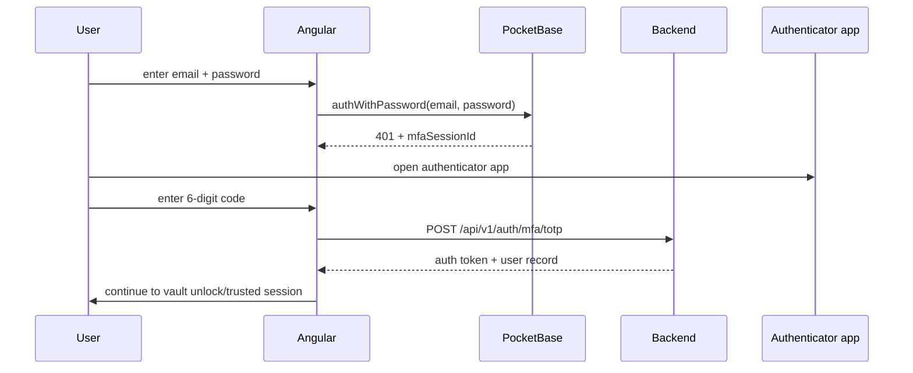
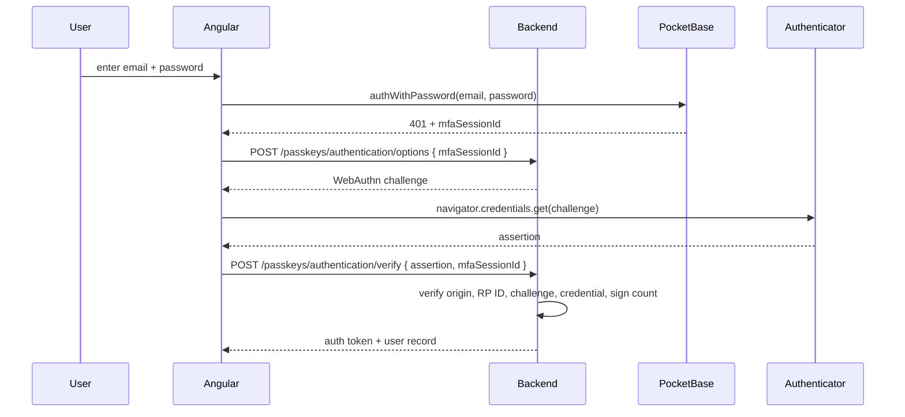

# MFA and Passkeys — Architecture Specification

**Status:** P0 (authenticator-app TOTP) implemented; P1 (passkeys) not started  
**Scope:** PocketBase auth hardening for Cognos accounts  
**Stack:** Go backend, Angular frontend, PocketBase v0.39.1, TOTP, WebAuthn/passkeys

## Decision summary

MFA is **authenticator-app only**.

1. **P0: custom TOTP MFA.**
   - Password remains the first factor.
   - Authenticator app codes are the only MFA factor.
   - Email OTP is explicitly not supported.
2. **P1: passkeys.**
   - Add custom WebAuthn endpoints and storage.
   - Use passkeys as a phishing-resistant sign-in / step-up option.
   - Do not let passkeys replace the Account Key.

Passkey-only login is a later decision. Fresh devices still need the Account Key to decrypt data.

## Resolved decisions

These were open in earlier drafts and are now settled:

1. **Lockout is acceptable; recovery favours security.** Losing both the authenticator and all
   recovery codes results in permanent loss of _auth_ access. This is a justifiable risk because the
   data was already gated by the Account Key. Therefore:
   - An email-verified password reset does **not** disable MFA. The new password still hits the MFA
     interceptor.
   - There is no self-service MFA reset. The only way to clear MFA without a valid code is a
     deliberate, audited support action (out of scope for this spec to automate).
2. **"Remember this device" for MFA ships in P0.** The existing 30-minute idle auto-logout would
   otherwise force a TOTP code on every return to an idle session. A signed, server-issued
   trusted-MFA-device token lets a previously-verified device skip the TOTP step for a bounded
   window without weakening first-device or fresh-device sign-in. See _Trusted MFA devices_ below.

## Current auth baseline

From the current codebase:

- `users` is a PocketBase auth collection.
- Password auth is enabled with `email` as the only identity field
  (`1760000011_harden_users_auth_surface.go`).
- OAuth2 is disabled (same migration). `OTP` and `MFA` are not explicitly configured — they sit at
  PocketBase's defaults (disabled). P0 should set them to `false` explicitly as documented
  hardening.
- Passwords are auth-only; encrypted data is unlocked by the Account Key. The `account_key_v2`
  marker lives on `user_key_pairs.unlock_scheme` (`1760000034`), not on `users`.
- Password minimum length is 12 (`min_password_length` collection option).
- Per-account password lockout exists: 5 failed attempts locks the account for 15 minutes
  (`internal/hooks/login_lockout.go`, hidden fields `failed_login_attempts` / `locked_until`).
- PocketBase auth rate limits cover password, reset, verification, and email-change flows
  (`internal/hooks/rate_limits.go`).
- Custom endpoints are registered under `/api/v1/*` in `cmd/api/routes.go` via
  `addPocketBaseRoutes`, bound with `apis.RequireAuth()` + a rate-limiter middleware. This is the
  pattern P0/P1 endpoints follow.
- The frontend currently calls `authWithPassword()` directly (`auth.service.ts`) and treats success
  as a complete login. It also auto-refreshes the token every 5 minutes — relevant to interception
  (see below).

## Goals

- Add authenticator-app MFA without weakening the existing password-auth surface.
- Keep email out of MFA.
- Add passkeys in a way that works with PocketBase auth tokens.
- Keep the Account Key model unchanged.
- Keep all MFA/passkey auth material out of public collection APIs.
- Avoid logging credentials, TOTP codes, recovery codes, passkey challenge material, or user
  content.

## Non-goals

- Email OTP MFA.
- SMS MFA.
- OAuth2/social login.
- Passkeys as a replacement for the Account Key.
- Recovering encrypted data after Account Key loss.
- Admin-managed enterprise MFA policies.

## Important constraint: do not use PocketBase native MFA for P0

PocketBase native MFA only counts its built-in auth methods: password, OAuth2, and email OTP. It has
no native TOTP/passkey method. Enabling PocketBase OTP would also expose email-code authentication,
which is weaker than the current password-only baseline.

So P0 should **not** enable `users.OTP` just to satisfy PocketBase MFA validation.

Instead:

- keep `users.OTP.Enabled = false`
- keep `users.MFA.Enabled = false`
- add our own TOTP enrolment and MFA session tables
- intercept password auth responses for enrolled users before a token is returned

This gives authenticator-app-only MFA without accidentally adding email login.

## P0 design — authenticator-app TOTP

### Collection configuration

Keep the auth surface narrow:

```txt
PasswordAuth.Enabled = true
PasswordAuth.IdentityFields = ["email"]
OAuth2.Enabled = false
OTP.Enabled = false
MFA.Enabled = false
```

Add hidden/server-managed fields to `users`:

```txt
mfa_enabled bool default false
mfa_enrolled_at date optional
```

Clients must not be able to PATCH these fields directly. Enrolment and disablement go through
first-party endpoints only.

`users.mfa_enabled` is the **authoritative, denormalized** flag the interceptor reads — it is
already on the loaded auth record, so the hot path needs no extra query. The
`user_mfa_totp.verified_at` / `disabled_at` columns are the audit detail. To avoid drift, always
write `mfa_enabled` in the same transaction as the TOTP-row state change; never let one say enabled
while the other says disabled.

### Data model

Add `user_mfa_totp` with all collection API rules locked (`nil`). One active row per user.

```txt
id
user relation -> users unique
secret_ciphertext text
secret_nonce text
secret_key_id text
algorithm text default "SHA1"
digits number default 6
period_seconds number default 30
verified_at date optional
disabled_at date optional
last_used_at date optional
created
updated
```

The TOTP seed must be encrypted at rest with a server-held key, not stored as plaintext. Use an env
managed key such as `MFA_TOTP_ENCRYPTION_KEY` and keep `secret_key_id` so rotation is possible.

Add `mfa_auth_sessions` with all collection API rules locked (`nil`).

```txt
id
user relation -> users
session_hash text unique
first_factor text default "password"
expires_at date
consumed_at date optional
created
```

Add `mfa_recovery_codes` with all collection API rules locked (`nil`).

```txt
id
user relation -> users
code_hash text
used_at date optional
created
```

Recovery codes are generated once at enrolment, shown once, and stored only as hashes. They are for
account access recovery, not a weaker day-to-day MFA channel. Generate a fixed set (10 codes), each
with ≥128 bits of entropy, hashed with a slow/keyed hash. **They recover auth access only — they do
not restore data.** A user who completes login via recovery code still needs the Account Key to
decrypt (see _Resolved decisions_: there is no other reset path).

Exclude `user_mfa_totp`, `mfa_auth_sessions`, and `mfa_recovery_codes` from soft-delete snapshots.
They are auth material and should disappear immediately.

### Password login interception

Add an `OnRecordAuthRequest("users")` hook.
**This is the correct interception point and the only one that works**: `OnRecordAuthRequest` fires
_before_ the token is serialized into the response, so returning an error from it (before calling
`e.Next()`) suppresses the token. `OnRecordAuthWithPasswordRequest` (used by the lockout hook)
cannot be used for this — by the time its `e.Next()` returns, the auth response has already been
written.

Hook logic:

- if `e.AuthMethod` is not the password sign-in method, continue (return `e.Next()`)
- if `mfa_enabled != true`, continue and return the normal PocketBase token
- if the request carries a valid **trusted-MFA-device** token for this user, continue and return the
  normal token (see _Trusted MFA devices_)
- otherwise:
    - create a short-lived `mfa_auth_sessions` row
    - return a distinct **MFA-required** error (HTTP `401` with a stable, machine-readable code such
      as `mfa_required` plus `{ "mfaSessionId": "..." }` in the error data) — **not** a bare `401`,
      so the frontend can branch to the TOTP step instead of treating it as session expiry
    - do not return the password-auth token

This protects even callers who hit PocketBase's `/api/collections/users/auth-with-password` route
directly.

#### Load-bearing constraint: do not re-intercept refresh or the MFA token issuance

`OnRecordAuthRequest` fires on **every** path that mints a token — including `authRefresh` (the
frontend refreshes every 5 minutes) and the token issued by the P0 `/api/v1/auth/mfa/totp` endpoint
itself. Both must pass through, or MFA users can never refresh and TOTP completion loops forever.

- The `e.AuthMethod` guard above must be verified against the actual constant values in PocketBase
  v0.39.1 (password vs. OAuth2 vs. OTP vs. refresh). Add explicit tests for each.
- The MFA-completion endpoints (`/totp`, `/recovery`, and P1 passkey verify) must issue their token
  in a way the interceptor lets through — e.g. issue under a non-password auth method like `"mfa"`,
  or set a request-context bypass flag that the hook honours. This must be tested as a regression
  guard against the infinite-loop failure mode.

### TOTP verification

Add a first-party unauthenticated endpoint:

| Method | Path                        | Purpose                                      |
| ------ | --------------------------- | -------------------------------------------- |
| `POST` | `/api/v1/auth/mfa/totp`     | Complete login with `mfaSessionId` + code    |
| `POST` | `/api/v1/auth/mfa/recovery` | Complete login with one unused recovery code |

Verification rules:

- session must exist, match the user, be unexpired, and be unused
- TOTP code must match the encrypted seed after decryption
- allow a small clock window, normally current step ±1
- reject replay by consuming the MFA session
- reject duplicate use of the same or older TOTP timestep via `last_accepted_step`
- update `last_used_at` on success
- issue the normal PocketBase auth response after success (under a non-password auth method so the
  interceptor passes it through — see above)

#### TOTP brute-force lockout

The password lockout does not protect TOTP — a 6-digit code with a ±1 window is far more guessable
than a 12-char password. P0 must add its own failure throttle so the second factor is not weaker
than the first:

- count failed code attempts against the `mfa_auth_sessions` row; burn the session after a small
  number of failures (e.g. 5), forcing the user back through password auth
- track failures per user as well, and apply a cooldown mirroring the existing password lockout (5
  failures → 15-minute lock) so an attacker cannot just keep minting fresh sessions
- the same throttle applies to `/recovery`
- rate limits remain per session, user, and IP on top of this

### Frontend login flow

Current flow:

```txt
email + password -> token
```

New flow for users with MFA enabled:



The vault flow does not change. After auth succeeds, the user still unlocks with the Account Key or
an existing trusted-device vault session.

### MFA settings flow

Add first-party authenticated endpoints:

| Method | Path                         | Purpose                                            |
| ------ | ---------------------------- | -------------------------------------------------- |
| `GET`  | `/api/v1/mfa`                | Return enabled state and enrolled factors          |
| `POST` | `/api/v1/mfa/totp/enrol`     | Create secret + QR provisioning URI                |
| `POST` | `/api/v1/mfa/totp/confirm`   | Verify first code, enable MFA, show recovery codes |
| `POST` | `/api/v1/mfa/totp/disable`   | Disable TOTP after password + current code         |
| `POST` | `/api/v1/mfa/recovery-codes` | Regenerate recovery codes after current code       |

Enrolment must not set `mfa_enabled=true` until the user proves they can generate a valid code.
Disablement requires both the current password and the current TOTP code. Starting enrolment should
also require a fresh password check, so a borrowed trusted-device session cannot silently add a
factor.

### Trusted MFA devices ("remember this device")

To avoid prompting for a TOTP code on every return after the 30-minute idle logout, a device that
has completed a full TOTP (or recovery, or passkey) challenge may be remembered for a bounded
window.

- On successful MFA completion, if the user opts in, issue a **trusted-MFA-device token**: a random
  high-entropy secret returned to the client and stored only as a hash server-side. The client keeps
  it in a long-lived, `HttpOnly`-equivalent store (or app storage) separate from the auth token.
- On password login, the frontend presents this token; the interceptor verifies the hash, the user
  match, and expiry, and if valid skips the TOTP step and returns the normal token.
- Properties:
    - bound to one user; expires after a fixed window (e.g. 30 days)
    - single source of truth is the hash row; the raw value is shown to the client once
    - revoked on: explicit logout, MFA disable, recovery-code regeneration, and password change
    - listed and individually revocable in the security settings UI
    - **never** unlocks data — it only waives the second auth factor; the Account Key /
      trusted-vault session is still required to decrypt
- This is distinct from the existing trusted-*vault* device (which stores the data unlock key). The
  two are independent: a device can be MFA-trusted without being vault-trusted and vice versa.

Add `mfa_trusted_devices` with all collection API rules locked (`nil`):

```txt
id
user relation -> users
token_hash text unique
label text optional
expires_at date
last_used_at date optional
revoked_at date optional
created
```

Exclude `mfa_trusted_devices` from soft-delete snapshots; it is auth material.

## P1 design — passkeys

PocketBase v0.39.1 has no native WebAuthn/passkey support. Implement passkeys as first-party Go
endpoints and integrate them with PocketBase tokens.

### Passkey role

P1 passkeys are:

- phishing-resistant account authentication
- usable for sensitive account actions
- not a data-decryption key
- not a replacement for the Account Key

A successful passkey assertion can either:

- complete an existing MFA session after password auth, or
- be used as a later passkey-first login flow if we explicitly choose that product behaviour.

### Data model

Add `user_passkeys` with all collection API rules locked (`nil`). Only first-party handlers read or
write it.

```txt
id
user relation -> users
credential_id text unique
public_key text
sign_count number
name text
transports json
backup_eligible bool
backup_state bool
aaguid text
last_used_at date optional
last_accepted_step number optional
disabled_at date optional
created
updated
```

Add `webauthn_challenges` with all collection API rules locked (`nil`):

```txt
id
user relation -> users optional
purpose select: registration, authentication, mfa, step_up
challenge_hash text unique
mfa_session_hash text optional
expires_at date
consumed_at date optional
created
```

Add hidden/server-managed `users.webauthn_user_handle` as a random stable value. Do not use email as
the WebAuthn user handle.

Exclude `user_passkeys` and `webauthn_challenges` from soft-delete snapshots. Deleted credentials
and challenges are auth material and should disappear immediately.

### Endpoints

| Method   | Path                                      | Purpose                                      |
| -------- | ----------------------------------------- | -------------------------------------------- |
| `POST`   | `/api/v1/passkeys/registration/options`   | Authenticated registration start             |
| `POST`   | `/api/v1/passkeys/registration/verify`    | Save verified credential                     |
| `POST`   | `/api/v1/passkeys/authentication/options` | Login/MFA assertion start                    |
| `POST`   | `/api/v1/passkeys/authentication/verify`  | Verify assertion; return token when complete |
| `GET`    | `/api/v1/passkeys`                        | List current user's passkeys                 |
| `DELETE` | `/api/v1/passkeys/{id}`                   | Revoke one passkey                           |

Registration requires an authenticated session. Deleting the final passkey is allowed; passkeys are
not the only account access path while password + TOTP exists.

### Passkey MFA flow



## Security requirements

- Do not enable PocketBase OTP.
- Use a server-held encryption key for TOTP seeds.
- Store recovery codes as hashes only.
- Rate-limit TOTP and recovery-code verification by session, user, and IP.
- Verify WebAuthn origin, RP ID hash, challenge, user presence, and user verification policy.
- Challenges and MFA sessions are single-use and expire quickly.
- Do not log TOTP codes, recovery codes, MFA session IDs, passkey challenges, assertions,
  credential IDs, or emails in error logs.
- Passkey credential IDs are auth material; keep them out of analytics.
- TOTP/passkey success does not unlock encrypted chats. The Account Key/trusted vault session still
  does that.
- Logout continues to rotate the PocketBase token key and clear the vault session wrap key.

## Testing plan

P0 API tests:

- `users` auth config keeps password enabled and keeps OAuth2, OTP, and native MFA disabled.
- Password login for `mfa_enabled=false` returns a token.
- Password login for `mfa_enabled=true` returns `mfaSessionId` and no token.
- Direct PocketBase password auth cannot bypass MFA.
- TOTP enrolment does not enable MFA until a valid first code is confirmed.
- TOTP verify with valid session + valid code returns a token.
- TOTP verify with wrong, expired, replayed, or missing session rejects.
- Recovery code works once and cannot be reused.
- Existing login lockout still triggers before MFA.
- Rate limits cover TOTP and recovery-code verification.
- Token auto-refresh for an `mfa_enabled` user is **not** re-intercepted (no second TOTP demand).
- The token issued by `/totp` and `/recovery` is **not** re-intercepted (no infinite loop).
- Repeated bad TOTP codes burn the MFA session and trip the per-user cooldown.
- An email-verified password reset does **not** disable MFA (login still demands a code).
- A valid trusted-MFA-device token skips TOTP; an expired/revoked/wrong-user one does not.
- Logout, MFA disable, recovery-code regeneration, and password change all revoke trusted devices.
- A trusted-MFA-device token does not unlock data (Account Key still required).

P0 browser tests:

- Login without MFA still works.
- Login with MFA shows the authenticator-code step and then opens the vault flow.
- Enrolment shows QR/manual secret, requires a first valid code, then shows recovery codes once.
- Refresh after MFA login preserves the existing auth/vault behaviour.
- "Remember this device" skips the TOTP step on the next sign-in within the window.
- Returning after the 30-minute idle logout on a remembered device does not re-prompt for TOTP.

P1 passkey tests:

- Registration challenge cannot be replayed.
- Authentication challenge cannot be replayed.
- Wrong origin/RP ID is rejected.
- Unknown or disabled credential is rejected.
- Credential sign count is updated.
- Passkey MFA completes a password-created `mfaSessionId` session.
- Deleting a passkey prevents future use.

## Rollout

1. ✅ Add the TOTP dependency (`pquerna/otp`). _(P1 WebAuthn lib still to add.)_
2. ✅ Tests for direct password-auth interception **and** the refresh / MFA-token-issuance
   pass-through (the infinite-loop guard) — Go (`cmd/api/mfa_login_test.go`) + e2e
   (`e2e/tests/mfa-api.spec.ts`).
3. ✅ TOTP, MFA-session, recovery-code, and trusted-MFA-device migrations; the four collections are
   excluded from `SoftDelete` snapshots (`internal/hooks/deleted_records.go`).
4. ✅ TOTP enrol/confirm/verify endpoints, the TOTP brute-force throttle (per-session burn +
   per-account cooldown), and trusted-device issue/verify/revoke.
5. ✅ Frontend MFA login (distinct `mfa_required` handling), settings state, and "remember this
   device" opt-in, in all 6 locales.
6. ✅ Authenticator-app MFA shipped behind the `/account/security` route (`security` flag on).
7. ⬜ Add passkey storage and WebAuthn endpoints (RP ID configured per environment).
8. ⬜ Decide separately whether passkeys can become a first factor.

### Implementation notes (P0)

- Interception: `internal/hooks/mfa_login.go` (`OnRecordAuthRequest`); it writes the `mfa_required`
  body directly because PocketBase sanitises `ApiError.Data`.
- Primitives: `internal/mfa` (seed-at-rest cipher, TOTP verify with matched-step capture,
  token/recovery hashing). Persistence + throttle/lockout: `internal/mfa/store.go`.
- Handlers: `internal/handler/mfa.go` (completion) and `mfa_manage.go` (enrol/disable/devices).
- Frontend: `services/mfa.service.ts`, the login MFA step, and
  `pages/account/security.component.ts`.
- Server key: `COGNOS_MFA_TOTP_ENCRYPTION_KEY` (base64 32 bytes). Absent ⇒ enrolment returns "not
  configured" rather than storing a plaintext seed. **Must be set in production** for MFA to work.
- Replay protection (`last_accepted_step`) advances only on the login path, not on authenticated
  confirm/regenerate, so a genuine login in the same 30s window as enrolment is not rejected.

## Business process docs

- [`mfa-login`](../business_processes/mfa-login.md)
- [`mfa-recovery-codes`](../business_processes/mfa-recovery-codes.md)
- [`passkey-authentication`](../business_processes/passkey-authentication.md)
