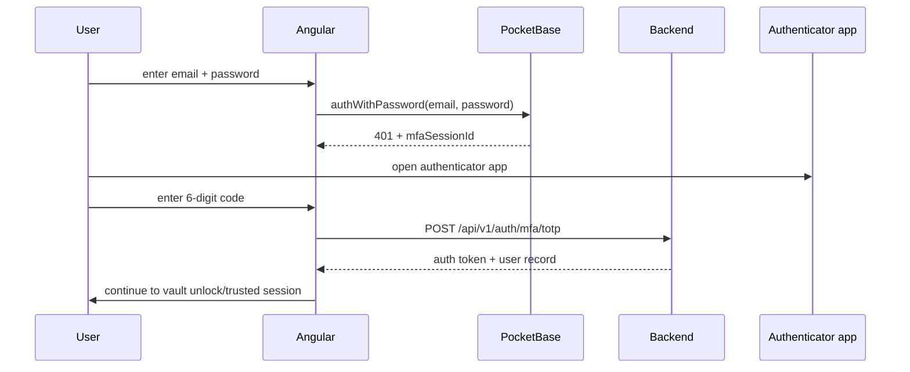
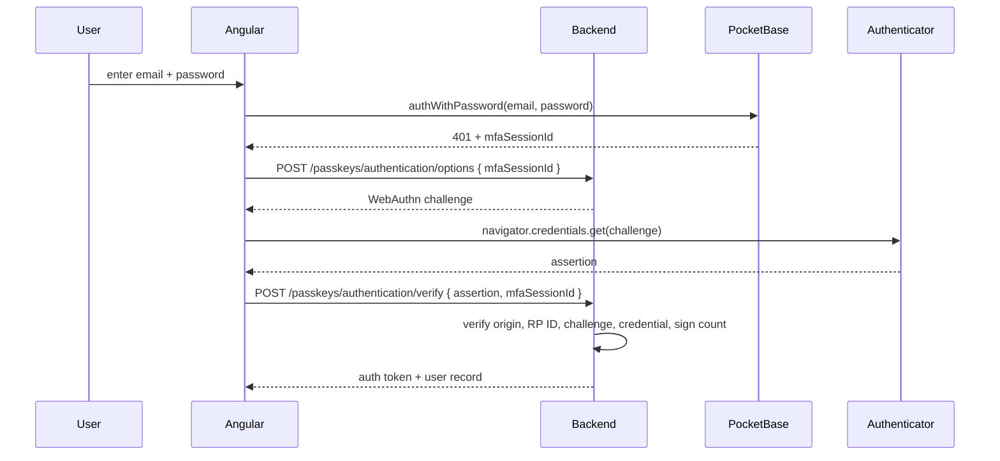

# MFA and Passkeys — Architecture Specification

**Status:** Draft  
**Scope:** PocketBase auth hardening for Cognos accounts  
**Stack:** Go backend, Angular frontend, PocketBase v0.39.1, TOTP, WebAuthn/passkeys

## Decision summary

MFA is **authenticator-app only**.

1. **P0: custom TOTP MFA.**
   - Password remains the first factor.
   - Authenticator app codes are the only MFA factor.
   - Email OTP is explicitly not supported.
2. **P1: passkeys.**
   - Add custom WebAuthn endpoints and storage.
   - Use passkeys as a phishing-resistant sign-in / step-up option.
   - Do not let passkeys replace the Account Key.

Passkey-only login is a later decision. Fresh devices still need the Account Key to decrypt data.

## Current auth baseline

From the current codebase:

- `users` is a PocketBase auth collection.
- Password auth is enabled with `email` as the only identity field.
- OAuth2 is disabled (`1760000011_harden_users_auth_surface.go`).
- Passwords are auth-only; encrypted data is unlocked by the Account Key (`account_key_v2`).
- Password minimum length is 12.
- Per-account password lockout exists: 5 failed attempts locks the account for 15 minutes.
- PocketBase auth rate limits cover password, reset, verification, and email-change flows.
- The frontend currently calls `authWithPassword()` directly and treats success as a complete login.

## Goals

- Add authenticator-app MFA without weakening the existing password-auth surface.
- Keep email out of MFA.
- Add passkeys in a way that works with PocketBase auth tokens.
- Keep the Account Key model unchanged.
- Keep all MFA/passkey auth material out of public collection APIs.
- Avoid logging credentials, TOTP codes, recovery codes, passkey challenge material, or user
  content.

## Non-goals

- Email OTP MFA.
- SMS MFA.
- OAuth2/social login.
- Passkeys as a replacement for the Account Key.
- Recovering encrypted data after Account Key loss.
- Admin-managed enterprise MFA policies.

## Important constraint: do not use PocketBase native MFA for P0

PocketBase native MFA only counts its built-in auth methods: password, OAuth2, and email OTP. It has
no native TOTP/passkey method. Enabling PocketBase OTP would also expose email-code authentication,
which is weaker than the current password-only baseline.

So P0 should **not** enable `users.OTP` just to satisfy PocketBase MFA validation.

Instead:

- keep `users.OTP.Enabled = false`
- keep `users.MFA.Enabled = false`
- add our own TOTP enrolment and MFA session tables
- intercept password auth responses for enrolled users before a token is returned

This gives authenticator-app-only MFA without accidentally adding email login.

## P0 design — authenticator-app TOTP

### Collection configuration

Keep the auth surface narrow:

```txt
PasswordAuth.Enabled = true
PasswordAuth.IdentityFields = ["email"]
OAuth2.Enabled = false
OTP.Enabled = false
MFA.Enabled = false
```

Add hidden/server-managed fields to `users`:

```txt
mfa_enabled bool default false
mfa_enrolled_at date optional
```

Clients must not be able to PATCH these fields directly. Enrolment and disablement go through
first-party endpoints only.

### Data model

Add `user_mfa_totp` with all collection API rules locked (`nil`). One active row per user.

```txt
id
user relation -> users unique
secret_ciphertext text
secret_nonce text
secret_key_id text
algorithm text default "SHA1"
digits number default 6
period_seconds number default 30
verified_at date optional
disabled_at date optional
last_used_at date optional
created
updated
```

The TOTP seed must be encrypted at rest with a server-held key, not stored as plaintext. Use an env
managed key such as `MFA_TOTP_ENCRYPTION_KEY` and keep `secret_key_id` so rotation is possible.

Add `mfa_auth_sessions` with all collection API rules locked (`nil`).

```txt
id
user relation -> users
session_hash text unique
first_factor text default "password"
expires_at date
consumed_at date optional
created
```

Add `mfa_recovery_codes` with all collection API rules locked (`nil`).

```txt
id
user relation -> users
code_hash text
used_at date optional
created
```

Recovery codes are generated once at enrolment, shown once, and stored only as hashes. They are for
account access recovery, not a weaker day-to-day MFA channel.

Exclude `user_mfa_totp`, `mfa_auth_sessions`, and `mfa_recovery_codes` from soft-delete snapshots.
They are auth material and should disappear immediately.

### Password login interception

Add an `OnRecordAuthRequest("users")` hook:

- if `AuthMethod != "password"`, continue
- if `mfa_enabled != true`, continue and return the normal PocketBase token
- if `mfa_enabled == true`:
    - create a short-lived `mfa_auth_sessions` row
    - return `401` with `{ "mfaSessionId": "..." }`
    - do not return the password-auth token

This protects even callers who hit PocketBase's `/api/collections/users/auth-with-password` route
directly.

### TOTP verification

Add a first-party unauthenticated endpoint:

| Method | Path                        | Purpose                                      |
| ------ | --------------------------- | -------------------------------------------- |
| `POST` | `/api/v1/auth/mfa/totp`     | Complete login with `mfaSessionId` + code    |
| `POST` | `/api/v1/auth/mfa/recovery` | Complete login with one unused recovery code |

Verification rules:

- session must exist, match the user, be unexpired, and be unused
- TOTP code must match the encrypted seed after decryption
- allow a small clock window, normally current step ±1
- reject replay by consuming the MFA session
- reject duplicate use of the same or older TOTP timestep via `last_accepted_step`
- update `last_used_at` on success
- issue the normal PocketBase auth response after success

### Frontend login flow

Current flow:

```txt
email + password -> token
```

New flow for users with MFA enabled:



The vault flow does not change. After auth succeeds, the user still unlocks with the Account Key or
an existing trusted-device vault session.

### MFA settings flow

Add first-party authenticated endpoints:

| Method | Path                         | Purpose                                            |
| ------ | ---------------------------- | -------------------------------------------------- |
| `GET`  | `/api/v1/mfa`                | Return enabled state and enrolled factors          |
| `POST` | `/api/v1/mfa/totp/enrol`     | Create secret + QR provisioning URI                |
| `POST` | `/api/v1/mfa/totp/confirm`   | Verify first code, enable MFA, show recovery codes |
| `POST` | `/api/v1/mfa/totp/disable`   | Disable TOTP after password + current code         |
| `POST` | `/api/v1/mfa/recovery-codes` | Regenerate recovery codes after current code       |

Enrolment must not set `mfa_enabled=true` until the user proves they can generate a valid code.
Disablement requires both the current password and the current TOTP code.

## P1 design — passkeys

PocketBase v0.39.1 has no native WebAuthn/passkey support. Implement passkeys as first-party Go
endpoints and integrate them with PocketBase tokens.

### Passkey role

P1 passkeys are:

- phishing-resistant account authentication
- usable for sensitive account actions
- not a data-decryption key
- not a replacement for the Account Key

A successful passkey assertion can either:

- complete an existing MFA session after password auth, or
- be used as a later passkey-first login flow if we explicitly choose that product behaviour.

### Data model

Add `user_passkeys` with all collection API rules locked (`nil`). Only first-party handlers read or
write it.

```txt
id
user relation -> users
credential_id text unique
public_key text
sign_count number
name text
transports json
backup_eligible bool
backup_state bool
aaguid text
last_used_at date optional
last_accepted_step number optional
disabled_at date optional
created
updated
```

Add `webauthn_challenges` with all collection API rules locked (`nil`):

```txt
id
user relation -> users optional
purpose select: registration, authentication, mfa, step_up
challenge_hash text unique
mfa_session_hash text optional
expires_at date
consumed_at date optional
created
```

Add hidden/server-managed `users.webauthn_user_handle` as a random stable value. Do not use email as
the WebAuthn user handle.

Exclude `user_passkeys` and `webauthn_challenges` from soft-delete snapshots. Deleted credentials
and challenges are auth material and should disappear immediately.

### Endpoints

| Method   | Path                                      | Purpose                                      |
| -------- | ----------------------------------------- | -------------------------------------------- |
| `POST`   | `/api/v1/passkeys/registration/options`   | Authenticated registration start             |
| `POST`   | `/api/v1/passkeys/registration/verify`    | Save verified credential                     |
| `POST`   | `/api/v1/passkeys/authentication/options` | Login/MFA assertion start                    |
| `POST`   | `/api/v1/passkeys/authentication/verify`  | Verify assertion; return token when complete |
| `GET`    | `/api/v1/passkeys`                        | List current user's passkeys                 |
| `DELETE` | `/api/v1/passkeys/{id}`                   | Revoke one passkey                           |

Registration requires an authenticated session. Deleting the final passkey is allowed; passkeys are
not the only account access path while password + TOTP exists.

### Passkey MFA flow



## Security requirements

- Do not enable PocketBase OTP.
- Use a server-held encryption key for TOTP seeds.
- Store recovery codes as hashes only.
- Rate-limit TOTP and recovery-code verification by session, user, and IP.
- Verify WebAuthn origin, RP ID hash, challenge, user presence, and user verification policy.
- Challenges and MFA sessions are single-use and expire quickly.
- Do not log TOTP codes, recovery codes, MFA session IDs, passkey challenges, assertions,
  credential IDs, or emails in error logs.
- Passkey credential IDs are auth material; keep them out of analytics.
- TOTP/passkey success does not unlock encrypted chats. The Account Key/trusted vault session still
  does that.
- Logout continues to rotate the PocketBase token key and clear the vault session wrap key.

## Testing plan

P0 API tests:

- `users` auth config keeps password enabled and keeps OAuth2, OTP, and native MFA disabled.
- Password login for `mfa_enabled=false` returns a token.
- Password login for `mfa_enabled=true` returns `mfaSessionId` and no token.
- Direct PocketBase password auth cannot bypass MFA.
- TOTP enrolment does not enable MFA until a valid first code is confirmed.
- TOTP verify with valid session + valid code returns a token.
- TOTP verify with wrong, expired, replayed, or missing session rejects.
- Recovery code works once and cannot be reused.
- Existing login lockout still triggers before MFA.
- Rate limits cover TOTP and recovery-code verification.

P0 browser tests:

- Login without MFA still works.
- Login with MFA shows the authenticator-code step and then opens the vault flow.
- Enrolment shows QR/manual secret, requires a first valid code, then shows recovery codes once.
- Refresh after MFA login preserves the existing auth/vault behaviour.

P1 passkey tests:

- Registration challenge cannot be replayed.
- Authentication challenge cannot be replayed.
- Wrong origin/RP ID is rejected.
- Unknown or disabled credential is rejected.
- Credential sign count is updated.
- Passkey MFA completes a password-created `mfaSessionId` session.
- Deleting a passkey prevents future use.

## Rollout

1. Add tests for direct password-auth interception.
2. Add TOTP, MFA session, and recovery-code migrations.
3. Add TOTP enrolment/confirm/verify endpoints.
4. Add frontend MFA login and settings state.
5. Ship authenticator-app MFA behind a visible account setting.
6. Add passkey storage and WebAuthn endpoints.
7. Decide separately whether passkeys can become a first factor.

## Business process docs

- [`mfa-login`](../business_processes/mfa-login.md)
- [`mfa-recovery-codes`](../business_processes/mfa-recovery-codes.md)
- [`passkey-authentication`](../business_processes/passkey-authentication.md)
