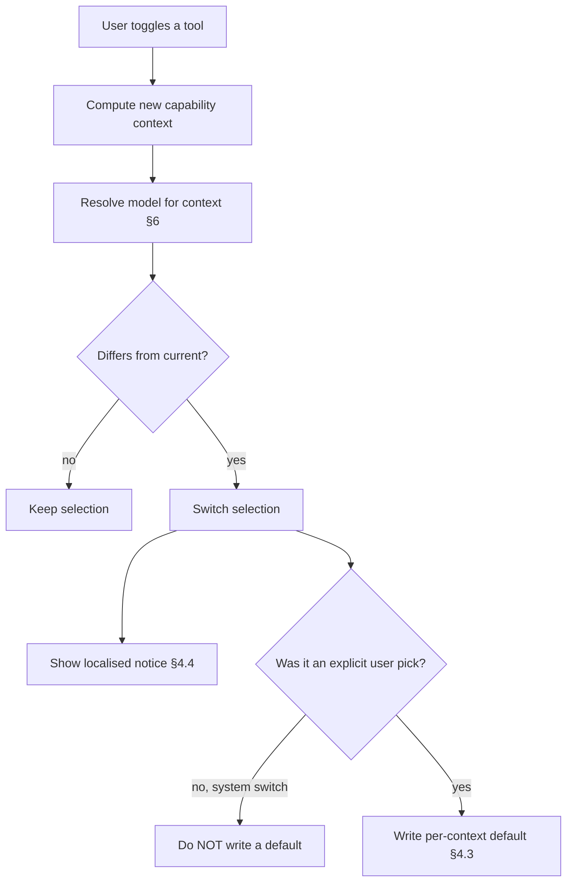

# Tool-Aware Model Selection

**Status:** Implemented (Phases 1–3)
**Scope:** Coupling composer tools to model capability; per-capability-context model defaults
(encrypted); auto-switching the selected model when a tool is toggled; treating text completion as a
first-class capability. Frontend product behaviour; relies on the backend capability gate.
**Extends:** [composer-model-discovery.md](./composer-model-discovery.md) (defaults, resolution,
encrypted preferences, `orderModels`). This spec only adds the **capability-context** dimension on
top of that work — read it first.
**Related code:**

- `frontend/src/app/services/composer-tools.service.ts`
- `frontend/src/app/services/model.service.ts`
- `frontend/src/app/services/user-preferences.service.ts`
- `frontend/src/app/utils/model-discovery.ts` (`orderModels`, `modelSupportsCapability`)
- `frontend/src/app/components/chat/message-form/model-selector/model-selector.component.ts`
- `frontend/src/app/components/chat/message-form/composer-tools/composer-tools.component.ts`
- `frontend/src/app/components/chat/message-form/message-form.component.ts`
- `frontend/src/app/interfaces/user_preferences.ts`, `frontend/src/app/interfaces/model.ts`
- `backend/internal/handler/complete.go`, `backend/internal/handler/image.go`
- [business_processes/model-capability-gating.md](../business_processes/model-capability-gating.md)

## 1. Why

A composer tool (image generation today; web search later) changes
**what the model has to be able to do**. But the model picker treats the selected model as a single
global default. So an Account holder can select an image-only model, turn the image tool off, and be
left on a model that can't answer a text prompt — the bug fixed in
`docs/bugs/2026-06-30-image-only-model-text-completion.md`.

The current default is also too blunt: `defaultModelId` is one value. An Account holder who likes
Claude for chat and Gemini for images has to re-pick every time they toggle the tool, because
selecting one overwrites the other.

This spec makes model selection **task-aware**: the picker only offers models that can do the
current task, and Cognos remembers the Account holder's preferred model **per task** so toggling a
tool restores the right one.

## 2. Concepts

- **Required capability** — what the current composer state needs the model to do. Today: either
  `text_completion` (no tool) or `image_generation` (image tool on).
- **Capability context** — a stable key for the _set_ of required capabilities, used to key
  preferences. `"text"` when no tool is active, `"image_generation"` when the image tool is on.
  Future combinations sort + join, e.g. `"image_generation+web_search"`. There is always exactly one
  active context.
- **Per-context default** — the model the Account holder last _explicitly chose_ while that context
  was active.

> **Key change from today:** text completion stops being the implicit "anything goes" state and
> becomes a real capability (`text_completion` ← `Model.supportsTextCompletion`). Every context —
> including plain chat — now filters the picker and resolves a default.

## 3. Principles

- **Privacy posture is preserved.** Per-context defaults live in the existing encrypted
  `user_preferences.data` blob (§5) — never a plaintext server field. No new key, collection, or API
  surface. Mirrors `docs/specs/composer-model-discovery.md` §4.1/§6.3.
- **The model carries meaning.** In Cognos a model implies cost, privacy tier, and hosting country.
  Auto-switching is therefore **always announced** (§4.4) and never silent across privacy tiers.
- **The backend gate is authoritative.** All UI behaviour here is convenience. The server rejects a
  model that can't do the requested operation regardless of UI state — see
  [model-capability-gating](../business_processes/model-capability-gating.md). UI cleverness never
  justifies removing that gate.
- **System actions don't become preferences.** An auto-switch (§4.2) never writes a per-context
  default; only an explicit Account holder selection does (§4.3). Otherwise the picker would "learn"
  choices the Account holder never made.
- **Stale-safe.** An unknown / ineligible / no-longer-capable remembered model ID is ignored at read
  time and resolution falls through (§6).
- **i18n.** Every new string ships in all six locales (`en/de/fr/es/it/pt`) per
  `composer-model-discovery.md` §4.2.

## 4. Features

### 4.1 Text completion is a first-class capability — P0

- **Story:** As an Account holder, I never want to see a model in the picker that can't do what I'm
  about to do.
- **Acceptance criteria:**
    - `modelSupportsCapability` understands `text_completion`, mapped to
      `Model.supportsTextCompletion`.
    - The composer's required capability is **never null**: it is `text_completion` when no tool is
      active, `image_generation` when the image tool is on.
    - `orderModels` (already filters by required capability) therefore hides image-only models from
      the picker in plain chat, and hides text-only models when the image tool is on.
    - A model that becomes hidden because it can't do the current task is not silently kept as the
      selection — resolution (§6) replaces it.

### 4.2 Auto-switch the model when a tool is toggled — P0

- **Story:** As an Account holder, when I turn image generation on I want the model I last used for
  images; when I turn it off I want my chat model back — without re-picking.
- **Acceptance criteria:**
    - Toggling a tool changes the capability context and **re-resolves the selected model** for the
      new context via §6.
    - Turning a tool **off** returns to the `"text"` context default (the Account holder's chat
      model), so an image-only model is never left selected for text — this is the structural fix
      for the bug.
    - The switch fires before the Account holder can send; `canSendMessage` is never satisfied with
      a model that can't do the current task.
    - Auto-switch is a **system action**: it does not write any per-context default (§4.3).
    - If no eligible, capable model exists for the new context, no switch happens and the fallback
      in §4.5 applies.

### 4.3 Remember the model per capability context — P0

- **Story:** As an Account holder, the model I pick while a tool is on should stick for that tool,
  and my chat model should stick for chat — independently.
- **Acceptance criteria:**
    - Explicitly selecting a model **while a context is active** persists it as that context's
      default (`"text"` → `defaultModelId`, unchanged; any other context →
      `toolModelDefaults[contextKey]`).
    - Selecting in one context never overwrites another context's default.
    - The persisted value is an eligible, capable model ID; stale-safe on read (§3).
    - This generalises today's "selecting a model is what makes it the default"
      (`composer-model-discovery.md` §5.6) from one default to one-per-context. Plain-chat behaviour
      is byte-for-byte unchanged (`defaultModelId`), so existing preferences need no migration.

### 4.4 Announce every auto-switch — P0

- **Story:** As a privacy-conscious Account holder, if Cognos changes my model I want to know —
  especially if it changes where my data is processed.
- **Acceptance criteria:**
    - When §4.2 changes the selection, show a localised, dismissible notice naming the model and the
      reason, e.g. "Switched to {model} for image generation" / "Switched back to {model}".
    - If the switch crosses privacy tiers (e.g. `ch_only` → `eu`), the notice states that
      explicitly.
    - Prefer a resolved default in the **same or more private** tier where one exists (§6 ordering
      respects tier the way the rest of the picker does).
    - The notice carries no model ID into analytics alongside a user identifier
      (`composer-model-discovery.md` §8).

### 4.5 Fallback when no capable model exists — P0 (shipped)

- **Story:** As an Account holder whose privacy tier has no model for this tool, I want a clear
  explanation, not a failed send.
- **Acceptance criteria:**
    - When the active context has no eligible, capable model, the composer **blocks the send** and
      the tools panel explains it (today: `selectedModelUnsupported` /
      `selectedModelTextIncompatible` with a one-tap fix). This is the existing behaviour from the
      bug fix and remains the backstop that auto-switch cannot resolve.

## 5. Data model & storage

Extends the encrypted `UserPreferencesData` (`composer-model-discovery.md` §6.3):

```txt
defaultModelId: string                      // unchanged — the "text" context default
toolModelDefaults: Record<string, string>   // new — contextKey → modelId, for non-text contexts
```

Rules:

- Lives in encrypted `user_preferences.data`; no plaintext server field, no new collection/API.
- `contextKey` is the canonical capability-context key (§2): `"image_generation"`, future
  `"image_generation+web_search"`, etc. The `"text"` context is **not** stored here — it stays in
  `defaultModelId` so existing data and behaviour are untouched.
- Zod default is `{}`; backward compatible (old payloads have no key).
- Read is stale-safe: an unknown/ineligible/non-capable value is ignored.

## 6. Resolution order (per active context)

Every candidate must be **eligible** _and_ **capable of the active context**. First match wins:

1. model explicitly selected this chat/session, **if it satisfies the current context**
2. encrypted project default (`composer-model-discovery.md` §5.7), if eligible and capable
3. encrypted per-context default — `defaultModelId` for `"text"`, else
   `toolModelDefaults[contextKey]`
4. recommended eligible model that is capable
5. first eligible, visible, capable model

If a tool toggle makes the session's current model fail step 1 (e.g. image tool on, model is
text-only), resolution continues from step 2 — that is the auto-switch.

## 7. Auto-switch lifecycle



Explicit selection in the picker is the only path that writes a default. The toggle-driven switch
only _reads_.

## 8. Backend enforcement

Independent of everything above, the server rejects a model that can't perform the requested
operation **before** billing, persistence, or any provider call:

- `text_completion` requires `supports_text_completion` on `/completions` and `/…/complete`.
- `image_generation` requires `supports_image_generation` on `/…/image`.

See [model-capability-gating](../business_processes/model-capability-gating.md). The two
`/api/v1/models` capability flags (`supports_text_completion`, `supports_image_generation`) drive
the UI; the handler checks are the authoritative gate. Both must agree — same contract as
[privacy-tier-gating](../business_processes/privacy-tier-gating.md).

## 9. Testing

Follow the project preference: high-level e2e first, then unit tests for pure logic.

### 9.1 Browser e2e (`frontend/e2e/`)

- Toggle image on → selected model becomes the Account holder's image model (or recommended image
  model on first use); a switch notice appears.
- Generate an image, toggle image off → selected model returns to the chat model; **no** image-only
  model is left selected.
- Pick a non-default image model with the tool on, toggle off and on again → that image model is
  restored; the chat default is unchanged.
- An Account holder on `ch_only` with no image model sees the §4.5 fallback, not a failed send.
- Plain chat with no tools shows no image-only model in the picker.

### 9.2 API e2e

- `user_preferences` payload stays opaque ciphertext; no plaintext `toolModelDefaults` field.
- Stale/unknown IDs in `toolModelDefaults` don't break `/api/v1/models` or chat startup.
- (Regression, shipped) image-only model rejected on both completion paths before persistence.

### 9.3 Unit

- `modelSupportsCapability` for `text_completion`.
- Capability-context key derivation for none/image/(future) combinations.
- Resolution order §6 across: session pick fails context, project default, per-context default,
  recommended, first eligible; stale/ineligible remembered IDs ignored.
- Explicit selection writes the correct context default; auto-switch writes nothing.
- Zod default for `toolModelDefaults` (missing key → `{}`).

## 10. Milestones

| Phase     | Deliverable                                                                                                                                                                                      |
| --------- | ------------------------------------------------------------------------------------------------------------------------------------------------------------------------------------------------ |
| 1 ✅      | `text_completion` capability + non-null required capability → picker filters image-only models out of chat; resolution replaces a now-incapable selection. Closes the bug class at the selector. |
| 2 ✅      | Auto-switch on toggle (§4.2) + localised, tier-aware notice (§4.4).                                                                                                                              |
| 3 ✅      | Per-context defaults (`toolModelDefaults`, §4.3/§5) in encrypted preferences; resolution prefers them; tests + opacity assertions.                                                               |
| later     | Generalise context key to multi-tool combinations as web search etc. land.                                                                                                                       |

## 11. Risks

| Risk                                                                       | Mitigation                                                                                                                                                   |
| -------------------------------------------------------------------------- | ------------------------------------------------------------------------------------------------------------------------------------------------------------ |
| Silent model change surprises Account holders / leaks across privacy tiers | Always announce (§4.4); prefer same-or-more-private tier; state tier changes explicitly.                                                                     |
| Auto-switch "learns" choices the Account holder never made                 | System switches never write defaults; only explicit picks do (§3, §7).                                                                                       |
| Remembered model becomes ineligible/incapable                              | Stale-safe read; resolution falls through (§3, §6).                                                                                                          |
| Over-engineering for one image-only model                                  | All of this dissolves when a text+image multimodal model lands (it satisfies every context). Build the minimum; don't pre-build a multi-tool restore matrix. |
| Drift between UI capability flags and backend gate                         | Single source: catalogue capability flags drive both; gate is authoritative; covered by API e2e (§9.2).                                                      |

## 12. Non-goals

- Server-side personalisation or model ranking.
- Remembering per-conversation (not per-context) model choices.
- A standalone "default models" management screen beyond the existing settings list.
- Any new key, collection, or plaintext preference field.
