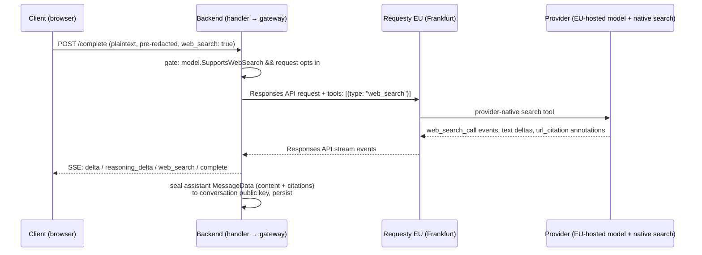

# Web Search

- **Version:** 0.2 Draft — sources UI design + Responses API migration folded in
- **Status:** Not started
- **Stack:** Go (PocketBase + Bifrost gateway), Angular frontend, Requesty EU router
- **Scope:** Provider-native web search for Requesty-routed, EU-hosted models. No Cognos-side
  agent loop, no Infomaniak search (deferred).
- **Related specs:** `tool-aware-model-selection.md` (composer tools + capability routing),
  `billing.md` (usage metering), `pii-redaction.md` (what leaves the device),
  `../security-model.md` (§2–§4 in-flight plaintext boundary)
- **Related code:**
    - `backend/internal/gateway/client.go` — gateway-neutral request/response types
    - `backend/internal/gateway/bifrost_client.go` — Bifrost request mapping + stream consumption
    - `backend/internal/handler/complete.go` — completion handler, SSE emission, persistence
    - `backend/internal/catalogue/models.go` — `SupportsWebSearch` capability flag (already exists)
    - `backend/internal/catalogue/requestysync/sync.go` — capability sync from Requesty
    - `backend/internal/billing/service.go`, `backend/internal/billing/ledger.go` — cost + metering
    - `frontend/src/app/services/composer-tools.service.ts` — composer tool state
    - `frontend/src/app/components/chat/message-form/composer-tools/composer-tools.component.ts` —
    the disabled "Web search" placeholder row to activate
    - `frontend/src/app/services/cognos-api.service.ts` — stream event union + parsing
    - `frontend/src/app/services/message.service.ts` — stream handling, message assembly
    - `frontend/src/app/interfaces/message.ts` — encrypted `MessageData` (citations live here)
    - `frontend/src/app/components/chat/message-list-item/message-list-item.component.ts` — sources
    UI

## 1. Overview & goals

Let the model answer with fresh information from the web. We use **Requesty's provider-native
web search tool** over Requesty's **Responses API**: the backend adds `{"type": "web_search"}`
to the request's `tools` array and Requesty maps it to the underlying provider's own search
(Anthropic web search, OpenAI Responses search, Gemini grounding). The provider searches, reads
results, and streams back an answer with citations. Cognos never calls a search engine itself.

We migrate the Requesty gateway path from Chat Completions to the **Responses API** as part of
this feature (Decision 7). Bifrost v1.5.12 already models it end-to-end
(`ResponsesStreamRequest`, `ResponsesToolTypeWebSearch`, `url_citation` annotations with
`start_index`/`end_index`, and `response.web_search_call.in_progress|searching|completed`
stream events), which is exactly what the sources UI needs: inline citation anchors and a live
"searching" signal.

### Goals

- Users on a search-capable model get current information without leaving the chat.
- Answers cite their sources; sources are rendered in the UI and stored **encrypted** with the
  message like all other message content.
- Search stays inside the EU data boundary: only EU-hosted searchable models expose the
  capability.
- Search cost is billed accurately using provider-reported cost, with a configured per-search
  floor as fallback.
- Zero new plaintext at rest, zero content logging — same discipline as the completion path.

### Non-goals (v1)

- **No Cognos-orchestrated agent loop** (server- or browser-side tool-call loop with our own
  search API). Deferred; revisit if Infomaniak models need search.
- **No search for Infomaniak models.** They keep `supports_web_search = false`.
- **No Perplexity Sonar** or other non-EU-hosted searchable models (see Decision 2).
- No user-tunable search options (context size, domain filters, location).
- No standalone "search the web" feature outside a chat completion.

## 2. Principles

1. **Provider does the searching.** We pass one tool declaration through; we never construct,
   execute, or proxy search queries ourselves. Least new attack/logging surface.
2. **Same trust boundary as messages.** Search queries are derived by the model from the
   (already client-side-redacted) conversation context. Citations arrive as plaintext in-flight,
   are encrypted at persistence, and are never logged — identical to message content
   (`security-model.md` §2–§4).
3. **On by default, easy to turn off.** Search-capable models have the tool enabled
   automatically; the composer Tools menu row is a per-conversation opt-out with a plain-language
   privacy note. The model decides per turn whether to actually search.
4. **EU only.** The capability is only exposed on models served from EU infrastructure through
   `router.eu.requesty.ai`, consistent with "kept in Switzerland or Europe".

## 3. How it works



Key properties:

- The **user message is redacted client-side before send** (existing pipeline), so any search
  query the model derives can only contain redaction tokens, not the raw values.
- Citations arrive on the stream, are shown live, and are folded into the assistant message's
  encrypted `MessageData` at persistence. Nothing search-related is stored in plaintext.
- If the model chooses not to search, the request behaves exactly like today.

## 4. Features

### 4.1 Search-grounded answers (P0)

As a user on a search-capable model, when I ask about something current, the model searches the
web and answers with citations.

Acceptance criteria:

- When the selected model has `supports_web_search` and the conversation hasn't opted out, the
  backend adds the web search tool to the provider request.
- Deltas stream as today; citation metadata (sources + inline anchors) streams as it arrives.
- Citations are stored inside the encrypted `MessageData` and re-rendered after decryption on
  reload, exactly like reasoning.
- Models without the flag are entirely unaffected (byte-identical provider request).

### 4.1a Sources UI (P0 — per design)

Designer mock: message header row → sources dropdown → reasoning row → answer body.

Acceptance criteria:

- **"Searched N sources" dropdown** sits at the top of the assistant message (above the
  reasoning row), **collapsed by default**; a chevron expands it. Count is localised with
  proper plural forms.
- Expanded, each source row shows: a letter avatar (first letter of the domain), the citation
  number, the page title, the domain, a one-line snippet, and an external-link icon. The whole
  row links to the source.
- **Inline citation markers**: superscript-style numbered chips in the answer body at the
  positions the provider anchors them (`url_citation` start/end indices into the raw markdown).
  Clicking/hovering a marker opens a **hover card** with the letter avatar, title, domain,
  snippet, and an "Open source ↗" link.
- All source links open in a new tab with `target="_blank" rel="noopener noreferrer"`
  (no referrer leaks the chat origin); URLs sanitised to `http(s)` only.
- Citation titles/snippets are rendered as plain text bindings — never through markdown/HTML.
- Hover card is keyboard-accessible (focusable marker, Escape closes) and works on touch (tap
  toggles).
- If the provider returns citations without usable indices, markers are omitted and the
  sources dropdown alone is shown — never guess anchor positions.
- Title-less proxy-URL citations (Vertex grounding redirects with no resolvable domain) are
  shown with a localised "Web source" fallback label — never the proxy hostname, and never
  dropped (anchor indices are stable, dropping would desync them).
- Styled entirely with `--cog-*` design tokens. (Implementation note: `external-link`/`globe`
  aren't in the `@cognos/ui` Lucide registry, so the registered `link` icon is used — adding
  the richer icons to `packages/ui` is a cosmetic follow-up.)

### 4.2 Opt-out control (P0)

As a privacy-conscious user, I can turn web search off for a conversation.

Acceptance criteria:

- The composer Tools menu row (currently a disabled placeholder) becomes a live toggle:
  **on by default** when the selected model supports search, off and disabled (with an
  explanatory hint) when it doesn't.
- The row description states plainly that questions may be sent to a search engine when this is
  on (see §9 copy rules; all six locales).
- The setting is per conversation and persists for that conversation's composer state
  (mirroring the image-generation toggle mechanics in `ComposerToolsService`).
- When off, the tool is omitted from the provider request — not merely ignored.

### 4.3 Capability visibility (P1)

As a user choosing a model, I can see which models can search.

Acceptance criteria:

- Model selector shows a "Web search" strength pill for capable models
  (`modelStrengthPills()` in `model-discovery.ts`, new i18n key
  `chat.models.strengths.webSearch` in all six locales).
- Switching to a non-capable model mid-conversation silently drops the tool (no error, no
  forced model switch — search is best-effort, unlike image generation which is the output
  format itself).

### 4.4 Search activity indication (P1)

As a user, I can see that the model is searching while I wait.

Acceptance criteria:

- The Responses API stream defines explicit signals —
  `response.web_search_call.in_progress` / `.searching` / `.completed` (modelled in Bifrost
  v1.5.12) — so the UI shows a transient "Searching the web…" status while a search call is
  active, replaced by the sources dropdown as citations arrive.
- Verify in the Phase-0 spike that Requesty actually forwards these events per provider family
  (the live response is the source of truth); if a family doesn't emit them, degrade to
  citations-only for that family.
- **Spike result (Vertex Gemini EU):** the events are forwarded but arrive _after_ the full
  answer has streamed — too late for a live indicator. Vertex Gemini therefore ships
  **citations-only** (no "Searching…" status). Anthropic/Azure OpenAI behaviour still
  unverified (org allowlist blocker).

## 5. Backend changes

### 5.1 Gateway — Responses API migration (Decision 7)

Bifrost v1.5.12 fully models the Responses API, so no raw-params workaround is needed:

- Migrate the completion path in `bifrost_client.go` from `ChatCompletionStreamRequest` to
  **`ResponsesStreamRequest`** (and the non-stream equivalent), building a
  `BifrostResponsesRequest` instead of `BifrostChatRequest`. The `gateway.Client` interface and
  neutral types are unchanged — the migration is contained inside the Bifrost client.
    - **Resolved (Phase-0 design):** Bifrost translates Responses→Chat, but only when the
    custom provider's `AllowedRequests` allowlist disallows Responses while allowing Chat
    (`shouldFallbackResponsesToChat`); the fallback stream is fully Responses-shaped
    (deltas, reasoning, terminal usage/cost). So: **single Responses code path for both
    providers** — Requesty keeps `AllowedRequests` nil (native `/v1/responses`), Infomaniak
    gets `AllowedRequests{ChatCompletion, ChatCompletionStream}` and transparently falls back
    to `/v1/chat/completions`. Leaving `AllowedRequests` nil for Infomaniak would 404 — the
    fallback must be opted into explicitly.
    - Regression watch: reasoning deltas, JSON mode (`ResponseFormat` → Responses `text.format`),
    stop handling, usage/cost fields — all must survive the migration unchanged (covered by the
    existing e2e suite).
- `gateway.CompleteRequest` gains `WebSearch bool`; when set, the Responses request includes
  the `web_search` tool (`ResponsesToolTypeWebSearch`) and
  `include: ["web_search_call.action.sources"]` so the searched sources are returned.
- `CompleteStreamEvent` gains:
    - `Citations []Citation` where `Citation` is `{URL, Title, Snippet string}` — normalised
    from `url_citation` annotations and `web_search_call` action sources.
    - `CitationAnchors []{CitationIndex, StartIndex, EndIndex int}` from annotation offsets into
    the raw output text (powers inline markers; omitted when a provider family doesn't supply
    usable indices).
    - `SearchActivity` (started/completed) from `response.web_search_call.*` events.
- Verify against a live call what each EU provider family (Anthropic, Azure OpenAI, Vertex
  Gemini) actually returns through Requesty and normalise in the gateway so the handler and
  client see one shape. Live response is the source of truth (Open question 2).
- **Live spike findings — Vertex Gemini EU (`vertex/gemini-3.5-flash@eu`), verified:**
    - `url_citation` annotations arrive with indices on
    `response.output_text.annotation.added`, **but attached to a second, empty synthetic
    message item** — the gateway must join annotations onto the real text item by output
    order, never assume same-item co-location.
    - **Annotation offsets are UTF-8 byte offsets** (verified against accented text). The
    gateway must normalise byte offsets → Unicode code-point (rune) offsets before emitting
    `CitationAnchors`; §7 defines the stored contract as code points. Unit-test with
    multi-byte text (é/è/emoji).
    - `action.sources` entries are `{type, url}` only — no title/snippet — and the URLs are
    `vertexaisearch.cloud.google.com/grounding-api-redirect/...` proxy links, not real source
    URLs. The displayable domain lives in the matching annotation's `title`. Gateway
    cross-references by URL; sources alone are unusable for the UI.
    - `web_search_call.in_progress/.searching/.completed` events exist but arrive **after**
    the full answer and annotations (sequence end) — useless for live status on this family
    (see 4.4 degradation).
    - Usage on `response.completed`: tokens + `cost`; **no search-count field**
    (`num_search_queries` does not exist) — search count must be derived by counting
    `web_search_call` output items. Cost matched pure token price exactly — **no visible
    search surcharge** (evidence for the §5.4 floor fee).
    - `system`-role input message honoured (open Q5 confirmed for this family).
    - Anthropic EU and Azure OpenAI EU legs are **blocked by a Requesty org-level provider
    allowlist** ("Provider blocked by policy" — only Vertex/Gemini currently enabled); rerun
    once the org dashboard allowlists those providers (launch-gate task).

### 5.2 Handler

- Request DTO gains `webSearch` (bool, default true when omitted — client sends explicit
  `false` on opt-out).
- Server-side gate mirroring the existing vision/file-input checks: if `webSearch` is
  requested/defaulted on but `model.SupportsWebSearch` is false, drop the tool silently (do not
  400 — see 4.3). Never enable it for non-Requesty providers.
- New SSE event type `web_search` in `completeStreamResponse` carrying citations, citation
  anchors, and search-activity status, alongside `delta`/`reasoning_delta`.
- Persistence: accumulate citations during the stream; include them in the assistant message's
  `MessageRecordData` before `EncryptAndPersistMessage`. Keep the struct in lockstep with the
  frontend `MessageData` interface (existing sync-warning comment applies).
- **Logging:** citations (URLs/titles) are message content. Log only counts
  (`search_count`, `citation_count`), never URLs, titles, or query text — same rule as
  `safeErrorSummary`.

### 5.3 Catalogue

- `requestysync` continues to sync `supports_web_search` from Requesty, **but the flag must
  only survive for EU-hosted serving** (Decision 2). Enforced predicate (settled by the
  Phase-0 models-API spike):
  `supports_web_search := raw.supports_web_search && raw.geolocation == "eu"` — exact string
  match on Requesty's flat `geolocation` field, **never** an id-suffix regex (`@europe-*`):
  the field is Requesty's own EU claim; an id regex would assert EU residency more strongly
  than Requesty does.
- Spike findings that shape this rule: the EU router hostname does **not** filter or annotate
  the catalogue (identical 560 models on both routers), so enforcement must be field-based;
  ~20 of 161 searchable models qualify (EU Claude-on-Vertex, Azure OpenAI France/Sweden, and
  only two Gemini `@eu` aliases — Requesty mislabels single-region Gemini pins like
  `@europe-west1` as `global`, and direct-API Anthropic models are never EU). Under-inclusion
  is the fail-safe direction; the Gemini mislabelling is flagged to Requesty support (§14 Q1
  follow-up).
- Enable Requesty **strict EU enforcement** on the org so a non-EU endpoint is rejected
  server-side even if misconfigured. Document in deployment steps.

### 5.4 Billing

Decision 4: **pass-through with floor.**

- `gateway.Usage` gains `SearchCount int` — **derived by counting `web_search_call` output
  items on the stream** (spike-verified: no search-count usage field exists; and Gemini's
  reported `cost` matched pure token price exactly, i.e. no search surcharge passes through —
  the floor fee is doing real work).
- `CalculateCost`:
    - When `ProviderCostUSD` is present (`UsedProviderCost`), trust it — Requesty's reported
    total should include the provider's search fee — and apply the existing margin.
    - When absent, add `SearchCount × configured per-search price` on top of token cost.
    - The per-search floor price is **operator-configurable in micro-rappen** (whole rappen is
    too coarse: Anthropic's ~USD 10/1k ≈ 0.9 rappen/search before margin):
    `billing.web_search_floor_micro_rappen` in `configs/api.*.yaml` — documented in
    `configs/api.example.yaml` alongside `trial_seed_rappen` — with env override
    `COGNOS_BILLING_WEB_SEARCH_FLOOR_MICRO_RAPPEN` via the existing koanf mapping. Ship a
    sensible default in code (≈ Anthropic per-search fee + margin) so an unset value never
    means free searches; tweak once Requesty support answers the pass-through question.
- New `OperationType` is **not** needed — search happens inside a `text` completion; the
  ledger record gains a `search_count` detail field for reconciliation instead.
- Pre-call gate: add one worst-case search fee to the estimate when the tool will be sent
  (keeps the 402 gate honest without over-blocking small balances).
- **Launch gate:** confirm with Requesty support that provider search fees appear in reported
  cost (their docs don't say). Until confirmed, treat reported cost as possibly excluding
  search and add the floor fee on top whenever `SearchCount > 0` — over-charging slightly beats
  silently eating search costs; revisit once confirmed.

## 6. Frontend changes

- **Stream:** add `web_search` to the `CompleteStreamEvent` union and
  `parseCompleteStreamData`; new cases in the `MessageService` stream switch accumulate
  citations/anchors on the streaming message and drive the "Searching the web…" status
  (pattern: `applyCompletionReasoningStreamDelta`).
- **`MessageData`:** optional `citations` + `citationAnchors` (see §7) — sealed at rest,
  mirrored in the backend struct.
- **Composer:** activate the placeholder Tools row as described in 4.2. `ComposerToolsService`
  gains web-search state; **no** `RequiredCapability` change and no auto-model-switching —
  search never forces a model change.
- **Model selector:** web-search strength pill (4.3).
- **Sources dropdown (4.1a):** new component in `message-list-item` above the reasoning
  section — "Searched N sources", collapsed by default; check
  `packages/ui-angular/COMPONENTS.md` for reusable disclosure/expansion and chip primitives
  before building.
- **Inline citation markers (4.1a):** insert marker tokens into the raw markdown at the
  anchor offsets _before_ rendering, then hydrate the rendered tokens into interactive
  numbered chips post-render — the exact pattern `RedactedMarkdownComponent.hydratePills`
  already uses for redaction pills. Anchors index the raw output text, so insertion must
  happen on the markdown source, not the rendered DOM.
- **Hover card:** shared overlay component (letter avatar, title, domain, snippet,
  "Open source ↗"); candidate for `@cognos/ui-angular` since it will recur (attachment chips,
  future tools). Extract if a second use appears.
- **Rendering safety:** citation titles/snippets/domains are plain text bindings; URLs
  sanitised to `http(s)` only; links `target="_blank" rel="noopener noreferrer"`.
- **Redaction interplay:** nothing new to do on the send path (context is pre-redacted).
  Citations are third-party web content, not user PII — no redaction pass; stored encrypted.

## 7. Data model

No new collections. One extension to the encrypted per-message blob:

Persisted JSON keys (snake_case, matching the existing `MessageData` convention — implemented
in commit `70b69cc7`, identical inner shape on the SSE `web_search` frame and in the encrypted
blob so the client parses one shape for live and reload):

```ts
// interfaces/message.ts — MessageData (encrypted at rest)
citations?: {
  url: string;
  title?: string; // omitempty — proxy action sources arrive title-less
  snippet?: string; // omitempty — currently always empty from the Gemini family
}[];
citation_anchors?: {
  citation: number; // stable index into citations[]
  start: number; // offsets into `content`, in Unicode CODE POINTS
  end: number; //   (gateway already normalised provider byte offsets → code points;
}[]; //             frontend converts code points → UTF-16 indices when slicing)
// omitted when the provider gave no usable indices → dropdown-only rendering
```

SSE `web_search` frame (incremental — `citations` carries only newly-seen sources with stable
indices; the client accumulates; `search_activity` is `"started"|"completed"` and may arrive
after the answer text; all payload fields omitempty):

```json
{
  "type": "web_search",
  "citations": [{ "url": "https://…", "title": "…", "snippet": "" }],
  "citation_anchors": [{ "citation": 0, "start": 19, "end": 24 }],
  "search_activity": "started"
}
```

Citations are NOT duplicated into the terminal `complete` event — live accumulation mirrors
the reasoning-delta pattern; reload reads the decrypted message.

Backend `MessageRecordData` mirrors it. Plaintext DB columns are unchanged; the server-visible
surface gains only the aggregate `search_count` on the billing ledger record.

## 8. Security & privacy

- **What changes:** when search runs, a model-derived query (built from redacted context)
  reaches the provider's search backend (e.g. Google/Bing/Brave via Anthropic/OpenAI/Gemini
  infrastructure). That backend's retention is outside both Cognos's and Requesty's documented
  no-retention boundary. This is the feature's honest residual exposure and the reason for the
  opt-out + disclosure copy.
- **What doesn't change:** in-flight plaintext boundary (§2–§4 of the security model) already
  covers this flow; nothing search-related is persisted in plaintext; no content logging.
- Update `security-model.md`: add a short web-search subsection stating the above (search
  queries are derived from redacted context; search-backend retention is outside our boundary;
  encrypted-at-rest citations).
- Marketing/privacy copy must stay plain-language (no "end-to-end"/"zero-knowledge") and must
  not claim search stays in Switzerland/Europe beyond what's true: the **model and Requesty
  processing** are EU; the **search index** behind the provider's tool is global.

## 9. i18n

All six locales (en-GB, de-CH, fr, es-ES, pt-PT, it), European variants, informal/formal
per house rules. New keys:

- `chat.composer.tools.webSearch.title` / `.description` (replace placeholder copy; description
  carries the plain-language disclosure, e.g. EN: "The model can look things up on the web.
  Your question may be sent to a search engine.")
- `chat.models.strengths.webSearch`
- `chat.messages.sources.searched` — "Searched {{count}} sources" with **proper plural forms
  per locale** (one/other at minimum)
- `chat.messages.sources.open` — "Open source" hover-card link label
- `chat.messages.searching` — "Searching the web…" activity status
- Unsupported-model hint for the disabled toggle state.

## 10. Testing

- **API e2e (`e2e/tests/*-api.spec.ts`, `just e2e-api`):**
    - Extend `cmd/mock-ai-provider` to speak the Responses API stream: (a) assert whether a
    `web_search` tool was present on the inbound request, (b) emit
    `web_search_call.in_progress/searching/completed` events, `url_citation` annotations with
    indices, and action sources mid-stream. (This doubles as the regression harness for the
    Responses migration itself.)
    - Capable model + opt-in default → tool present, citations in stream, citations inside the
    persisted encrypted message (decrypt with test conversation key and assert).
    - Opt-out request → no tool on the wire.
    - Non-capable model with `webSearch: true` → tool silently dropped, completion succeeds.
    - Billing: stream with `search_count > 0` and no provider cost → ledger includes floor fee;
    with provider cost → `UsedProviderCost` path unaffected except `search_count` recorded.
    - Cross-user access rules: no new endpoints, so no new `api-permissions.md` entries — assert
    that in review.
- **Browser e2e:** toggle on/off in Tools menu; pill visible on capable model; sources
  dropdown collapsed by default and expandable; inline markers render and hover card opens
  with a working "Open source" link (`_blank`, `noopener noreferrer`); sources survive reload
  (decrypt path).
- **Go unit tables:** Responses request building (tool on/off/unsupported, include flag),
  citation + anchor normalisation across provider chunk shapes, `CalculateCost` search-fee
  matrix (provider-cost × search-count × floor).
- **Vitest tables:** `parseCompleteStreamData` with `web_search` events (well-formed, empty,
  malformed → ignored), anchor-offset marker insertion (start/mid/end of text, adjacent
  anchors, out-of-range indices → dropped), `MessageData` citations round-trip, URL
  sanitisation.

## 11. Milestones

| Phase | Deliverable                                                                                                                                             | Status                                                                             |
| ----- | ------------------------------------------------------------------------------------------------------------------------------------------------------- | ---------------------------------------------------------------------------------- |
| 0     | Spike: live Responses API call through Requesty per EU provider family — citation/anchor shapes, search events, Infomaniak translation                  | ✅ (Gemini verified; Anthropic/Azure legs blocked on org allowlist → launch gates) |
| 1     | Backend: gateway migration to `ResponsesStreamRequest` (regression-clean), web_search tool flag, `web_search` SSE event, encrypted citation persistence | ✅ commits `3c3146c8`…`70b69cc7`                                                   |
| 2     | Frontend: composer toggle (auto-on/opt-out), stream handling, sources dropdown + inline markers + hover card, pill, i18n ×6                             | ✅ commits `4afa21b5`…`14982ed6`                                                   |
| 3     | Billing: `search_count` metering, floor fee, pre-call estimate; catalogue EU-only enforcement                                                           | ✅ commits `e2de4951`, `957740f1` (+ ledger column follow-up)                      |
| 4     | Launch gates: Requesty cost-pass-through confirmation, strict EU enforcement enabled, security-model.md updated                                         | ☐                                                                                  |

**Rollout-order caveat:** `requestysync` already refreshes `supports_web_search` from Requesty
on every run, so production model rows may carry the flag TODAY. Because the handler is
auto-on (Decision 3), deploying Phase 1 would start running (unbilled, un-EU-filtered)
searches. **Do not deploy this branch until Phase 3 (floor fee + EU-only sync predicate) has
landed.** Pre-launch this is low stakes, but the ordering is load-bearing.

## 12. Risks

| Risk                                                                                                | Mitigation                                                                                                                                                   |
| --------------------------------------------------------------------------------------------------- | ------------------------------------------------------------------------------------------------------------------------------------------------------------ |
| Responses API migration regresses existing completion behaviour (reasoning, JSON mode, stop, usage) | Contained behind `gateway.Client`; existing e2e suite + Responses-speaking mock provider as the regression harness                                           |
| Infomaniak (Chat Completions only) breaks if migrated blindly                                       | Spike Bifrost's cross-protocol translation first; else route Infomaniak on the chat path per provider                                                        |
| Citation/anchor shape varies by provider family behind Requesty                                     | Normalise in gateway; live-verify each EU provider family in the spike; degrade to dropdown-only when indices unusable                                       |
| Anchor offsets don't align with rendered markdown                                                   | Insert markers into the raw markdown pre-render (redaction-pill pattern); drop out-of-range anchors, never guess                                             |
| Search fees not included in Requesty-reported cost → margin loss                                    | Floor fee added whenever `search_count > 0` until pass-through is confirmed in writing                                                                       |
| Auto-on surprises privacy-sensitive users                                                           | Plain-language disclosure in the Tools row, per-conversation opt-out, security-model.md honesty                                                              |
| EU-hosted searchable models answer worse than Sonar                                                 | Accepted trade-off (Decision 2); revisit if Requesty adds an EU Sonar variant                                                                                |
| Model switches mid-conversation to a non-capable model                                              | Tool silently dropped; no error, no forced switch                                                                                                            |
| Vertex Gemini citation URLs are Google grounding-redirect proxies, not real source URLs             | Show the domain from the annotation title (avatar + label); "Open source" follows the redirect — works, but flag the redirect hop in the security-model note |
| Byte-offset anchors misplace markers on non-ASCII text                                              | Gateway normalises to code points; frontend converts to UTF-16; unit tests with accented/emoji text                                                          |

## 13. Resolved decisions

| #   | Decision               | Resolution                                                                                                                                                                       |
| --- | ---------------------- | -------------------------------------------------------------------------------------------------------------------------------------------------------------------------------- |
| 1   | Architecture           | Requesty-native `{"type": "web_search"}` tool only; no Cognos agent loop (server or browser) in v1                                                                               |
| 2   | Data residency         | EU-hosted searchable models only; sync forces `supports_web_search=false` otherwise; no Sonar                                                                                    |
| 3   | Activation UX          | Auto-on for capable models; per-conversation opt-out via the composer Tools row; model decides per turn                                                                          |
| 4   | Billing                | Provider cost pass-through when reported; configured per-search floor fee otherwise (and until pass-through is confirmed)                                                        |
| 5   | Citation storage       | Inside encrypted `MessageData` (`citations[]`), never plaintext; ledger sees only `search_count`                                                                                 |
| 6   | Model-switch behaviour | Search is best-effort: unsupported model ⇒ tool dropped silently, no forced model switch                                                                                         |
| 7   | API surface            | Migrate the Requesty gateway path to the Responses API (Bifrost `ResponsesStreamRequest`) — newer surface, richer citations (indices for inline markers), explicit search events |
| 8   | Sources UX             | "Searched N sources" dropdown collapsed by default; numbered inline citation chips with hover card ("Open source" → `_blank` + `noopener noreferrer`) per design                 |

### Deferred to future specs

- Server-side agent loop so Infomaniak (Swiss-hosted) models can search
- Search options (context size, domain allow/deny, user location)
- Multi-tool composer combinations (`image_generation+web_search` context key in
  `tool-aware-model-selection.md`)
- Rich source previews (favicons, images) beyond the letter-avatar + snippet design

## 14. Open questions

1. Does Requesty's reported cost include provider search fees? (Launch gate — ask support.)
   - todo(ewan): ask support
   - Spike evidence (Gemini): cost matched pure token price to the last digit — no search
     surcharge visible. Floor fee validated for that family at least.
   - Follow-up finding: the search DID run (executed query + grounding sources + ~8.5k input
     tokens of injected results in the capture) but **Requesty's own logs show no web search**
     — Vertex grounding is a native provider feature, invisible to Requesty's tool
     observability, hence never metered. Sharpened support question: "is Vertex grounding
     billed at all through you, and if so where does it appear?" Note the injected grounding
     results DO inflate input tokens, which we already bill — the floor fee covers the
     provider-side grounding fee, not the tokens.
2. Does Requesty forward the Responses API `response.web_search_call.*` events per provider
   family?
   - **Partially resolved:** Vertex Gemini — yes, but after the answer (citations-only UX for
     that family). Anthropic EU / Azure OpenAI EU — **blocked by the Requesty org provider
     allowlist** ("Provider blocked by policy"); todo(ewan): enable Anthropic + Azure OpenAI
     providers in the Requesty org dashboard, then rerun the spike legs.
3. ~~Does Bifrost translate Responses API requests for Chat-Completions-only providers
   (Infomaniak)?~~ **Resolved:** yes, via per-provider `AllowedRequests` opt-in fallback
   producing Responses-shaped streams — single gateway code path. See §5.1.
4. System prompt placement on the Responses path: `system`-role input message (recommended —
   zero change to `persona.BuildMessages`) vs top-level `instructions` — confirm each provider
   family honours the system input item in the live spike.
5. ~~Exact EU-geolocation signal in the Requesty models API the sync should key off~~
   **Resolved (Phase-0 spike):** exact match `geolocation == "eu"`; router hostname carries no
   geo signal; id-suffix matching rejected as over-permissive. See §5.3.
