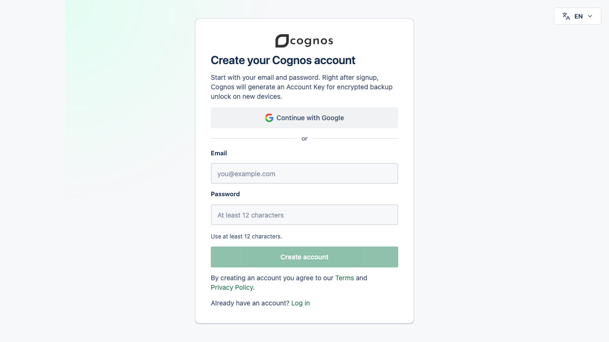
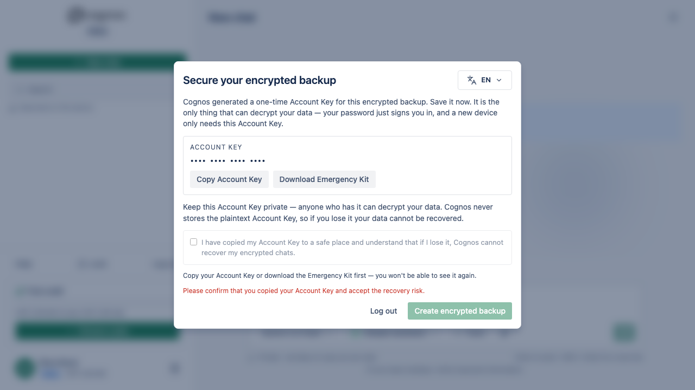
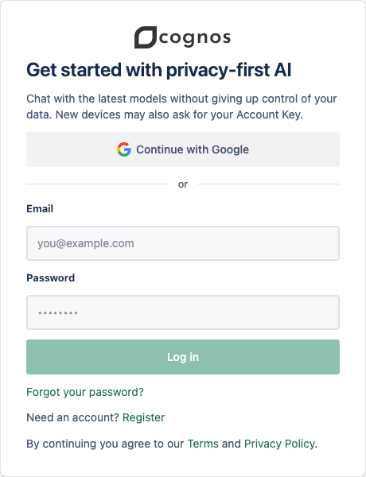
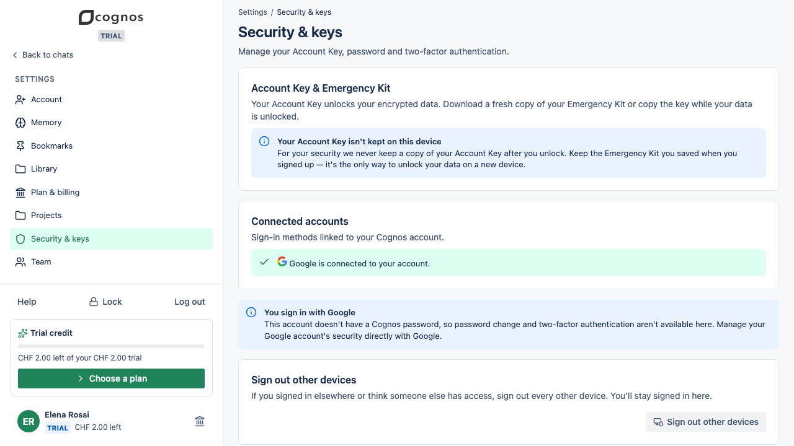

# Sign in with Google

Google confirms who you are. Your **Account Key** is separate: it Unlocks your encrypted data, and
neither Google nor Cognos keeps a copy that can replace it.

## Before you start

You need:

- access to the Google Account you want to keep using with Cognos;
- Safari or another browser that allows the Google sign-in popup;
- a password manager or another safe place for your Emergency Kit.

## Create a new Cognos Account

1. Open the Cognos registration page.
2. Choose **Continue with Google**.
3. In the popup, choose the Google Account you want to bind to Cognos.
4. Back in Cognos, download your **Emergency Kit** and store it safely.
5. Continue to Cognos. You do not need a separate Cognos email-verification message.

## Sign in again

1. Choose **Continue with Google** on the sign-in page.
2. Use the same Google Account you connected before.
3. On a new device or browser, enter your **Account Key** to Unlock your data.

Google sign-in does not replace the Account Key. Losing access to Google affects sign-in; losing the
Account Key makes encrypted data unrecoverable.

## If the email already has a password Account

Cognos does not merge Accounts just because their emails match.

1. Sign in with your Cognos email and Account password.
2. Open **Security & keys**.
3. Enter your current Account password.
4. Choose **Connect Google**, then select the Google Account you want to bind.

After connection, either method signs you in. Password sign-in still asks for Cognos
authenticator-app MFA when it is enabled; Google sign-in does not currently ask for a Cognos MFA
code.

## If Google sign-in does not open

1. Check whether Safari shows a blocked-popup message in the address bar.
2. Allow popups for the Cognos app, then choose **Continue with Google** once more.
3. If you closed the Google window, return to Cognos and retry.
4. If Google reports a problem, recover access through Google before retrying Cognos.

Closing or blocking the popup does not create a partial Account or connect Google halfway.

## Google-only Account limits

- Cognos password reset is not available. The reset screen gives the usual neutral confirmation,
  but no reset email is sent; recover access through Google.
- Cognos email change is not available because it requires a Cognos password.
- Cognos authenticator-app MFA is not available for Google-only Accounts today.
- Signing out of Cognos does not sign you out of Google.

For privacy, Google learns that you use Cognos when you choose Google sign-in. Google never receives
your Account Key or decrypted Conversation content.
